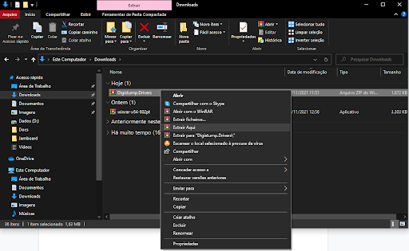
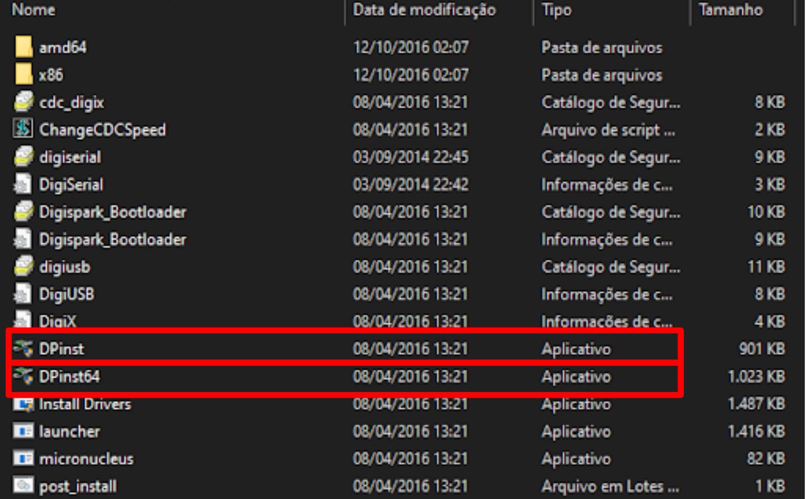
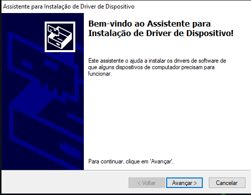
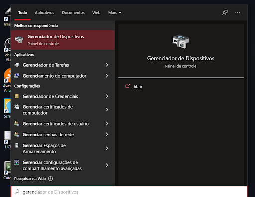
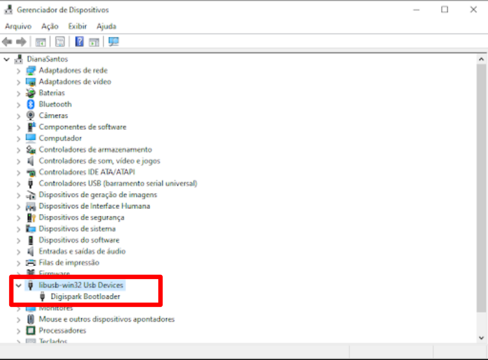

Até aqui você possui a placa pronta!

Agora precisamos instalar os drivers necessário para que a USB da Franzininho DIY possa receber os códigos através da Arduino IDE.

A seguir são apresentados os passos para correta configuração, conforme o sistema operacional usado.

## Windows

Faça o download do driver no seguinte link: https://github.com/digistump/DigistumpArduino/releases/download/1.6.7/Digistump.Drivers.zip

Descompacte.

Abra a pasta!

Dentro dela terá vários arquivos, vá até as opções abaixo:

Para Windows 32 bits execute o DPinst.exe e se tiver usando o Windows 64 bits execute o DPinst64.exe

Ao selecionar um deles dê dois cliques e irá aparecer uma janela, pressione sim, então aparecerá outra janela e clique em avançar.

Aguarde a instalação e clique em concluir!

Maravilha, agora veremos se realmente o driver foi  instalado.

Plugue seu Franzininho na USB do seu computador e abra o gerenciador de dispositivo.

Se aparecer libusb ou digispark, maravilha foi instalado com sucesso!

:::warning Não esqueça de plugar a Franzininho em seu computador, pois se não. Não irá aparecer!
:::

Fonte: http://digistump.com/wiki/digispark/tutorials/connecting

## Linux

Faça o seguinte procedimento

Linux Troubleshooting: http://digistump.com/wiki/digispark/tutorials/linuxtroubleshooting
