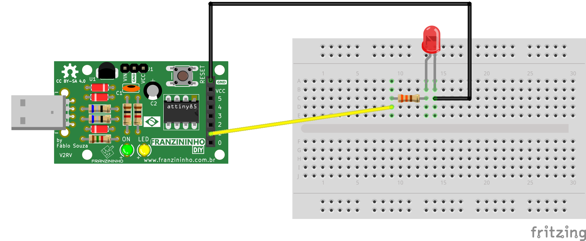

Esse exemplo exibe como controlar a intensidade de um LED usando a função analogWrite() na Franzininho DIY.


# Materiais

* Placa Franzininho;
* Protoboard;
* LED 3mm;
* Resistor 330;
* Jumpers macho/fêmea;

## Circuito

Na protoboard você pode montar o circuito para acionamento do LED da seguinte forma:



## Sketch

```cpp
/*
  Franzininho
  Exemplo: Controle Brilho de LED - PWM
  Esse exemplo exibe como controlar a intensidade de brilho de um LED usando PWM
*/

const int LED = 1; //pino para o LED
int i = 0;        //utilizaremos essa variável para contagem auxiliar

void setup() {
 pinMode(LED,OUTPUT); //configura o pino do LED como uma saída
}

void loop() {
  //faz um loop de 0 a 255 (acende gradualmente)
  for (i = 0; i<255; i++) {
    analogWrite (LED, i);  // define o brilho do LED
    delay (10); //espere 10ms, pois analogwrite é um instantâneo e não veríamos nenhuma alteração
  }

  delay(1000);

  //faz um loop de 255 a 1 (apaga gradualmente)
  for (i = 255; i > 0; i--) {  
   analogWrite(LED, i); //define o brilho do LED
   delay(10);          //aguarda 10ms
  }

  delay(1000);
}
```

:::tip Saidas PWM
Verifique no pinout da Franzininho DIY quais os pinos possuem função de saída PWM
:::

## Simulação

<iframe width="100%" height="458px"src="https://wokwi.com/arduino/projects/311359730520949312?view=diagram"></iframe>


## Video de Funcionamento

<iframe src="https://www.youtube.com/embed/0W5Dos0NHsE" title="YouTube video player" frameborder="0" allow="accelerometer; autoplay; clipboard-write; encrypted-media; gyroscope; picture-in-picture" allowfullscreen></iframe>

