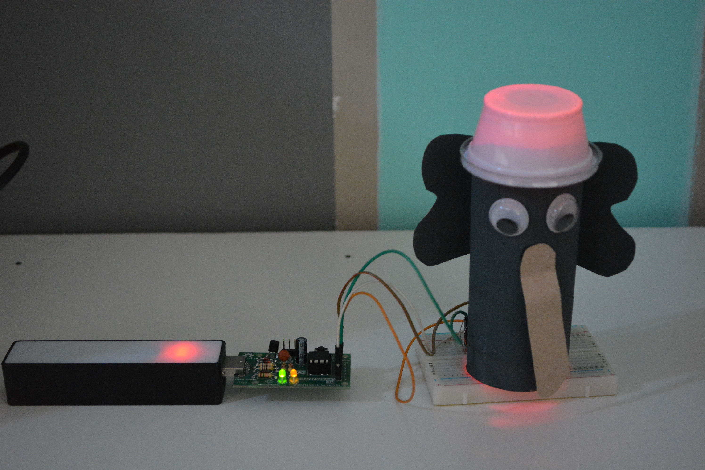
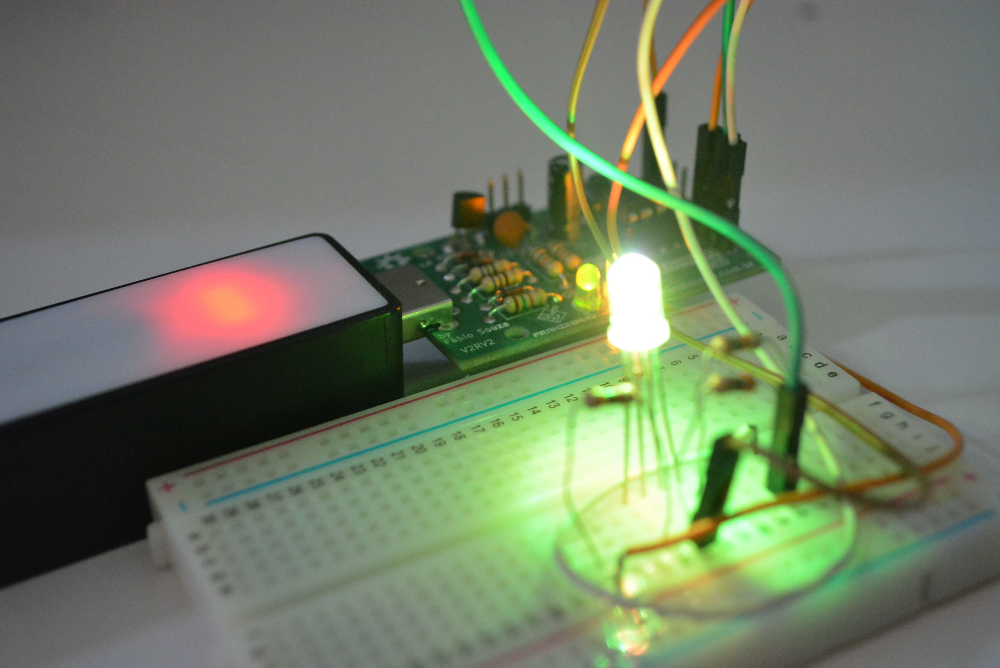
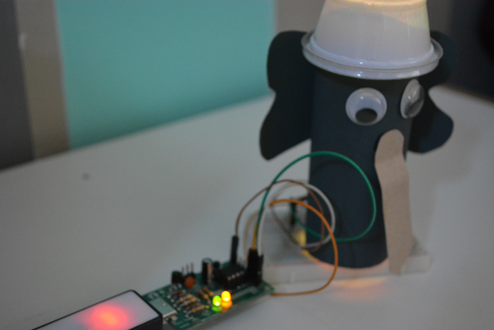

Esse exemplo exibe como usar o LED RGB para fazer uma aplicação didática. Podemos adaptar essa brincadeira com eletrônica, confira abaixo!

## Elefante colorido! Que cor?



“Elefante colorido”. É uma brincadeira característica da Região Sudeste, da cidade de São Paulo. As regras são as seguintes: uma criança é escolhida para comandar. Em roda, ela diz aos colegas: “Elefante colorido!” O grupo pergunta: “Que cor ele é?” O comandante escolhe uma cor e as crianças correm para tocar em algo que tenha a cor que o comandante escolheu.

> Com essa brincadeira podemos trabalhar diversas habilidades, como o desenvolvimento da concentração, atenção, coordenação motora, reconhecimento das cores, discriminação visual e auditiva.

### Podemos adaptar essa brincadeira com eletrônica?



Sim e o mais bacana de tudo que ela está alinhada a BNCC.

Para Educação infantil trabalhamos com o campos de Experiência:

- Traços, sons, cores e formas
- Escuta, fala, pensamento e imaginação

Para o Fundamental 1 (1° ao 5 ano):

- (EF15AR02) Explorar e reconhecer elementos constitutivos das artes visuais (ponto, linha, forma, cor, espaço, movimento etc.).
- (EF15AR26) Explorar diferentes tecnologias e recursos digitais (multimeios, animações, jogos eletrônicos, gravações em áudio e vídeo, fotografia, softwares etc.) nos processos de criação artística.



## Materiais

- 1 Placa Franzininho;
- 1 Protoboard;
- 1 LED RGB;
- 3 Resistor 1k;
- 3 Jumpers macho/fêmea

## Circuito
Na protoboard você pode montar da seguinte forma:


:::tip
Você pode montar ele fora da protoboard depois!
:::

## Código

Modo simples: utilizando apenas 3 cores: vermelho, verde e azul.

```cpp
//RGB com a Franzininho DIY

const int red = 0; 
const int green = 1; 
const int blue = 2; 

void setup() {
  // configura os pinos de cada cor como saída:
  pinMode(red, OUTPUT);
  pinMode(green, OUTPUT);
  pinMode(blue, OUTPUT);
}

void loop() {
  // aciona o LED na cor vermelha:
  digitalWrite(red, HIGH);
  digitalWrite(green, LOW);
  digitalWrite(blue, LOW);
  delay(5000); // aguarda 5000ms 
  
  // aciona o LED na cor verde:
  digitalWrite(red, LOW);
  digitalWrite(green, HIGH);
  digitalWrite(blue, LOW);
  delay(5000); // aguarda 5000ms 

  // aciona o LED na cor azul:
  digitalWrite(red, LOW);
  digitalWrite(green, LOW);
  digitalWrite(blue, HIGH);
  delay(5000); // aguarda 5000ms 
}
```

Modo avançado: Variando as cores, confira!

```cpp
const int red = 0; 
const int green = 1; 
const int blue = 2;

// variáveis para salvar a intensidade de cada cor
int valor_r = 255; // vermelho (red)
int valor_g = 0; // verde (green)
int valor_b = 0; // blue (blue)

void setup() {
  // configura os pinos de cada cor como saída:
  pinMode(red, OUTPUT);
  pinMode(green, OUTPUT);
  pinMode(blue, OUTPUT);
  
  // inicializa LED em cor vemelha  e de máxima intensidade
  analogWrite(red, valor_r);
  analogWrite(green, valor_g);
  analogWrite(blue, valor_b);
}

void loop() {
  // aumenta a intensidade do LED verde
  for (valor_g = 0; valor_g < 255; valor_g=valor_g+5){
    analogWrite(green, valor_g);
    delay(50); // aguarda 50ms 
  }
  
  // diminui a intensidade do LED vermelho
  for (valor_r = 255; valor_r > 0; valor_r=valor_r-5){
    analogWrite(red, valor_r);
    delay(50); // aguarda 50ms 
  }
  
  // aumenta a intensidade do LED azul
  for (valor_b = 0; valor_b < 255; valor_b=valor_b+5){
    analogWrite(blue, valor_b);
    delay(50); // aguarda 50ms 
  }
  
  // diminui a intensidade do LED verde
  for (valor_g = 255; valor_g > 0; valor_g=valor_g-5){
    analogWrite(green, valor_g);
    delay(50);
  }
  
  // aumenta a intensidade do LED vermelho
  for (valor_r = 0; valor_r < 255; valor_r=valor_r+5){
    analogWrite(red, valor_r);
    delay(50); // aguarda 50ms 
  }
}

```


## Simulação (modo avançado)

<iframe width="100%" height="458px" src="https://wokwi.com/arduino/projects/311376279774429761?view=diagram"></iframe>

## Video de Funcionamento

<iframe src="https://www.youtube.com/embed/t2_ay1J6TWQ" title="YouTube video player" frameborder="0" allow="accelerometer; autoplay; clipboard-write; encrypted-media; gyroscope; picture-in-picture" allowfullscreen></iframe>
