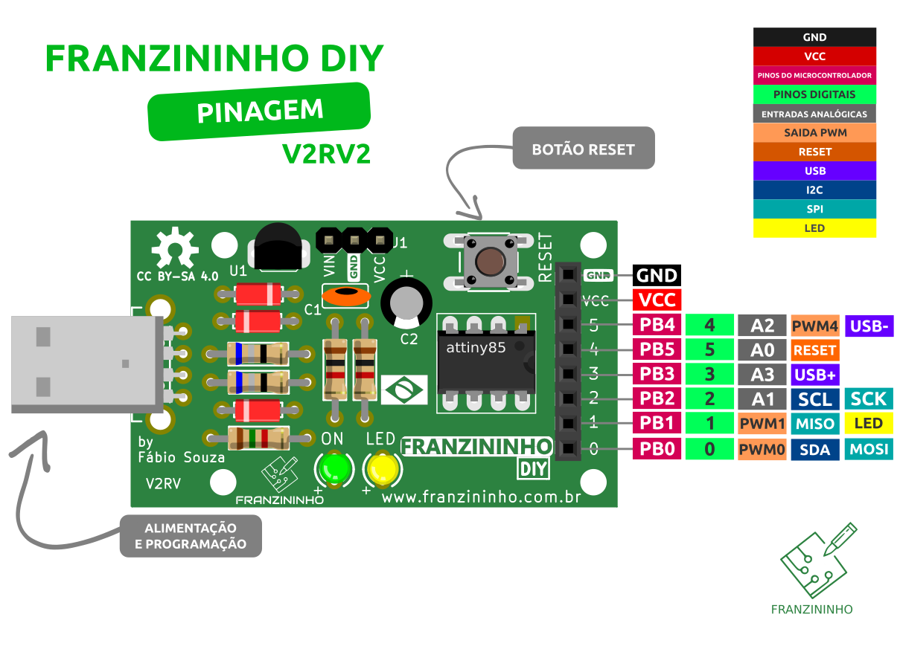
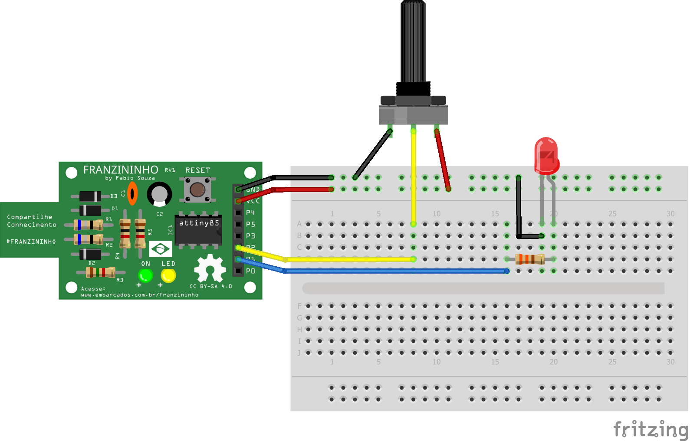

Na Franzininho DIY alguns pinos que podem ser usados como entradas analógicas:



:::warning
Devido as limitações de hardware da Franzininho DIY recomendamos apenas o uso da Entrada A1 para sinais analógicos.
As demais entradas (A0,A2,A3) devem ser usadas com cautela e analisando o circuito para ver o circuito presente no pino não atrapalhará no sinal analógico.
:::

## Função

Para a leitura de um sinal analógico no pino que possui essa função, não é necessário configurar o pino como entrada analógica. Isso é feito na função de leitura:

`int analogRead(pino)`

Lê o valor presente em um pino configurado como entrada analógica. Internamente o Arduino possui um conversor A/D de 10 bits. Dessa forma o valor retornado por esta função estará na faixa de 0 a 1023 conforme o valor presente no pino.

### Sintaxe

`analogRead(pino);`

### Parâmetros

**pino:** número do pino configurado como entrada analógica \(0,1,2,3 na Franzininho\)

### Retorno

int \(0 a 1023\)

## Exemplo

Vamos ler o valor de um potenciômetro ligado ao pino P2\(A1\) e acionar o LED quando a leitura atingir um valor definido:



```cpp
const byte LED = 1; //pino do LED
const byte POT = A1; //pino do Potenciômetro

void setup() {
  pinMode(LED,OUTPUT);
}

void loop() {

  int valor = analogRead(POT); // lê o valor do potenciômetro

  if(valor> 511){              //se valor maior que 511
    digitalWrite(LED,HIGH);    //liga LED
  }else{                       //se não
    digitalWrite(LED,LOW);     //apaga LED
  }
}
```
