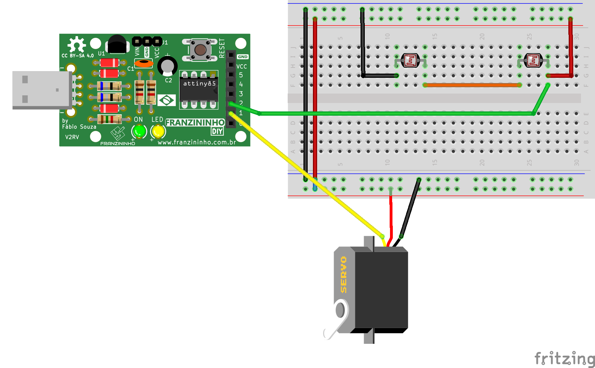

Nesse exemplo vamos fazer um girassol automatizado que se movimenta conforme a posição da luz.

## Materiais:

- Placa Franzininho DIY;
- Protoboard;
- LED 3mm;
- 1 Resistor  LDR (foto resistores 10 k)
- 1 Servo motor
- Jumpers macho/fêmea

## Circuito


No protoboard você deve inserir o foto resistores e o servo motoro, conforme a imagem abaixo:



## Código

```cpp

/*
Franzininho
Exemplo:  Girassol Automatizado
Nesse exemplo é de um girassol automatizado com dois fotos resistores,  um servo motor, entre outros materiais, confira.
*/
//

#include <Servo.h>

int sensor = A;
int servoMotor = 1;

int valorSensor =0;
int analogServo = 90;

Servo servo;

void setup() {
 servo.attach(servoMotor);
 servo.write(anguloServo);
}

void loop() {
 valorSensor = analogRead(sensor);
 if(valorSensor <512)
 {
   if(anguloServo < 170)anguloServo++;
 }
 if(valorSensor = >512)
 {
   if(anguloServo > 10)anguloServo--;
 }

servo.write(anguloServo);
delay(50);
}

```

## Video explicativo

Este projeto foi feiro para colaborar no projeto Co.Lab da Red Hat, confira esse e outros na plataforma:https://www.redhat.com/pt-br/colab-repo

### Co.Lab | Workshop: Robótica Educacional - Aprenda sobre Ciência da Natureza e Eletrônica (Parte 1)

<iframe width="100%" height="422" src="https://youtu.be/wGXmITj9mHE" title="YouTube video player" frameborder="0" allow="accelerometer; autoplay; clipboard-write; encrypted-media; gyroscope; picture-in-picture" allowfullscreen></iframe>


### Co.Lab | Workshop: Robótica Educacional - Aprenda sobre Ciência da Natureza e Eletrônica (Parte 2)

<iframe width="100%" height="422" src="https://youtu.be/ANmRyWnvq4U" title="YouTube video player" frameborder="0" allow="accelerometer; autoplay; clipboard-write; encrypted-media; gyroscope; picture-in-picture" allowfullscreen></iframe>


| Autor | Diana Santos |
|-------|--------------|
| Data: | 22/01/2022   |