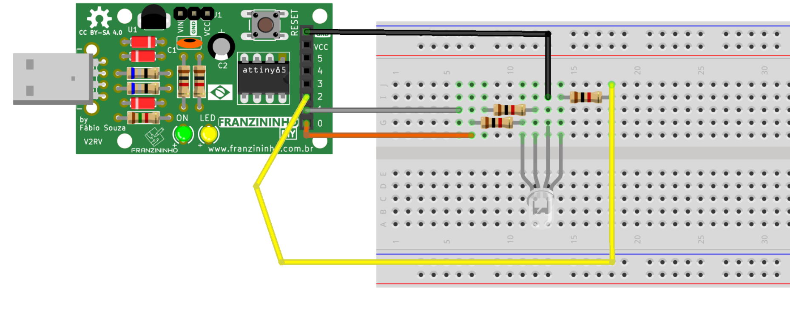

Esse exemplo aprenderemos a como ligar o LED RGB com a Franzininho DIY suas três cores.

Você pode controlar da forma que você quiser, confira o código simples que está na documentação.

Modifique, crie e compartilhe!

## Materiais

- 1 Placa Franzininho DIY;
- 1 Protoboard;
- 1 LED RGB catodo comum;
- 3 Resistor 1k
- 3 Jumpers macho/fêmea;

## Circuito

Na protoboard você pode montar da seguinte forma:



## Sketch

```cpp
//RGB com a Franzininho DIY

const int red = 0; 
const int green = 1; 
const int blue = 2; 

void setup() {
  // configura os pinos de cada cor como saída:
  pinMode(red, OUTPUT);
  pinMode(green, OUTPUT);
  pinMode(blue, OUTPUT);
}

void loop() {
  // aciona o LED na cor vermelha:
  digitalWrite(red, HIGH);
  digitalWrite(green, LOW);
  digitalWrite(blue, LOW);
  delay(5000); // aguarda 5000ms 
  
  // aciona o LED na cor verde:
  digitalWrite(red, LOW);
  digitalWrite(green, HIGH);
  digitalWrite(blue, LOW);
  delay(5000); // aguarda 5000ms 

  // aciona o LED na cor azul:
  digitalWrite(red, LOW);
  digitalWrite(green, LOW);
  digitalWrite(blue, HIGH);
  delay(5000); // aguarda 5000ms 
}
```

## Simulação

<iframe   src="https://wokwi.com/arduino/projects/311375002746225216?view=diagram"></iframe>

## Video de Funcionamento

<iframe   src="https://www.youtube.com/embed/qdJ21Qu36S0" title="YouTube video player" frameborder="0" allow="accelerometer; autoplay; clipboard-write; encrypted-media; gyroscope; picture-in-picture" allowfullscreen></iframe>
