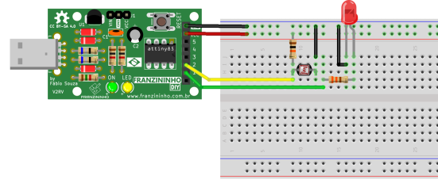

Nesse exemplo vamos ler um sensor LDR usando a entrada analógica. 

Será exibido um exemplo de funcionamento de uma fotocélula, onde ao escurecer será aceso o LED, como acontece com a luz da rua.

## Materiais

* Placa Franzininho;
* Protoboard;
* 1 Resistor 10K;
* 1 LDR\(10K\)
* Jumpers


## Circuito

Faça a seguinte ligação no protoboard:



## Sketch

```cpp
/*
  Franzininho
  Exemplo: Sensor de Luz - LDR
 Nesse exemplo vamos ler um sensor LDR usando a entrada analógica. Será exibido um exemplo de funcionamento de uma fotocélula, onde ao escurecer será aceso o LED, como acontece na luz da rua. ;)
*/
//Sensor de luz com LDR
int ledPin = 1; //Led no pino 1 - LED da placa
int ldrPin = A1; //LDR no pino analógico A1
int ldrValor = 0; //Valor lido do LDR

void setup() {
 pinMode(ledPin,OUTPUT); //define LED como Saída
}

void loop() {
 //ler o valor do LDR
 ldrValor = analogRead(ldrPin); //O valor lido será entre 0 e 1023
 //se o valor lido for maior que 800, liga o led
 if (ldrValor>= 800){
   digitalWrite(ledPin, HIGH);      //aciona saída
 } else {  // senão, apaga o led            
   digitalWrite(ledPin,LOW);        //desliga saída
 }
 delay(100);
}
```


## Simulação

<iframe width="100%" height="458px" src="https://wokwi.com/arduino/projects/311443234729493056?view=diagram"></iframe>

## Video de Funcionamento

<iframe   src="https://www.youtube.com/embed/AzypBpXO238" title="YouTube video player" frameborder="0" allow="accelerometer; autoplay; clipboard-write; encrypted-media; gyroscope; picture-in-picture" allowfullscreen></iframe>

