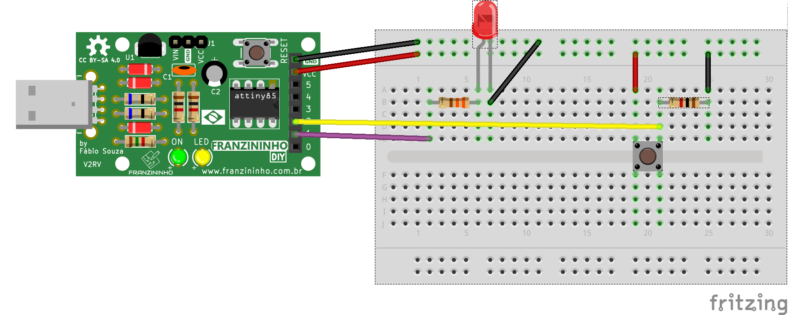

Nesse exemplo vamos fazer uma tecla liga/desliga, que pode ser usada para acionamentos diversos.

## Materiais

- Placa Franzininho;
- Protoboard;
- LED 3mm; 
- 1 Resistor 3300; 
- 1 Resistor de 1K; 
- 1 Botão; 
- Jumpers;

## Circuito

No protoboard você deve inserir o LED, resistores e o botão, conforme a imagem abaixo:



## Sketch

```cpp
/*
  Franzininho
  Exemplo: Tecla liga/desliga
  Esse exemplo exibe como fazer ligar e desligar uma saída através de uma tecla
*/
const int LED = 1; //pino para o LED
const int BOTAO = 2; //pino para o botão
int estadoAnteriorBotao = 0;   // armazena o estado anterior do botão

void setup(){
  pinMode(LED,OUTPUT); //o LED é uma saída
  pinMode(BOTAO,INPUT); //o BOTAO é uma entrada
}

void loop (){
 int estadoAtualBT= digitalRead(BOTAO);      // Lê estado do botão
 delay(10);

if ((estadoAtualBT != estadoAnteriorBotao)&& (estadoAtualBT == LOW)){       //Se o botão foi pressionado e o seu estado mudou
  digitalWrite(LED,!digitalRead(LED)); //inverte estado do LED
}
  estadoAnteriorBotao = estadoAtualBT;  //salva o estado do botão para comparar na próxima leitura
}
```

## Simulação

<iframe width="100%" height="458px" src="https://wokwi.com/arduino/projects/311373968060711489?view=diagram"></iframe>


## Video de Funcionamento

<iframe width="100%" height="422" src="https://www.youtube.com/embed/Aht0fUuGIjQ" title="YouTube video player" frameborder="0" allow="accelerometer; autoplay; clipboard-write; encrypted-media; gyroscope; picture-in-picture" allowfullscreen></iframe>

