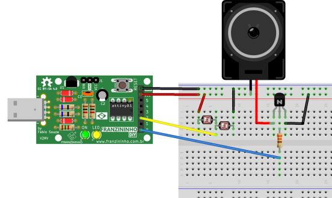

O Theremim é um instrumento musical eletrônico controlado sem contato físico. O nome vem do seu inventor, Léon Theremin, que patenteou o dispositivo em 1928.

Nesse tutorial você fará uma versão simplificada do Theremim  usando a Franzininho DIY.

## Materiais necessários

* Franzininho DIY
* 2 LDR 10K 
* BC548
* Resistor 330 R
* Alto falante 8 ohm

## Circuito



  


## Código

O código a seguir ler o valor da entrada analógica e atua na saída do speaker:

```cpp
/*
 * Theremim Franzininho
 * Autor: Fábio Souza
 * Data: 10/09/2018
 */
int speaker = 0; // pino de saída do falante
int sensor = 1;

void setup()
{
 pinMode(speaker, OUTPUT);
}

// Theremin
void loop()
{
 digitalWrite(speaker, HIGH);
 delayMicroseconds(analogRead(sensor)<<2);
 digitalWrite(speaker, LOW);
 delayMicroseconds(analogRead(sensor)<<2);
}
```

## Simulação

<iframe width="100%" height="458px" src="https://wokwi.com/arduino/projects/311445334890906178?view=diagram"></iframe>

## Video de Funcionamento

<iframe   src="https://www.youtube.com/embed/l1MmqiYB4GI" title="YouTube video player" frameborder="0" allow="accelerometer; autoplay; clipboard-write; encrypted-media; gyroscope; picture-in-picture" allowfullscreen></iframe>

