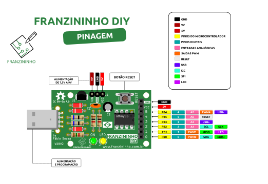

## Introdução

No exemplo anterior conhecemos os registradores responsáveis pela configuração e manipulação dos pinos de I/O. Nesse exemplo vamos concentrar no uso dos pinos como entradas digitais.

Ao final, você saberá como ler sinais digitais externos a Franzininho DIY.

## Recursos Necessários
- Placa Franzininho DIY(com Micronucleus)
- Chave Tactil
- Jumpers
- Computador com as ferramentas de software instaladas

## Entrada Digital

Uma entrada digital é capaz de ler nível alto (5V) e nível baixo(0V) em sua entrada. Essa funcionalidade é usada para ler estado de botões, sensores, e dispositivos que em suas saídas apresentam 2 estados.

Quando o pino é configurado como entrada digital ele é colocado em um estado de alta impedância, equivalente a um resistor de 100 MegaOhms em série com o circuito a ser monitorado. Dessa forma, o pino absorve uma corrente muito baixa do circuito que está monitorando. Devido a essa característica de alta impedância, quando um pino colocado como entrada digital ele fica flutuando (sem ligação definida), o nível de tensão presente nesse pino fica variando não podendo ser determinado um valor estável devido ao ruído elétrico e até mesmo capacitância de entrada do pino. Para resolver esse problema é necessário colocar um resistor de pull up (ligado a +5V) ou um resistor de pull down (ligado a GND) conforme a necessidade. Esses resistores garantem nível lógico estável quando, por exemplo uma tecla não está pressionada. Geralmente utiliza-se um resistor de 10K para esse propósito. A seguir é exibida a ligação desses resistores no circuito para leitura de tecla:


É possível habilitar o resistor de pull up interno, isso mesmo, o Attiny85 possui resistores de pull-up internos (20 Kilohms) que facilitam a ligação de teclas, sensores sem a necessidade de conectar externamente um resistor de pull-up. A habilitação desses resistores é feita de maneira simples via software. Vamos ver isso mais adiante.

### Algumas Particularidades do circuito da Franzininho DIY

Os pinos de I/O são marcados em Amarelo no Pinout da Franzininho DIY



- O pino PB5 é configurado como RESET na Franzininho DIY, sendo assim não poderemos usá-lo como I/O.
- Os pinos PB3 e PB4 são usados para o circuito da USB, sendo assim temos que usá-los com cautela. Geralmente esses pinos são usados apenas como saídas digitais.
- O LED amarelo da placa está ligado ao pino PB1.
- Os pinos PB0 E PB2 não possuem circuito ligados a eles.

## Registradores responsáveis pelos pinos de I/O

Para trabalhar com os pinos de I/O no ATtiny85 temos 3 registradores:
- PORTB: Registrador de dados. Responsável pela escrita nos pinos;
- DDRB: Registrador de direção do pino. Responsável pela configuração dos pinos para definir se será entrada ou saída;
- PINB: Registrador de entrada da porta. Responsável pela leitura do estado do pino.

Note que todos os registradores terminam com B no final. Isso significa que estamos trabalhando com o PORTB. Caso fosse um microcontrolador com maior quantidade de pinos teríamos os finais A, B,C, etc. Cada porta só possui no máximo 8 pinos.

Na seção 10 do datasheet do ATtiny85 temos todos os detalhes para se trabalhar com os I/O. A tabela a seguir, retirada do datasheet, exibe as configurações possíveis para os pinos:


A figura abaixo exibe os registradores responsáveis pelos pino de I/O do PORTB:


Conforme exibido acima, para configurar um pino como entrada digital deve-se configurar o bit DDRBx correspondente ao pino em 0. Se quiser habilitar o pull up para esse deve-se escrever 1 no bit PORTBx correspondente ao pino. A leitura do estado do pino é feita através do registrador PINBx.

Vamos verificar um exemplo para fazer a leitura de um botão externo e ligar o LED da Franzininho DIY.

## Circuito


## Código

```c
#include <avr/io.h>
#include <util/delay.h>

#define F_CPU 16500000L

// Macros
#define setBit(valor,bit) (valor |= (1 << bit))
#define clearBit(valor,bit) (valor &= ~(1 << bit))
#define toogleBit(valor,bit) (valor ^= (1 << bit))
#define testBit(valor,bit) (valor & (1 << bit))

int main(void)
{
    setBit(DDRB, PB1);         // Configura Pino PB1 como saída (Pino do LED)
    clearBit(DDRB, PB0);       // Configura pino PB0 como entrada (pino do Botão)
    setBit(PORTB, PB0);        // Habilita pull up para a entrada PB0
                               // Lógico 1 quando botão não estiver pressionado
    while (1)
    {
        if (!testBit(PINB, PB0))  // Faz a leitura do botão - Se pressionado
        {
            setBit(PORTB, PB1);   // Liga o LED 1
        }
        else
        {
            clearBit(PORTB, PB1); // Desliga o LED 1
        }
    }

    return (0);
}
```

O exemplo exibiu como configurar os pinos, note que tivemos que configurar um pino como saída, para o LED e outro como entrada, para o botão. Note que foi usado o pull up interno.

O uso de macros facilitou a manipulação dos bits nos registradores. Recomendo que se você leia esse artigo para entender sobre as macros e as operações efetuadas: https://www.embarcados.com.br/bits-em-linguagem-c/

Para leitura do estado do pino, ou seja, se o botão está solto ou pressionado, fazemos um teste a cada iteração no loop infinto. Quando o botão é pressionado o nível logico no pino vai para 0 e quando solto permanece em 1. Conforme o teste 0 liga o LED e 1 apaga o LED.

Assim, o funcionamento será:
- Botão Solto = LED apagado
- Botão Pressionado = LED Aceso

Bacana, não?

## Desafio

Faça com com que o LED mude estado e permaneça ao soltar o botão, funcionando como uma tecla liga/desliga.

| Autor | [Fábio Souza](https://github.com/FBSeletronica) |
|-------|-------------|
| Data: | 24/04/2021  |
