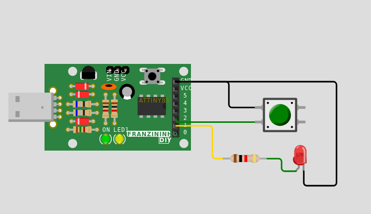

As interrupções externas permitem que o microcontrolador interrompa sua execução de tarefas regulares para executar uma tarefa de prioridade mais alta quando ocorre um evento externo. Isso pode ser útil em aplicações que requerem resposta rápida a eventos externos, como pressionar um botão ou receber um sinal de outro dispositivo.

A configuração de uma interrupção externa no ATTINY85 envolve a definição do pino que será usado como fonte de interrupção, a configuração do nível lógico que causará a interrupção e a definição da rotina de interrupção que será executada quando a interrupção for acionada.

Ao programar a Franzininho DIY (ATTINY85) com a biblioteca avrlibc, você pode facilmente configurar interrupções externas usando funções da biblioteca como sei() e cli(). Além disso, a avrlibc oferece muitas outras bibliotecas úteis para o ATTINY85, tornando o processo de programação mais fácil e eficiente.


## Recursos Necessários
- Placa Franzininho DIY(com Micronucleus)
- Chave Tactil
- Jumpers
- Computador com as ferramentas de software instaladas


## Circuito



## Código
```c
/**
 * 
 * @file main.c
 * @author Fábio Souza
 * @brief Exemplo para leitura de botão e acionamento de LED
 * @version 0.1
 * @date 2021-02-03
 * 
 * @copyright Franzininho 
 * This example code is in the Public Domain (or CC0 licensed, at your option.)
 * Unless required by applicable law or agreed to in writing, this
 * software is distributed on an "AS IS" BASIS, WITHOUT WARRANTIES OR
 * CONDITIONS OF ANY KIND, either express or implied.
 * 
 */

#include <avr/io.h>
#include <avr/interrupt.h>

#define F_CPU 16500000L
 	
//Macro auxiliares para manipulação de bits   
#define setBit(valor,bit) (valor |= (1<<bit))
#define clearBit(valor,bit) (valor &= ~(1<<bit))
#define toogleBit(valor,bit) (valor ^= (1<<bit))
#define testBit(valor,bit)    (valor & (1<<bit))

// define o pino que o botão está conectado
#define BUTTON_PIN PB2
// define o pino que o LED está conectado
#define LED_PIN PB1


ISR (INT0_vect)        // Interrupt service routine 
{
  toogleBit(PORTB,LED_PIN);
}

int main()
{
  setBit(DDRB,LED_PIN); 	    // Configura Pino PB1 como saída (Pino do LED)
  clearBit(DDRB,BUTTON_PIN); //configura pino PB0 como entrada (pino do Botão)
  setBit(PORTB,BUTTON_PIN);  //habilita pull up para a entrada PB0 - garante nivel 
                             // lógico 1 quando botão não estiver pressionado
  
  setBit(GIMSK,INT0);        // Ativa a interrupção externa INT0
  setBit(MCUCR,ISC01);       //configura borda de descida
  sei();                     // Habilita as interrupções globais

  while(1)
  {

  }
   
   return 0;
}
```

# Simulação

<iframe width="100%" height="458px" src="https://wokwi.com/projects/355838633796327425?view=diagram"></iframe>

## Desafio

Faça com com que o LED ligue ao pressionar o botao e desligue quando soltar. Para isso você preciará configurar a interrução na borda de subinda.

| Autor | [Fábio Souza](https://github.com/FBSeletronica) |
|-------|-------------|
| Data: | 05/02/2023  |