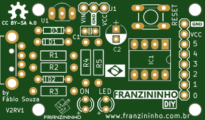

# Identificando os componentes

## Placa de Circuito impresso

A placa de circuito impresso é responsável por receber todos os componentes. Ela pode ser feita de fibra de vidro ou fenolite. Para a Franzininho DIY foi desenvolvido um projeto em face simples, o que permite a fabricação caseira.

Na parte superior da placa \(TOP\) há os desenhos dos componentes, indicando a posição de cada um. Os componentes são encaixados em seus respectivos locais e depois são soldados através da parte inferior \(Bottom\).

## Resistores

Os resistores são componentes passivos que se opõem à passagem de corrente elétrica no circuito. Existem diversos tipos de resistores disponíveis. Na Franzininho DIY usamos resistores de carbono de 1/4 W. Os anéis coloridos indicam o valor e tolerância do resistor.

Fonte: [http://blog.render.com.br/eletronica/como-calcular-o-valor-de-um-resistor/](http://blog.render.com.br/eletronica/como-calcular-o-valor-de-um-resistor/)

Na Franzininho usamos 5 resistores, com as seguintes referências e valores:

- R1 e R2 - 68 R \(Azul, Cinza, Preto, Dourado\)

- R3 - 1K5 \(Marrom, Verde, Vermelho, Dourado\)

R4 e R5 - 1K \(Marrom, Preto, Vermelho, Dourado\)

## Capacitores

Capacitores são dispositivos elétricos capazes de armazenar carga elétrica em um campo elétrico. Na Franzininho temos 2 tipos de capacitores:

C1 - Capacitor Cerâmico 100 nF x 50 V

C2 - Capacitor eletrolítico 10uF x 35V

## LEDs

O LED \(Light Emitting Diode\) é usado para a emissão de luz em locais e instrumentos onde se torna mais conveniente a sua utilização no lugar de uma lâmpada.

Na Franzininho são usados dois leds difusos de 3 mm

ON - LED Verde, LED - LED Amarelo

## Chave táctil

É um botão de contato momentâneo. Na Franzininho usamos uma chave táctil NA \(normalmente aberta\) de 4,3 x 6 x 6 mm que tem a função de botão de Reset.

Chave - RESET

## Soquete

O soquete é usado para o encaixe de circuitos integrados, facilitando a sua troca na placa.

Na Franzininho usamos um soquete de 8 pinos para acomodar o Microcontrolador attiny85

IC1 - Soquete

## Barra de pinos

São usadas para expansão de pinos e entrada de alimentação na placa. Na Franzininho usamos 3 vias para o conector de alimentação e 8 vias para o conector de expansão da placa

* J1 - Barra de 3 pinos
* P0, P1...GND - Barra de 8 pinos

## Regulador de Tensão

Usado para abaixar a tensão de entrada para um nível em que o circuito possa trabalhar. Na Franzininho usamos um regulador de tensão de 5V, o 78L05

IC2 - 78L05 - Regulador de tensão 5V

## Conector USB

Usado para conectar a placa ao computador ou a um circuito de alimentação com conector USB. Na Franzininho usamos um Conector USB Macho 90º com trava

## ATtiny85

É o cerebro da Franzininho DIY e o componente mais caro. Tenha cuidado na hora de encaixar no soquete. Siga as orientações de montagem.

