Passo a passo da montagem da Franzininho DIY V2RV2

### Antes de colocar a mão na massa

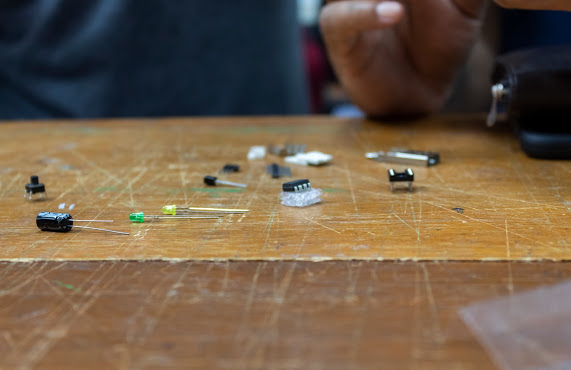

Antes de tudo você deve preparar o ambiente, separando as ferramentas necessárias para a soldagem. Vamos precisar de:

- Ferro de solda;
- Estanho
- Alicate de corte diagonal para eletrônica;
- Óculos de proteção;

Você também deve separar os componentes para facilitar na hora de soldar. Você encontra os componentes na [lista de materiais](https://franzininho.github.io/docs-franzininho-site/docs/franzininho-diy/lista-de-materiais). Tudo organizado, então vamos lá?!

### Montando a Versão V2RV2

De início você terá uma placa sem componentes, conforme a imagem abaixo:

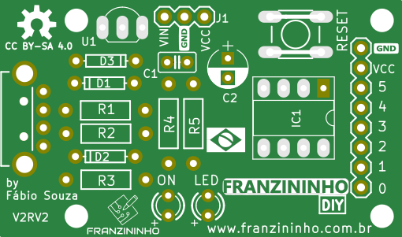

:::tip Sequência de montagem
Você deve sempre começar pelos componentes baixos. Siga a sequência recomendada abaixo.
:::

### Diodo 1N1448

O primeiro componente a ser colocado é o diodo 1N4148 no **D3**.

:::caution Atenção
Cuidando com a polaridade do diodo. A faixa preta do diodo deve ser colocada conforme o desenho do componente na placa.
:::

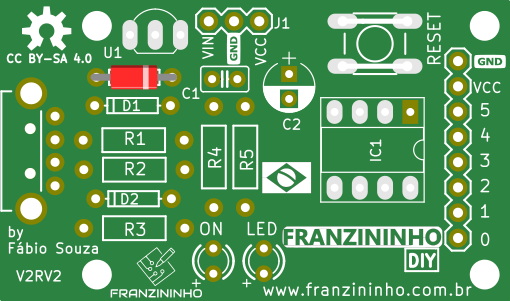 

### Diodos Zener (3V6)

Temos dois diodos zeners que deverão ser colocados nas referências **D1** e **D2**. 

:::caution Atenção
Cuidando com a polaridade do diodo. A faixa preta do diodo deve ser colocada conforme o desenho do componente na placa.
:::

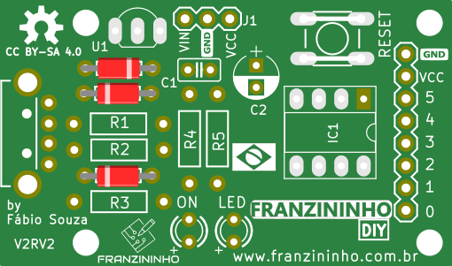 

### Resistores de 68R

Nas referências **R1** e **R2** você irá colocar os resistores de 68R que são representado pelas cores (azul, cinza, preto e dourado).

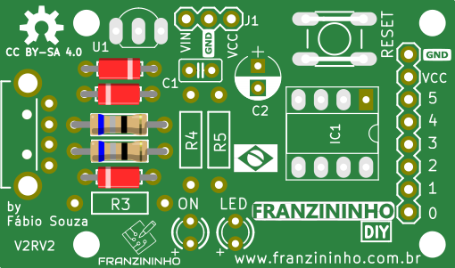  
 
### Resistor 1k5

Em **R3** deve-se colocar o resistor 1k5 que é representado nas cores (marrom, verde, vermelho e dourado).
 
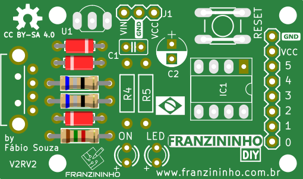 
 
### Resistores 1k
 
Resistores de 1k que são representados nas cores (marrom, preto, vermelho e dourado) devem ser colocados em **R4** e **R5**.
 
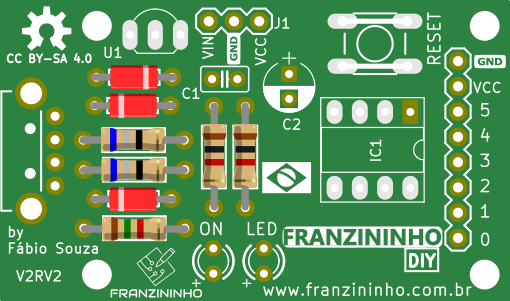  
  
### Soquete 8 pinos

O soquete deve ser colocado no **IC1** que traz a facilidade do encaixe do Attiny85.

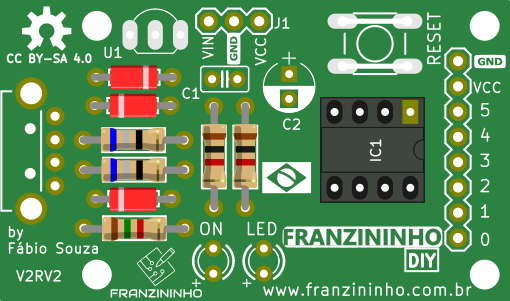 
  
### Chave táctil

  A chave você consegue colocar apenas em uma posição, então é só encaixá-la onde está localizada como **RESET**.
  
  
  
### Capacitor Cerâmico

No **C1** você irá colocar o capacitor cerâmico.  
  
  
    
### LED Verde  

O LED verde deve ser colocado no **ON**.  

:::tip Fique atento a polaridade dos terminais dos LED. 
:::

**Terminal maior (positivo) - Terminal menor (negativo)** 

    
    
    
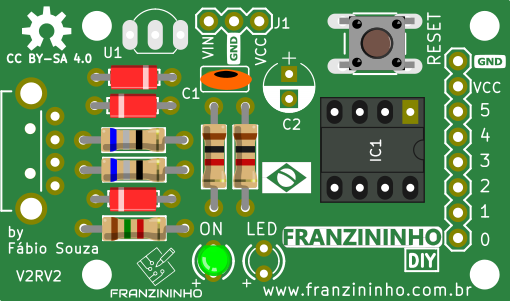  
    
### LED Amarelo 

O LED amarelo deve ser colocado no **LED**. 
    
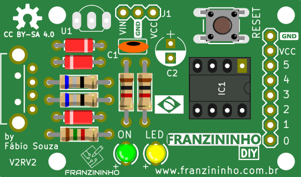  
    
### Regulador de tensão  
    
No **IC2** você deve colocar o regulador. Ele tem 3 terminais e deve ser colocado conforme o desenho na placa.
 
  
 
### Barra de 3 pinos

Em **UI**, onde está indicado com **VIN, GND, VCC**, você irá colocar a barra com três pinos.

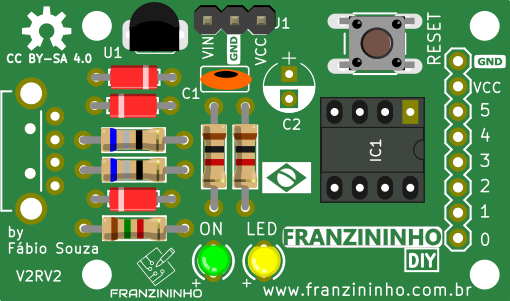  
 
### Barra de 8 pinos

Deverá ser colocada onde estão indicados **(GND, VCC, P6, ..., P1,P0)**

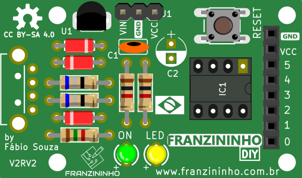 
 
### Capacitor eletrolítico

Agora vamos colocar o capacitor eletrolítico em **C2**.

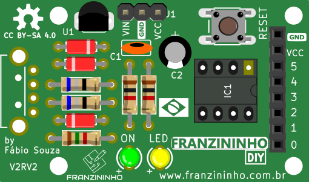 
 
### Conector USB

Quase lá! Iremos agora colocar o conector USB, conforme o encaixe dele.

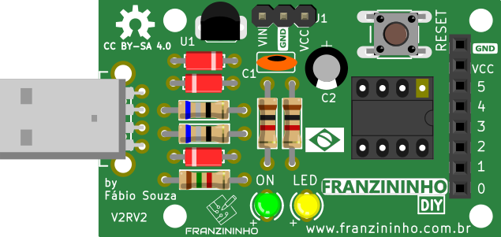 

### Attiny85

Por último iremos colocar o microcontrolador ATtiny85 no soquete de 8 pinos.

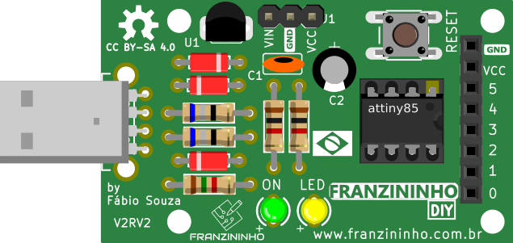 

Pronto!

Sua Franzininho versão V2RV2 está montada, agora é só programar e criar vários projetos.

