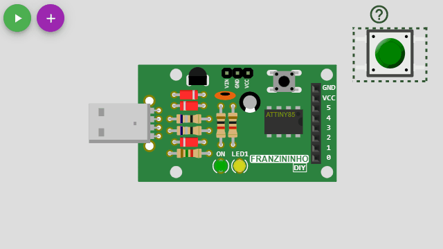

Wokwi é um simulador online para Arduino e Eletrônica. Foi desenvolvido para makers, por makers.

Você pode usar o Wokwi para aprender a programar o Franzininho DIY, criar protótipos de suas idéias, e compartilhar seus projetos com outros makers.

<div style={{textAlign: 'center'}}>

[](https://wokwi.com/arduino/new?template=franzininho)

</div>

:::tip Dica
Use o Template do Franzininho DIY clicando na imagem acima para começar um novo projeto no Wokwi.
:::

## Primeiros passos

Vamos começar o nosso programa acendendo o `LED1` do Franzinino DIY no simulador, para isso copie ou digite o código abaixo no editor do Wokwi conforme imagem abaixo.

<div style={{textAlign: 'center'}}>


</div>

### Código do exemplo 1

```cpp
const byte LED1 = 1;

void setup() {
  pinMode(LED1, OUTPUT);     // Configura como pino de saída digital
}

void loop() {
  digitalWrite(LED1, HIGH);  // Acende o LED interno
  delay(1000);               // Aguarda um segundo
  digitalWrite(LED1, LOW);   // Apaga o LED interno
  delay(1000);               // Aguarda um segundo
}
```

Em seguida, vamos executar o nosso programa clicando no botão verde conforme a imagem abaixo.

<div style={{textAlign: 'center'}}>


</div>


## Peças

Vamos chamar os novos módulos ou componentes de ***peças***, que seriam como por exemplo, as peças de um jogo de montagem, onde vamos adicionando cada uma para depois fazermos as ligações entre elas.

Cada projeto de simulação contém um arquivo [diagram.json](#saiba-mais) localizado no editor de código. Este arquivo define as peças
que serão usadas para a simulação, suas propriedades e as conexões entre os componentes.

O editor de diagramas fornece uma maneira interativa de editar seu diagrama: adicionando peças à simulação e definindo as conexões entre elas.


### Adicionando uma nova peça

Para adicionar uma nova peça, clique no botão ***roxo "+"*** na parte superior do editor de diagramas.

Você verá um menu com uma lista de peças que você pode adicionar. Escolha uma peça para adicioná-la. A peça será adicionada na posição (0, 0), e então você pode arrastá-la para a posição desejada, conforme imagem abaixo.


<div style={{textAlign: 'center'}}>


</div>

### Rotacionando uma peça

Gire uma peça clicando nela (para selecioná-la) e pressionando "R". A peça girará 90 graus no sentido horário. Se você precisar girar uma peça
com um valor diferente (por exemplo, 45 graus), você pode conseguir isso editando o arquivo [diagram.json](#saiba-mais) no editor de código.

### Removendo uma peça

Exclua uma peça clicando nela (para selecioná-la) e em seguida pressionando a tecla Delete.

## Ligações

### Criação de uma ligação entre as duas peças

Para criar um ***novo fio*** entre duas peças, clique em um dos pinos que deseja conectar. Em seguida, clique no segundo pino (alvo). Isso criará o fio.

<div style={{textAlign: 'center'}}>



</div>

Se quiser que o fio vá de uma maneira específica, você pode guiá-lo clicando para onde deseja que ele vá após selecionar o primeiro pino.

Para cancelar um novo fio (exclua-o sem selecionar um pino de destino), clique com o botão direito do mouse ou pressione Escape.


Para excluir uma ligação apenas clique com o botão esquerdo do mouse no fio que ele será removido.

<div style={{textAlign: 'center'}}>


</div>


### Ligação entre os fios

Para fazer mais de uma ligação na mesma peça, apenas arraste o fio até o pino da peça, conforme a imagem abaixo.

<div style={{textAlign: 'center'}}>


</div>

:::caution Atenção
Cuidado para não clicar em cima de um fio existente ao arrastar o segundo fio e removê-lo sem querer. Procure sempre clicar em cima do pino da peça.
:::


### Código do exemplo 2

```cpp
const byte BUTTON = 0;
const byte LED1 = 1;

int buttonState = 0;

void setup() {
  pinMode(LED1, OUTPUT);      // Configura como pino de saída digital
  pinMode(BUTTON, INPUT);     // Configura como pino de entrada
}

void loop() {
  // Lê o estado do botão
  buttonState = digitalRead(BUTTON);

  // Verifica se está pressionado
  if (buttonState == LOW) {
    digitalWrite(LED1, HIGH); // Acende o LED interno
  } else {
    digitalWrite(LED1, LOW);  // Apaga o LED interno
  }
}
```

### Mudando a cor de um fio

A cor dos novos fios é determinada automaticamente pela função do pino: os fios que começam nos pinos de aterramento são pretos e os outros fios são verdes.

O editor interativo não oferece suporte para definir a cor dos fios. Você pode, no entanto, alterar a cor de qualquer fio editando o diagram.json, [saiba mais](#saiba-mais).


## Atalhos do teclado

A tabela a seguir resume os atalhos do teclado:

| Tecla  | Função                                  |
| ------ | --------------------------------------- |
| -      | Reduz o zoom                            |
| +      | Aumenta o zoom                          |
| R      | Gira a peça selecionada                 |
| Delete | Remove a peça selecionada               |
| ?      | Abre a documentação da peça selecionada |
| Escape | Cancela o fio (no modo de fiação)       |

Usuários do Firefox: se os atalhos do teclado não funcionarem, certifique-se de que a configuração "Pesquisar texto ao começar a digitar" esteja desabilitada.

## Desfazer / Refazer

Qualquer mudança que você fizer no editor interativo também se refletirá em [diagram.json](#saiba-mais).

O editor interativo **não tem** o recurso de desfazer no momento (há uma [solicitação aberta para isso](https://github.com/wokwi/wokwi-features/issues/77)).

Você ainda pode obter o histórico completo de Desfazer se selecionar a guia "diagram.json" no editor de código. Quaisquer alterações feitas no editor de diagramas interativo
refletirá imediatamente no editor de código e você poderá desfazê-los clicando no editor de código e pressionando Ctrl+Z.

Observe que isso só funciona se a guia "diagram.json" estiver ativa enquanto você faz alterações. Esta é uma solução temporária até implementarmos o Desfazer no editor de diagramas interativo.

## Saiba mais

Caso queira saber mais sobre outras funcionalidades do simulador, dê uma olhada na lista abaixo. Você pode também consultar as peças na lista de [Referência do Diagrama](https://docs.wokwi.com/pt-BR/), disponível na documentação do Wokwi.

- [Formato do diagram.json](https://docs.wokwi.com/pt-BR/diagram-format)
- [Teclas de Atalho do Editor](https://docs.wokwi.com/pt-BR/keyboard-shortcuts)
- [O Monitor Serial](https://docs.wokwi.com/pt-BR/guides/serial-monitor)
- [Usando o GDB no Wokwi](https://docs.wokwi.com/pt-BR/gdb-debugging)
- [Guia do Analisador Lógico](https://docs.wokwi.com/pt-BR/guides/logic-analyzer)
- [Lista completa das Bibliotecas Arduino](https://docs.wokwi.com/pt-BR/guides/libraries), atualmente disponíveis no Wokwi.

## Exemplos no Simulador

- [Pisca LED](https://wokwi.com/arduino/projects/301693553069785610)
- [Dado eletrônico](https://wokwi.com/arduino/projects/304646764687786560)
- [Sensor de Temperatura NTC](https://wokwi.com/arduino/projects/301751077214093834), usando Termistor NTC e SSD1306.
- [Sensor de Umidade e Temperatura Digital](https://wokwi.com/arduino/projects/301745949656482317), com DHT22 e SSD1306.
- [Sensor Ultra-sônico](https://wokwi.com/arduino/projects/302020345098928648), usando 74HC595 e HC-SR04.
- [Controle de posição Servo Motor](https://wokwi.com/arduino/projects/302291615188255242), com um Motor Micro Servo e um LCD1602.
- [Contador de pulsos externos](https://wokwi.com/arduino/projects/302199144424931848)
- [Relógio](https://wokwi.com/arduino/projects/301738586036765194), usando dois 74HC595 e RTC DS1307.
- [Letreiro](https://wokwi.com/arduino/projects/304826828859638336), com quatro MAX7219, um RTC DS1307 e um sensor DHT22.
- [LCD 4 bits com 74HC595](https://wokwi.com/arduino/projects/313076832346833472)
- [Simulação de 6 portas lógicas com Franzininho DIY](https://wokwi.com/arduino/projects/311202006419112513)
- [LED Bar Graph](https://wokwi.com/arduino/projects/310022133947302466)
- [LED RGB ](https://wokwi.com/arduino/projects/306670612160447042)
- [Simon Game](https://wokwi.com/arduino/projects/311426763532010048)
- [Semáforo](https://wokwi.com/arduino/projects/301931601583931913)
- [Painel de senhas para atendimento](https://wokwi.com/arduino/projects/314180422625919552)