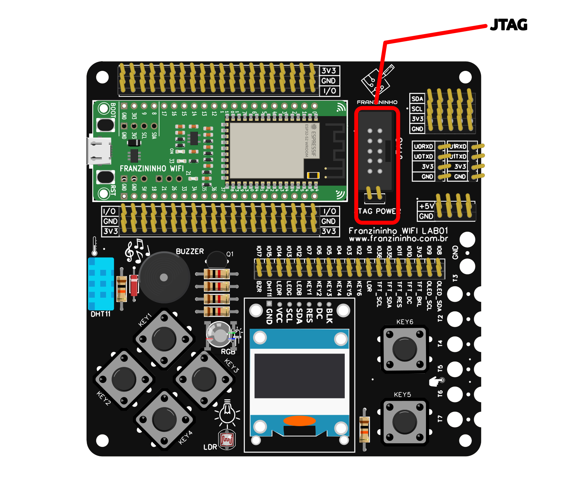

A Franzininho WiFi LAB01 é uma placa de expansão para a placa [Franzininho WiFi](https://embarcados.com.br/franzininho-wifi/), com a proposta de ser um laboratório para auxiliar no ensino e aprendizagem do ESP32, com base na Franzininho WiFi. Ela vem com diversos recursos onboard que facilitam o desenvolvimento de atividades e experiencias.

Nesse material você encontra os detalhes do hardware da Franzininho WiFi LAB01.

Saiba mais sobre a Franzininho WiFi: [Placa Franzininho WiFi](https://docs.franzininho.com.br/docs/franzininho-wifi/franzininho-wifi)

## Franzininho WiFi LAB01

A placa Franzininho WiFi LAB01 foi desenvolvida para facilitar o ensino e aprendizagem em diversos níveis e abordagens com a Franzininho WiFi.

Essa placa é o laboratório base para os exemplos apresentados com a Franzininho WiFi sendo usada em oficinas, workshops e formações em diversos níveis de abordagem, desde iniciantes até desenvolvedores experientes.

### Recursos da Franzininho WiFi LAB01

- Conector para placa Franzininho WiFi
- 6 chaves tácteis
- Conector para display IPS 240×240 ST7789
- Conector para display OLED 0.96 SSD1306
- DHT11
- LDR
- LED RGB
- BUZZER
- Expansões:
    - 5 x I2C
    - 2 UARTs
    - Alimentação (5V, GND)
    - 6x Conector para garras jacarés (TOUCH, entrada DIGITAL)
    - Todos os I/Os da Franzininho WiFi
- JTAG
- Possibilidade de desabilitar/habilitar recursos para uso dos I/Os por outro recurso

### Resumo dos recursos da placa

### Esquemático

## Licença

A **Franzininho WiFi LAB01** é um projeto open source e está disponível sob a licença **CERN Open Hardware License**.

O projeto, criado em fevereiro de 2022 no **EasyEDA**, está disponível em: [https://oshwlab.com/fabiosouza/shield-franzininho-wifi](https://oshwlab.com/fabiosouza/shield-franzininho-wifi).

## Usando os pinos de expansão da placa

A placa Franzininho WiFi LAB01 foi pensanda para o uso dos recursos existentes na placa e também dando a possibilidade para adicionar recursos externos. Por exemplo, se voce precisar adicionar um rele para acionamento de potência, ou outro sensor, você pode usar os pinos de expansão da placa.

Caso o pino da Franzininho WiFi que voce queira usar esteja sendo usado por um dos recursos onboard da placa, voce pode desabilitar através dos jumper correspondente:

Além disso, ela possui alguns barramentos de comunicações que facilitam a conexão de módulos externos. É posivel ligar 5 módulos I2C e 2 UARTs#

## Mapa de pinos Franzininho vs Recurso onboard

| Pino | Recurso      |
|------|--------------|
| I01  | LDR          |
| I02  | BT6          |
| IO3  | BT5          |
| IO4  | BT4          |
| IO5  | BT3          |
| IO6  | BT2          |
| IO7  | BT1          |
| IO8  | OLED_SDA     |
| IO9  | OLED_SCL     |
| IO10 | TFT_DC       |
| IO11 | TFT_RES      |
| IO12 | LED AZUL     |
| IO13 | LED VERDE    |
| IO14 | LED VERMELHO |
| IO15 | DHT11        |
| IO17 | BUZZER       |
| IO35 | TFT_SDA      |
| IO36 | TFT_scl      |

## JTAG

A Franzininho WiFI LAB01 possui conector para JTAG compatível com o [ESP-PROG](https://docs.espressif.com/projects/espressif-esp-dev-kits/en/latest/other/esp-prog/user_guide.html)

## Como Programar?

Conforme apresentado no artigo “[Como programar a Franzininho WiFi? Descubra agora mesmo!](https://embarcados.com.br/como-programar-a-franzininho-wifi/)“, a Franzininho WiFi pode ser programada de diversas formas, entre elas as mais comuns são:

- ESP-IDF, Arduino, CircuitPython e MicroPython

### Exemplos de código:

- Arduino: [https://github.com/Franzininho/Franzininho-WiFI-LAB01-Arduino](https://github.com/Franzininho/Franzininho-WiFI-LAB01-Arduino)
- CircuitPython: tbd
- MicroPython: tbd
- ESP-IDF: tbd

## Onde adquirir a placa?

Entre em contato para verificar a disponilidade e canais de compra.

Se você quiser equipar o laboratório da sua instituição com essa placa, entre em contato conoscopara condições comerciais.

Contato: fabio.souza@embarcados.com.br
