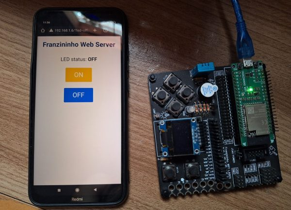
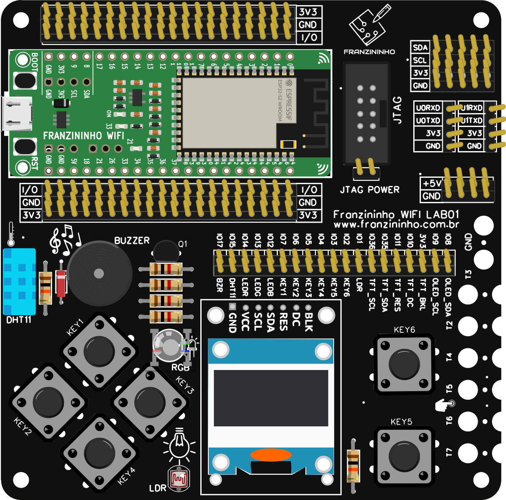
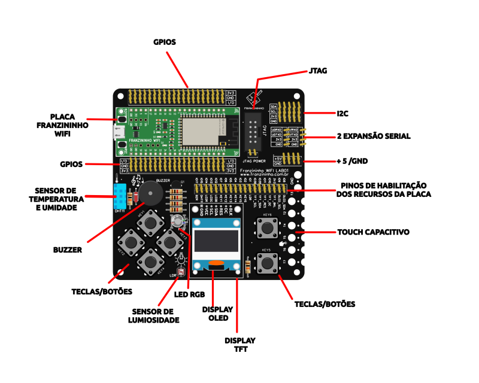
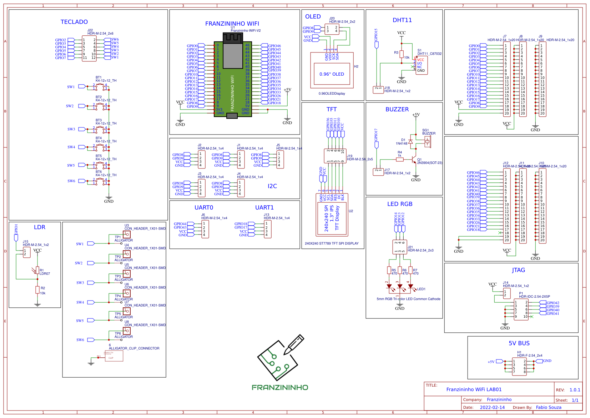
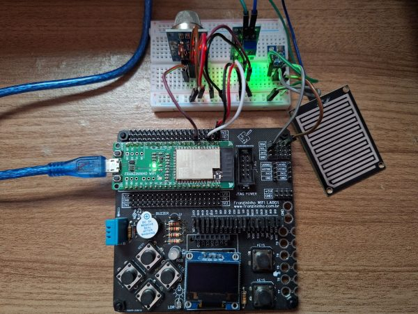
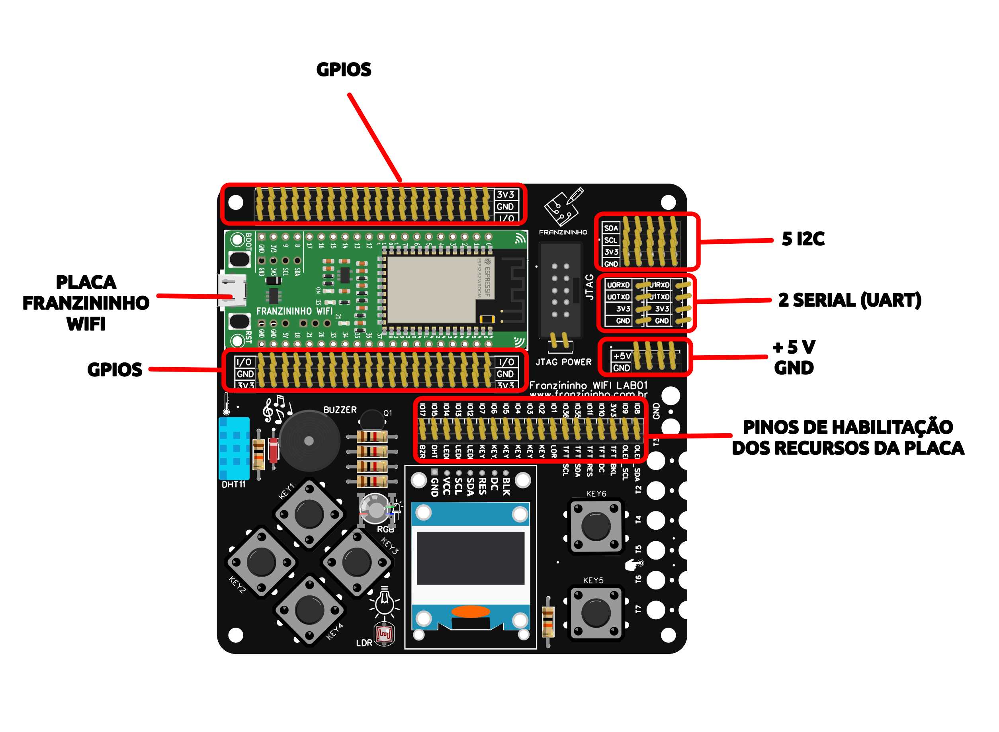
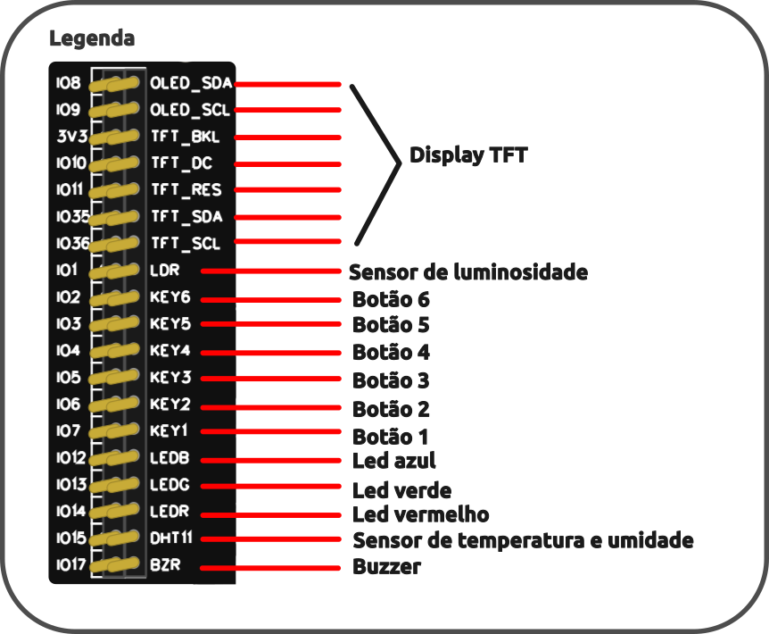
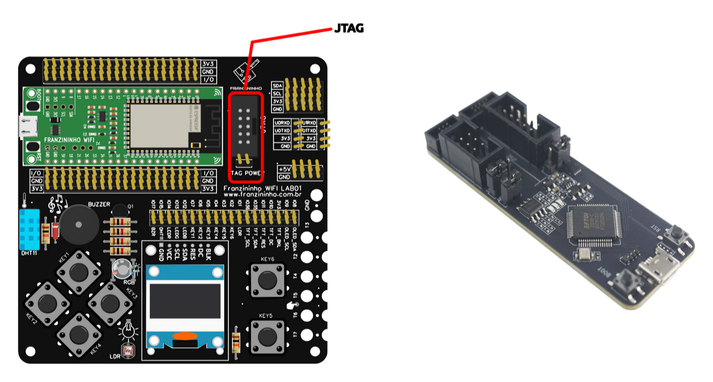

A **Franzininho WiFi LAB01** é uma plataforma projetada para facilitar o ensino, a experimentação e a prototipagem rápida de sistemas embarcados e aplicações IoT. Com uma ampla variedade de sensores, interfaces e recursos integrados, a LAB01 possibilita desde a introdução aos conceitos básicos até o desenvolvimento de projetos mais avançados.

Com suporte a diferentes periféricos e protocolos de comunicação, a LAB01 é ideal para estudantes, educadores e profissionais que desejam explorar o universo dos microcontroladores e da conectividade de maneira prática e intuitiva. Seja para aprendizado ou desenvolvimento de soluções inovadoras, a Franzininho WiFi LAB01 oferece um ambiente completo para transformar ideias em realidade.

<figure>

<figcaption>Figura 1 – Exemplo de aplicação</figcaption>
</figure>

<figure>

<figcaption>Figura 2 – Placa em destaque</figcaption>
</figure>

Nesse material você encontra os detalhes do hardware da Franzininho WiFi LAB01.

Saiba mais sobre a Franzininho WiFi: [Placa Franzininho WiFi](https://docs.franzininho.com.br/docs/franzininho-wifi/franzininho-wifi)

## **Franzininho WiFi LAB01 – Recursos e Expansibilidade**

A **Franzininho WiFi LAB01** é uma plataforma completa para ensino, experimentação e prototipagem de sistemas embarcados e IoT. Projetada para atender desde iniciantes até desenvolvedores experientes, ela oferece um ambiente prático para explorar conceitos fundamentais e avançados de hardware e firmware.

Com uma variedade de sensores, interfaces e conectores integrados, a LAB01 permite testar diferentes aplicações sem a necessidade de montagens complexas, sendo amplamente utilizada em oficinas, workshops e programas de formação.

### **Recursos da Franzininho WiFi LAB01:**

**Interação e Entrada de Dados**

- 6 chaves tácteis para controle e experimentação
- Sensor de temperatura e umidade **DHT11**
- Sensor de luz ambiente **LDR**

**Saídas Visuais e Sonoras**

- **LED RGB** para efeitos luminosos
- **Buzzer** para geração de sons e alertas

**Displays Compatíveis**

- **Conector para display IPS 240×240 ST7789**
- **Conector para display OLED 0.96” SSD1306**

**Expansibilidade e Comunicação**

- **5 portas I2C** para conexão de sensores e módulos adicionais
- **2 interfaces UART** para comunicação serial
- **JTAG** para depuração avançada

**Facilidade na Prototipagem**

- **6 conectores para garras jacaré** (TOUCH, entrada digital)
- **Todos os I/Os acessíveis** para conexão e personalização
- **Alimentação dedicada (5V e GND)** para módulos externos

**Opção de habilitar/desabilitar recursos** para otimização do uso dos I/Os

**Além dos recursos da placa, temos todas as funcionalidades do ESP32S2, como USB, WiFi, sensor de temperatura, etc.**

A **LAB01** é uma ferramenta essencial para quem deseja explorar o universo dos microcontroladores e IoT, proporcionando um ambiente versátil e completo para desenvolvimento de projetos educacionais e profissionais.

<figure>

<figcaption>Figura 3 – Exibição dos recursos</figcaption>
</figure>

### **Esquemático**

<figure>

<figcaption>Figura 4 – Esquemático</figcaption>
</figure>

## **Licença**

A **Franzininho WiFi LAB01** é um projeto **open source**, disponibilizado sob a **CERN Open Hardware License**, permitindo que a comunidade explore, modifique e contribua para sua evolução.

O design da placa foi criado em fevereiro de 2022 no EasyEDA e pode ser acessado no repositório oficial:  
🔗 [Projeto Franzininho WiFi LAB01 no OSHWA Lab](https://oshwlab.com/fabiosouza/shield-franzininho-wifi)

Essa licença garante transparência e liberdade para inovação, incentivando o desenvolvimento de novas aplicações e aprimoramentos para a comunidade.

## **Usando os Pinos de Expansão da Franzininho WiFi LAB01**

A **Franzininho WiFi LAB01** foi projetada para oferecer não apenas os recursos integrados, mas também a flexibilidade de expansão, permitindo a conexão de módulos e periféricos externos.

Se você precisar adicionar novos componentes, como  **relés para acionamento de potência, sensores adicionais ou outros módulos**, basta utilizar os **pinos de expansão** disponíveis na placa. Essa abordagem permite adaptar a LAB01 a diferentes aplicações, ampliando suas possibilidades de uso em projetos embarcados e IoT.

<figure>

<figcaption>Figura 5 – Explorando os pinos de expansões em uma aplicação</figcaption>
</figure>

Os pinos de expansão disponíveis incluem:

- **5 portas I2C** para conexão de sensores e módulos externos
- **2 interfaces UART** para comunicação serial
- **6 conectores para garras jacaré** (TOUCH, entrada digital)
- **Acesso a todos os I/Os da placa** para personalização
- **Alimentação (5V e GND) dedicada** para módulos adicionais

<figure>

<figcaption>Figura 6 – Pinos de Expansões da Franzininho WiFi LAB01</figcaption>
</figure>

Caso o **pino da Franzininho WiFi** que você deseja utilizar esteja sendo ocupado por um dos recursos **onboard** da LAB01, é possível **desabilitá-lo através dos jumpers correspondentes**, liberando o uso do pino para sua aplicação específica.

<figure>

<figcaption>Figura 7 – Jumpers para controle dos recursos</figcaption>
</figure>

Com essa estrutura, a **Franzininho WiFi LAB01** se adapta a diversas necessidades, permitindo desde projetos educacionais até aplicações mais avançadas, sem necessidade de placas adicionais para conexão de novos dispositivos.

## **Mapa de pinos Franzininho vs Recurso onboard**

|   |   |
|---|---|
|**Pino**|**Recurso**|
|I01|LDR|
|I02|BT6|
|IO3|BT5|
|IO4|BT4|
|IO5|BT3|
|IO6|BT2|
|IO7|BT1|
|IO8|OLED_SDA|
|IO9|OLED_SCL|
|IO10|TFT_DC|
|IO11|TFT_RES|
|IO12|LED AZUL|
|IO13|LED VERDE|
|IO14|LED VERMELHO|
|IO15|DHT11|
|IO17|BUZZER|
|IO35|TFT_SDA|
|IO36|TFT_SCL|

## **Depuração Avançada com JTAG**

A Franzininho WiFi LAB01 conta com um conector JTAG compatível com o [ESP-PROG](https://docs.espressif.com/projects/espressif-esp-dev-kits/en/latest/other/esp-prog/user_guide.html), permitindo a depuração avançada de firmware diretamente no ESP32.

Com o suporte ao JTAG, é possível realizar debug em tempo real, definir pontos de interrupção, inspecionar registradores e variáveis e acompanhar a execução do código de forma precisa, facilitando o desenvolvimento e a otimização de aplicações embarcadas.

Essa funcionalidade torna a Franzininho WiFi LAB01 uma excelente ferramenta para aprendizado e desenvolvimento profissional, proporcionando um ambiente completo para análise e depuração de código no ESP32.

<figure>

<figcaption>Figura 8 – Suporte a JTAG</figcaption>
</figure>

## **Como Programar a Franzininho WiFi LAB01?**

A **Franzininho WiFi LAB01** pode ser programada utilizando diversas plataformas e frameworks, proporcionando flexibilidade para diferentes perfis de desenvolvedores, desde iniciantes até profissionais experientes.

Conforme apresentado no artigo “[Como programar a Franzininho WiFi? Descubra agora mesmo!](https://embarcados.com.br/como-programar-a-franzininho-wifi/)“, algumas das principais opções de desenvolvimento incluem:

- **ESP-IDF** – Framework oficial da Espressif para desenvolvimento profissional no ESP32
- **Arduino** – Ambiente acessível e popular para programação embarcada
- **CircuitPython** – Fácil de usar e ideal para prototipagem rápida
- **MicroPython** – Python otimizado para microcontroladores
- **Zephyr** – RTOS robusto para aplicações embarcadas escaláveis
- **Nuttx** – Sistema operacional leve para dispositivos embarcados
- **BIPES** – Programação visual e intuitiva via interface web
- **Rust** – Linguagem de alto desempenho para sistemas embarcados seguros

Com essa ampla compatibilidade, a **Franzininho WiFi LAB01** se adapta a diversos cenários de desenvolvimento, permitindo a escolha da melhor ferramenta para cada projeto, seja para aprendizado, prototipagem ou aplicações industriais.

## **Materiais, Tutoriais e Exemplos**

Para facilitar o desenvolvimento e o aprendizado com a **Franzininho WiFi LAB01**, disponibilizamos diversos materiais, tutoriais e exemplos práticos para diferentes plataformas de programação.

### **Códigos exemplos**:

- Arduino: [https://github.com/Franzininho/Franzininho-WiFI-LAB01-Arduino](https://github.com/Franzininho/Franzininho-WiFI-LAB01-Arduino)
- CircuitPython:  [https://github.com/Franzininho/Franzininho-WiFI-LAB01-CircuitPython](https://github.com/Franzininho/Franzininho-WiFI-LAB01-CircuitPython) 
- MicroPython:  [https://github.com/Franzininho/Franzininho-WiFI-LAB01-Micropython](https://github.com/Franzininho/Franzininho-WiFI-LAB01-Micropython)
- ESP-IDF:  [https://github.com/Franzininho/Franzininho-wifi-exemplos-esp-idf](https://github.com/Franzininho/Franzininho-wifi-exemplos-esp-idf) 

### **Artigos e tutoriais:**

- [Franzininho WiFI – Arduino](https://embarcados.com.br/serie/franzininho-wifi-arduino/)
- [Franzininho WiFi: ESP-IDF](https://embarcados.com.br/serie/franzininho-wifi-esp-idf/)
- [Franzininho WiFi com MicroPython](https://embarcados.com.br/serie/franzininho-wifi-com-micropython/)
- [Franzininho WiFi – CircuitPython](https://embarcados.com.br/serie/franzininho-wifi-circuitpython/)
- [Franzininho WiFi com BIPES](https://embarcados.com.br/serie/franzininho-wifi-com-bipes/)
- [Treinamento Franzininho WiFi](https://embarcados.com.br/treinamento-franzininho-wifi-videos-gravados/)
- [Como programar a Franzininho WiFi: 6 opções para você escolher!](https://embarcados.com.br/como-programar-a-franzininho-wifi/)
- [Automatizando o Desenvolvimento Embarcado: GitHub Actions com Franzininho WiFi](https://embarcados.com.br/automatizando-o-desenvolvimento-embarcado-github-actions-com-franzininho-wifi/)
- [Atualização OTA com Franzininho WiFi](https://embarcados.com.br/atualizacao-ota-com-franzininho-wifi/)
- [Machine Learning na Franzininho WiFi](https://embarcados.com.br/serie/machine-learning-na-franzininho-wifi/)
- [Programando a Franzininho WiFi com Zephyr RTOS](https://embarcados.com.br/programando-a-franzininho-wifi-com-zephyr-rtos/)
- [Franzininho WiFi: Explorando o display LCD com uma biblioteca própria](https://embarcados.com.br/franzininho-wifi-display-lcd/)

Esses recursos auxiliam no uso da placa, desde os primeiros passos até aplicações mais avançadas, permitindo explorar todo o potencial da **Franzininho WiFi LAB01** de maneira prática e objetiva.

Caso tenha dúvidas ou precise de suporte, acompanhe a comunidade  **Franzininho** e participe dos fóruns e grupos de discussão! 🚀

## **Onde adquirir a Franzininho WiFi LAB01?**

A **Franzininho WiFi LAB01** está sendo produzida em **lotes especiais** para atender aos cursos do **Embarcados** e projetos específicos.

Se você deseja **equipar o laboratório da sua instituição** com essa placa, entre em contato **com antecedência** para reservar unidades antes da produção.

Se você é um **estudante, maker ou profissional** e quer utilizar a **Franzininho WiFi LAB01** em seus estudos e projetos, entre em contato para **demonstrar interesse e verificar a disponibilidade**. Será um prazer apoiar o seu desenvolvimento!

📩 **Contato:** [**fabio.souza@embarcados.com.br**](mailto:fabio.souza@embarcados.com.br) 

## **Saiba Mais**

Confira a documentação do projeto Franzininho em: 

- [https://docs.franzininho.com.br](https://docs.franzininho.com.br)
- [GitHub](https://github.com/franzininho)

Siga o projeto Franzininho nas redes sociais:

- [Instagram](https://www.instagram.com/franzininho/)
- [Facebook](https://facebook.com/franzininho/)
- [Youtube](https://www.youtube.com/channel/UCxyabOm4teS0kx0EgJW78_g)

Participe da comunidade Franzininho: [Discord](https://discord.gg/H5kENmWGaz)
