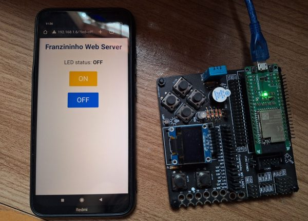
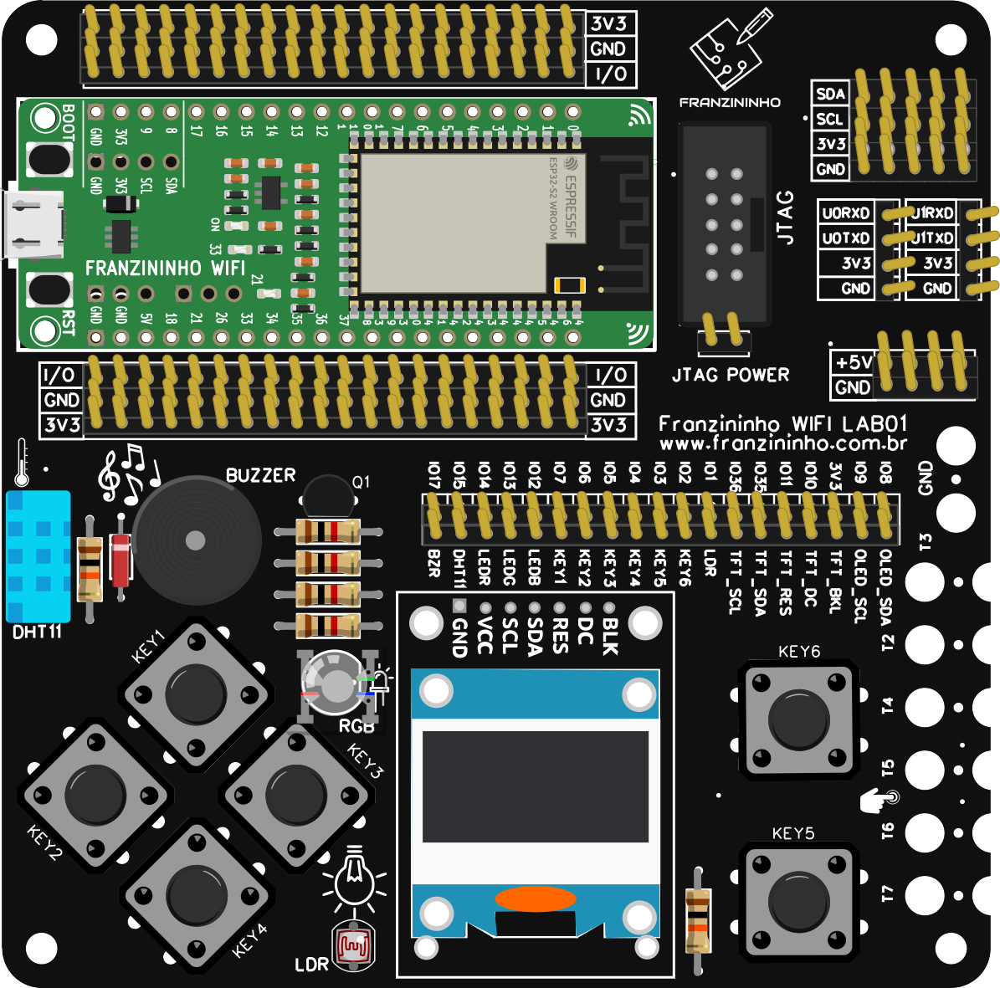
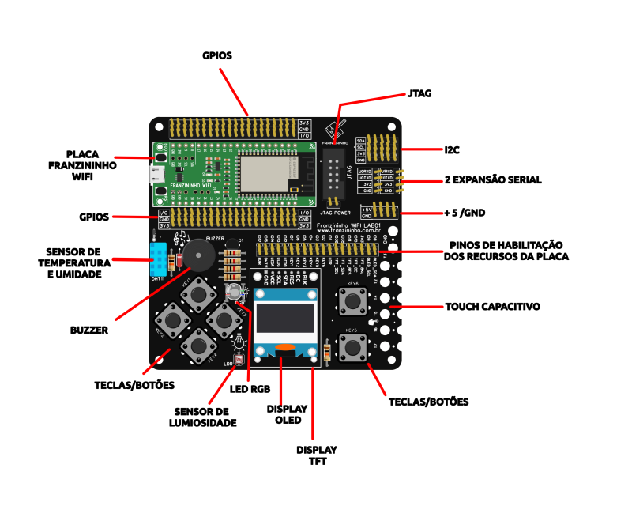
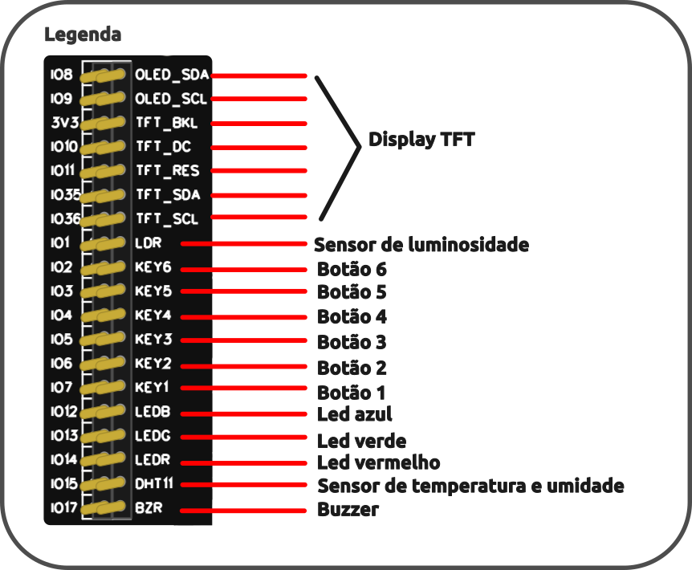
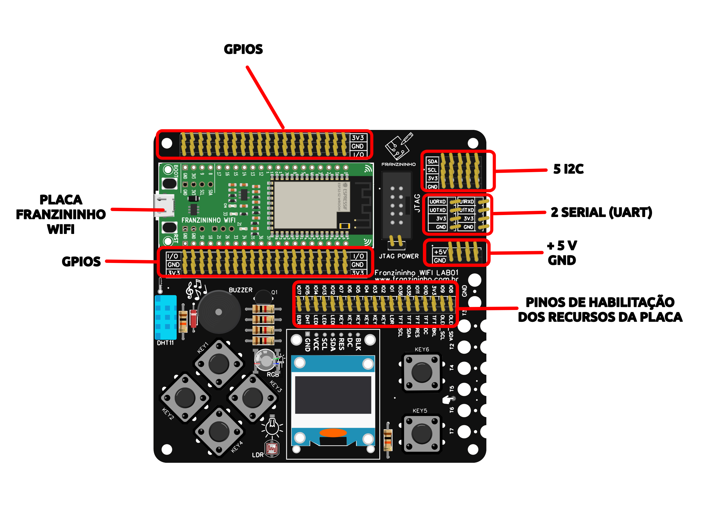
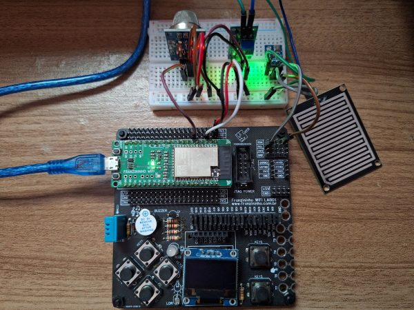
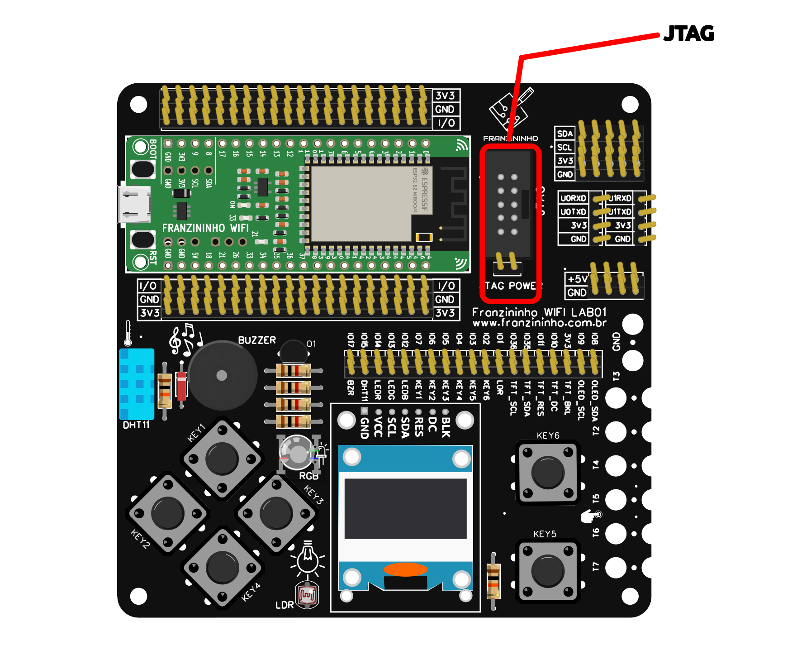
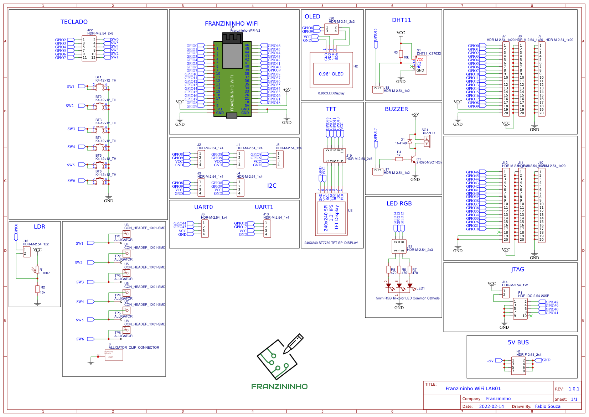

A **Franzininho WiFi LAB01** é uma plataforma de desenvolvimento baseada na [Franzininho WiFi](/docs/franzininho-wifi/franzininho-wifi), projetada para facilitar o ensino, a experimentação e a prototipagem rápida de sistemas embarcados e aplicações IoT.

Com sensores, displays, interfaces de comunicação e conectores de expansão integrados, a LAB01 elimina a necessidade de montagens externas para a maioria dos experimentos — ideal para estudantes, educadores e profissionais que desejam explorar microcontroladores de forma prática.

## Recursos

### Entrada e interação

- 6 chaves tácteis
- Sensor de temperatura e umidade DHT11
- Sensor de luz ambiente LDR

### Saídas visuais e sonoras

- LED RGB
- Buzzer

### Displays compatíveis

- Conector para display IPS 240×240 ST7789
- Conector para display OLED 0,96" SSD1306

### Expansão e comunicação

- 5 portas I2C para sensores e módulos externos
- 2 interfaces UART
- JTAG para depuração avançada
- 6 conectores para garras jacaré (touch e entrada digital)
- Acesso a todos os I/Os da Franzininho WiFi
- Alimentação dedicada 5 V e GND para módulos externos
- Jumpers para habilitar/desabilitar recursos onboard e liberar pinos

## Mapeamento de pinos

Relação entre os pinos da Franzininho WiFi e os recursos onboard da LAB01:

| Pino | Recurso      |
| ---- | ------------ |
| IO1  | LDR          |
| IO2  | BT6          |
| IO3  | BT5          |
| IO4  | BT4          |
| IO5  | BT3          |
| IO6  | BT2          |
| IO7  | BT1          |
| IO8  | OLED SDA     |
| IO9  | OLED SCL     |
| IO10 | TFT DC       |
| IO11 | TFT RES      |
| IO12 | LED Azul     |
| IO13 | LED Verde    |
| IO14 | LED Vermelho |
| IO15 | DHT11        |
| IO17 | Buzzer       |
| IO35 | TFT SDA      |
| IO36 | TFT SCL      |

Caso um pino esteja ocupado por um recurso onboard e você precise dele para outra finalidade, use o jumper correspondente para desabilitá-lo.

## Depuração com JTAG

A LAB01 possui conector JTAG compatível com o [ESP-PROG](https://docs.espressif.com/projects/espressif-esp-dev-kits/en/latest/other/esp-prog/user_guide.html), permitindo depuração em tempo real: pontos de interrupção, inspeção de registradores e variáveis, e acompanhamento preciso da execução do firmware.

## Esquemático

## Formas de programação

A LAB01 herda todos os ambientes de programação da Franzininho WiFi:

| Ambiente | Nível | Exemplos |
| --- | --- | --- |
| Arduino | Iniciante / Intermediário | [GitHub](https://github.com/Franzininho/Franzininho-WiFI-LAB01-Arduino) |
| CircuitPython | Iniciante / Intermediário | [GitHub](https://github.com/Franzininho/Franzininho-WiFI-LAB01-CircuitPython) |
| MicroPython | Iniciante / Intermediário | [GitHub](https://github.com/Franzininho/Franzininho-WiFI-LAB01-Micropython) |
| ESP-IDF | Avançado | [GitHub](https://github.com/Franzininho/Franzininho-wifi-exemplos-esp-idf) |
| Zephyr RTOS | Avançado | [Documentação oficial](https://docs.zephyrproject.org/) |
| NuttX RTOS | Avançado | [Documentação oficial](https://nuttx.apache.org/docs/latest/) |
| BIPES | Iniciante | [bipes.net.br](https://bipes.net.br/) |
| Rust | Avançado | — |

## Artigos e tutoriais

- [Franzininho WiFi – Arduino](https://embarcados.com.br/serie/franzininho-wifi-arduino/)
- [Franzininho WiFi: ESP-IDF](https://embarcados.com.br/serie/franzininho-wifi-esp-idf/)
- [Franzininho WiFi com MicroPython](https://embarcados.com.br/serie/franzininho-wifi-com-micropython/)
- [Franzininho WiFi – CircuitPython](https://embarcados.com.br/serie/franzininho-wifi-circuitpython/)
- [Franzininho WiFi com BIPES](https://embarcados.com.br/serie/franzininho-wifi-com-bipes/)
- [Treinamento Franzininho WiFi](https://embarcados.com.br/treinamento-franzininho-wifi-videos-gravados/)
- [Como programar a Franzininho WiFi: 6 opções para você escolher!](https://embarcados.com.br/como-programar-a-franzininho-wifi/)
- [Automatizando o Desenvolvimento Embarcado: GitHub Actions com Franzininho WiFi](https://embarcados.com.br/automatizando-o-desenvolvimento-embarcado-github-actions-com-franzininho-wifi/)
- [Atualização OTA com Franzininho WiFi](https://embarcados.com.br/atualizacao-ota-com-franzininho-wifi/)
- [Machine Learning na Franzininho WiFi](https://embarcados.com.br/serie/machine-learning-na-franzininho-wifi/)
- [Programando a Franzininho WiFi com Zephyr RTOS](https://embarcados.com.br/programando-a-franzininho-wifi-com-zephyr-rtos/)
- [Franzininho WiFi: Explorando o display LCD com uma biblioteca própria](https://embarcados.com.br/franzininho-wifi-display-lcd/)

## Onde adquirir

A Franzininho WiFi LAB01 é produzida em lotes especiais para cursos e projetos institucionais. Entre em contato para verificar disponibilidade ou reservar unidades para o laboratório da sua instituição.

Contato: [fabio.souza@embarcados.com.br](mailto:fabio.souza@embarcados.com.br)

## Licença

A Franzininho WiFi LAB01 é um projeto open source licenciado sob a **CERN Open Hardware License**. O design foi criado no EasyEDA e está disponível no repositório oficial:

[Projeto no OSHWA Lab](https://oshwlab.com/fabiosouza/shield-franzininho-wifi)
