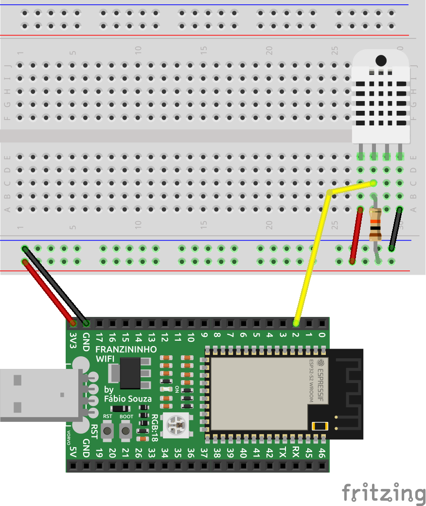
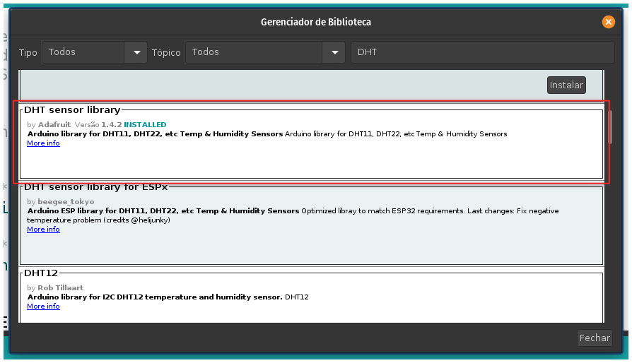
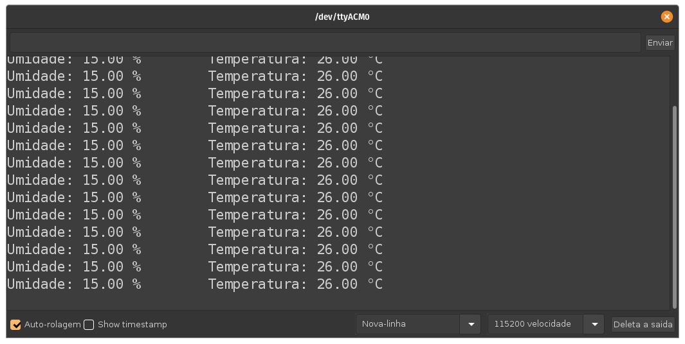

Nesse exemplo vamos fazer a leitura do sensor de temperatura e umidade, DHT11, e imprimir os valores no terminal serial.


## Materiais necessários

Identifique os seguintes materiais necessários para este projeto:

- 1 Franzininho WiFi.
- 1 Sensor DHT11
- 1 Resistor de 10k
- 1 Protoboard.
- Cabos de ligação.

## Circuito

Realize a montagem do circuito da maneira indicada pela figura a seguir:



## Código

Para usar o sensor DHT com a Franzininho WiFi no Arduino, precisamos instalar uma bibloteca. Vamos usar a biblioteca mantida pela Adafruit.

Vamos instalar a biblioteca usando o gerenciador de biblitecas do Arduino. Acesso Ferramentas -> Gerenciar Bibliotecas. Procure por DHT e instale a bibloteca DHT sensor library da Adafruit:




Agora vamos fazer a leitura do sensor e imprimir os valores de temperatura e umidade no terminal serial.

```cpp
/*************************************************************************************
 * Exemplo para leitura de sensor DHT11
 * 
 * 
 * Bibliotecas necessarias
 * DHT da Adafruit - Instalar pelo gerenciador de bibliotecas
 *  
 *  por: Fábio Souza
 *************************************************************************************/

#include "DHT.h"
 
#define DHTPIN 2 
#define DHTTYPE DHT11
 
DHT dht(DHTPIN, DHTTYPE);


/*********************************************************************************
 *  Função Setup
 *  Configurações iniciais da aplicação
 *********************************************************************************/
void setup() 
{
Serial.begin(19200);
Serial.println("Teste de leitura do sensor DHT11");
dht.begin();
}

/*********************************************************************************
 *  Função loop
 *********************************************************************************/
void loop() 
{

  float umidade = dht.readHumidity();
  float temperatura = dht.readTemperature();

  delay(500);
  

  // Se as variáveis temperatura e umidade não forem valores válidos, acusará falha de leitura.
  if (isnan(temperatura) || isnan(umidade)) 
  {
  Serial.println("Falha na leitura do dht11...");
  } 
  else //se não, exibirá os valores lidos 
  {
    //Imprime os dados no monitor serial
    Serial.print("Umidade: ");
    Serial.print(umidade);
    Serial.print(" %\t"); //tab
    Serial.print("Temperatura: ");
    Serial.print(temperatura);
    Serial.println(" °C");
  }
}
```

## Análise do código

Na primeira parte do código adicionamo as bibliotecas a serem usadas na aplicação e a instancia do DHT11:
```cpp
#define DHTPIN 2 
#define DHTTYPE DHT11
 
DHT dht(DHTPIN, DHTTYPE);
```
Na função `setup()` fizemos a inicialização do DHT11 e da comunicação Serial:
```cpp
void setup() 
{
Serial.begin(19200);
Serial.println("Teste de leitura do sensor DHT11");
dht.begin();
}
```

No `loop()` infinito fazemos a leitura da temperatura e umidade a cada 500 ms e imprimimos na serial. Caso ocorra falha na leitura do DHT11 é exibido uma mensagem de erro:

```cpp
void loop() 
{

  float umidade = dht.readHumidity();
  float temperatura = dht.readTemperature();

  delay(500);
  

  // Se as variáveis temperatura e umidade não forem valores válidos, acusará falha de leitura.
  if (isnan(temperatura) || isnan(umidade)) 
  {
  Serial.println("Falha na leitura do dht11...");
  } 
  else //se não, exibirá os valores lidos 
  {
    //Imprime os dados no monitor serial
    Serial.print("Umidade: ");
    Serial.print(umidade);
    Serial.print(" %\t"); //tab
    Serial.print("Temperatura: ");
    Serial.print(temperatura);
    Serial.println(" °C");
  }
}
```

## Resultado

A figura a seguir exibe os valores lidos no monitor serial:




## Conclusão

O sensor DHT11( e similares) possibilita que façamos leitura de temperatura e umidade de uma forma simples e eficiente. Através de 1 fio de comunicação conseguimos fazer a leitura das duas grandezas. Como a comunicação é um pouco complexa, o  uso de uma biblioteca facilita a comunicação com o dispositivo. A biblioteca mantida pela Adafruit é muito eficiente e estável.


:::info
Se tiver alguma dúvida consulte a comunidade Franzininho no [Discord](https://discord.gg/H5kENmWGaz)
:::

| Autor | Fábio Souza |
|-------|--------------|
| Data: | 23/10/2021   |
