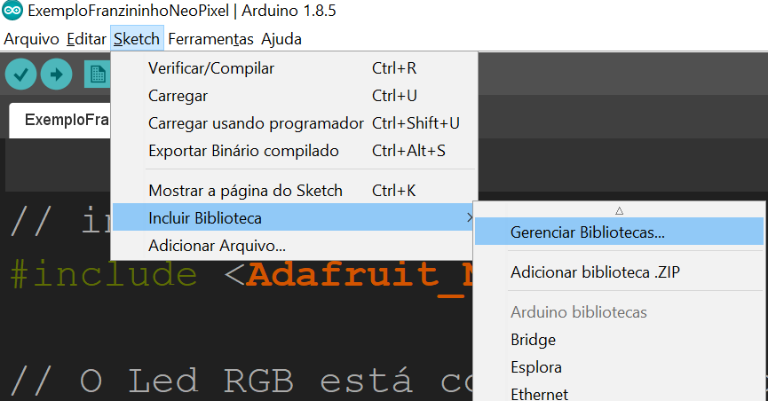

## Instalação da biblioteca

Na IDE Arduino, clique em **Sketch -> Incluir Biblioteca -> Gerenciar Bibliotecas**



Selecione: "Adafruit NeoPixel by Adafruit Versão X.X.X" e clique em **Instalar**


Após selecionar a placa Franzininho conforme os outros tutoriais, poderá ser usado o código de exemplo abaixo:

## Código de Exemplo
```C++

// inclui biblioteca NeoPixel
#include <Adafruit_NeoPixel.h>

// O Led RGB está conectado ao pino 18 do Franzininho
#define PIN         18
// Há apenas um LED
#define NUMPIXELS   1

// quantidade de cores que serão mostradas
#define MAXCOLORS 4

// Instância do objeto "Adafruit_NeoPixel"
Adafruit_NeoPixel pixels(NUMPIXELS, PIN, NEO_GRB + NEO_KHZ800);

//cores
#define RED    pixels.Color(255, 0, 0)     // vermelho
#define GREEN  pixels.Color(0, 255, 0)     // verde
#define BLUE   pixels.Color(0, 0, 255)     // azul
#define WHITE  pixels.Color(255, 255, 255) // branco

// array com todas as cores para uso em laço for
// uint32_t é o tipo retornado pela função Color
uint32_t   cores[MAXCOLORS] = {RED, GREEN, BLUE, WHITE};


void setup() {
  
  // Inicializa o NeoPixel
  pixels.begin();
}

void loop() {
  
  // "apaga" o LED RGB
  pixels.clear();

  // exibe as cores em sequência definida no array cores
  for(int i = 0; i<MAXCOLORS;i++){
    pixels.setPixelColor(0,cores[i]);
    pixels.show();  // envia o pixel atualizado para o hardware
    delay(300);  // tempo para exibição da cor
  }
}


```
