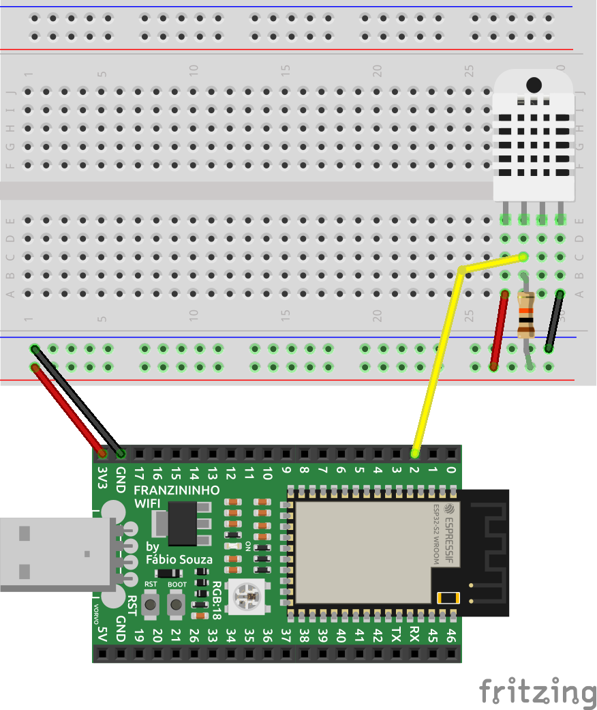
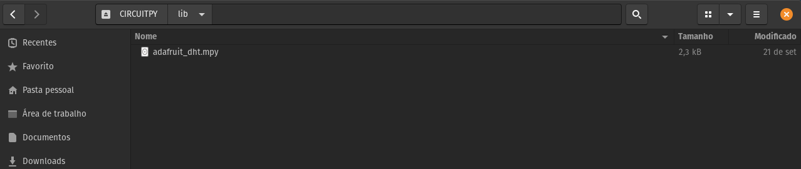
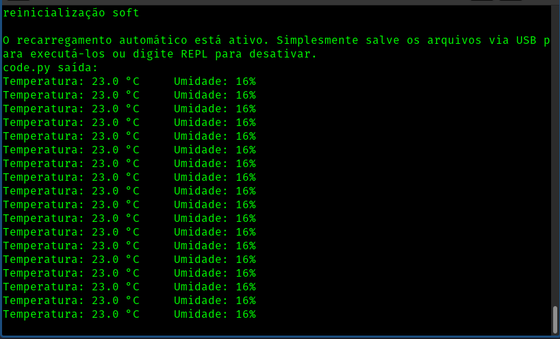

Nesse exemplo aprenderemos usar ler valores de temperatura e umidade com o sensor DHT11.

## Materiais necessários

Identifique os seguintes materiais necessários para este projeto:

- 1 Franzininho WiFi.
- 1 Sensor DHT11
- 1 Resistor de 10k
- 1 Protoboard.
- Cabos de ligação.

## Circuito

Realize a montagem do circuito da maneira indicada pela figura a seguir:




## Código

Para usar o sensor DHT com a Franzininho WiFi, precisamos instalar o módulo **adafruit_dht** na placa antes de criarmos nosso código.

As bibliotecas para o CircuitPython podem ser obtidas através do endereço [https://circuitpython.org/libraries](https://circuitpython.org/libraries). Escolha e baixe o arquivo de acordo com a versão do CircuitPyhthon que você tem instalado na Franzininho WiFi.

Em seguida, copie o seguinte arquivo diretamente para a pasta **lib** do sistema de arquivos da Franzininho WiFi:
- adafruit_dht.mpy



Para demonstrar o uso do módulo do sensor DHT, digite o código abaixo e conecte ao terminal serial (REPL) da placa para verificar os valores de temperatura e umidade lidos.

```python
""" Leitura de temperatura e umidade com DHT11 """

import board
import time
import adafruit_dht

dht = adafruit_dht.DHT11(board.IO2)

while True:
    try:
        temperatura = dht.temperature
        umidade = dht.humidity
        # Imprime valores lidos na serial
        print("Temperatura: {:.1f} °C \t Umidade: {}%".format(temperatura, umidade))
    except RuntimeError as e:
        # A leitura do DHT11 pode falhar
        print("Falha na leitura do DHT11: ", e.args)

    time.sleep(1)
```

## Análise do código

Na primeira parte do código temos a importação das bibliotecas a serem usadas na aplicação. Note que importamos o módulo **adafruit_dht** que instalamos na pasta **lib** da placa:
```python
import board
import time
import adafruit_dht
```

Em seguida criamos uma instância e escolhemos o modo DHT11, ja que é possível trabalhar com outros modelos com essa biblioteca. É necessario passar como parâmetro o pino que está conectado a linha de comunicação do sensor. Em nosso caso passamos o pino 2:
```python
dht = adafruit_dht.DHT11(board.IO2)
```

No loop infinito fazemos a leitura dos valores de temperatura e umidade a cada **1 segundo** através dos metodos `dht.temperature` e `dht.humidity`, e imprimimos os valores lidos no terminal serial.
```python
while True:
    try:
        temperatura = dht.temperature
        umidade = dht.humidity
        # Imprime valores lidos na serial
        print("Temperatura: {:.1f} °C \t Umidade: {}%".format(temperatura, umidade))
    except RuntimeError as e:
        # A leitura do DHT11 pode falhar
        print("Falha na leitura do DHT11: ", e.args)

    time.sleep(1)
```

## Resultado

A figura a seguir exibe os valores lidos no terminal serial(REPL):




## Conclusão
O sensor DHT11( e similares) possibilita que façamos leitura de temperatura e umidade de uma forma simples e eficiente. Através de 1 fio de comunicação conseguimos fazer a leitura das duas grandezas. Como a comunicação é um pouco complexa, o  uso de uma biblioteca facilita a comunicação com o dispositivo.


:::info
Se tiver alguma dúvida consulte a comunidade Franzininho no [Discord](https://discord.gg/H5kENmWGaz)
:::

| Autor | Fábio Souza |
|-------|--------------|
| Data: | 10/10/2021   |
