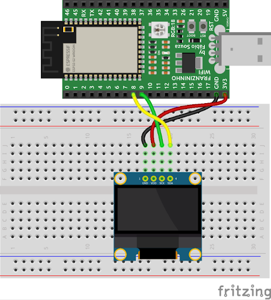
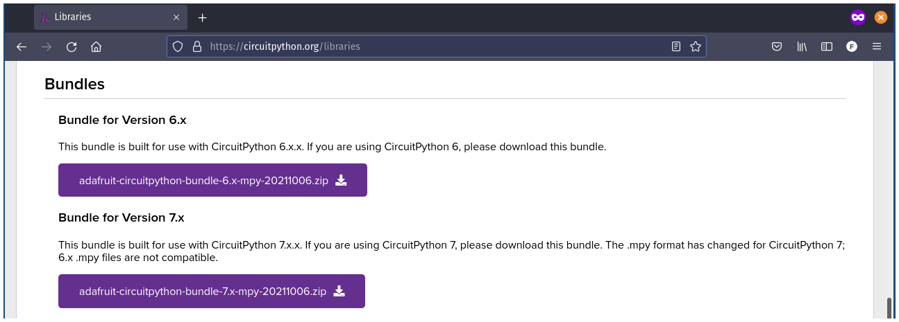

Nesse exemplo aprenderemos usar o display OLED com comunicação I2C explorando as funcionalidades básicas usando o CircuitPython.

## Materiais necessários

Identifique os seguintes materiais necessários para este projeto:

- 1 Franzininho WiFi.
- 1 Display OLED 128x64 I2C.
- 1 Protoboard.
- Cabos de ligação.

## Circuito

A próxima etapa consiste em realizar a montagem da maneira indicada pela figura a seguir:



Resumindo o que é mostrado nas Figuras 4.2 até 4.5, a conexão dos terminais do OLED aos terminais das respectivas placas de desenvolvimento deve ser realizada conforme a tabela a seguir.

|  OLED I2C  | Franzininho WiFi |
|:----------:|:----------------:|
| SDA (DATA) |       GPIO8      |
|  SCK (CLK) |       GPIO9      |
|     VDD    |        3V3       |
|     GND    |        GND       |

## Código

Como o display OLED é um componente com funcionamento bastante complexo, vamos fazer uso de uma biblioteca que implementa todas as funcionalidades, permitindo que nossos programas possam ser implementados de maneira bastante simples e produtiva.

As bibliotecas para o CircuitPython podem ser obtidas através do endereço [https://circuitpython.org/libraries](https://circuitpython.org/libraries). Escolha e baixe o arquivo de acordo com a versão do CircuitPyhthon que você tem instalado na Franzininho WiFi.



Em seguida, copie os seguintes arquivos diretamente para a posta lib do sistema de arquivos da Franzininho WiFi:
- adafruit_ssd1306.mpy
- adafruit_framebuf.mpy

Copie também o arquivo **font5x8.bin**, mas neste caso, para a pasta raiz da Franzininho WiFi. Por fim, implemente o programa abaixo no arquivo **code.py** que está localizado na pasta raiz da Franzininho WiFi.

```python
import board
import busio
import adafruit_ssd1306
import time

i2c = busio.I2C(scl=board.IO9, sda=board.IO8)
oled = adafruit_ssd1306.SSD1306_I2C(128, 64, i2c, addr=0x3C)

try:
  inverter = False
  while True:
    oled.invert(inverter)
    oled.fill(0)
    oled.rect(0, 0, 128, 64, 1)
    oled.rect(2, 2, 124, 60, 1)
    oled.text('Franzininho', 4, 4, 1)
    oled.text('WiFi', 4, 14, 1)
    oled.show()
    inverter = not inverter
    time.sleep(2)
finally:
  oled.invert(False)
  oled.fill(0)
  oled.show()
```

## Análise do código


Devemos importar as bibliotecas busio e adafruit_ssd1306, que serão responsáveis pelas classes que irão possibilitar a comunicação I2C e o uso do display OLED, respectivamente. 
```python
import busio
import adafruit_ssd1306
```
A comunicação I2C será realizada através do terminais **IO9** e **IO8** da Franzininho WiFi, conforme podemos observar na pinagem, disponível em [https://franzininho.github.io/docs-franzininho-site/docs/franzininho-wifi/franzininho-wifi](https://franzininho.github.io/docs-franzininho-site/docs/franzininho-wifi/franzininho-wifi) 
```python
i2c = busio.I2C(scl=board.IO9, sda=board.IO8)
```
A configuração do display OLED deve levar em conta as suas dimensões e o seu endereço no barramento I2C.
```python
oled = adafruit_ssd1306.SSD1306_I2C(128, 64, i2c, addr=0x3C)
```
Neste programa o objetivo e realizar a inversão da exibição do conteúdo no display a cada 2 segundos. Desta forma, será usado o método `invert` que receberá uma variável booleana como parâmetro, sendo seu valor alternado entre `True` e `False`.
```python
oled.invert(inverter)
```
O método `fill` é usado para preencher toda área do display e atuará em conjunto com o método `invert`. Como se trata de um display monocromático temos duas cores disponíveis, 0 (zero) que representa o preto (pixel desligado) e 1 (um) para especificar o branco (pixel ligado), caso o método `invert` tenha recebido como parâmetro o valor False. Por outro lado, caso `invert` receber True como parâmetro,  1 (um) vai representar o preto (pixel desligado) e 0 (zero) vai especificar o branco (pixel ligado).
```python
oled.invert(inverter)
oled.fill(0)
```
Na sequência foi usado o método `rect` para desenhar um retângulo começando nas coordenadas **x = 0** e **y = 0** e com **128 pixels de largura** e **64 pixels de altura** e, logo em seguida, um outro retângulo levemente inferior. O último parâmetro do método `rect` consiste na cor que, neste exemplo, será branco. Desta forma, acabamos desenhando uma borda dupla que envolve toda a área do display. 
```python
oled.rect(0, 0, 128, 64, 1)
oled.rect(2, 2, 124, 60, 1)
```
O método `text` possibilita exibir um texto nas coordenadas e na cor especificadas.
```python
oled.text('Franzininho', 4, 4, 1)
oled.text('WiFi', 4, 14, 1)
```
O método `show`, irá executar os métodos usados anteriormente, ou seja, `fill`, `rect` e `text` no display. Ou seja, qualquer conteúdo só é exibido no display quando o método `show` é executado.
```python
oled.show()
```

Tente exibir outros textos e imagens. Compartilhe seus resultados com a comunidade. 

:::info
Se tiver alguma dúvida consulte a comunidade Franzininho no [Discord](https://discord.gg/H5kENmWGaz)
:::

| Autor | [Cláudio Luís Vieira Oliveira](mailto:claudio.oliveira@fatec.sp.gov.br) |
|-------|--------------|
| Data: | 07/10/2021   |
