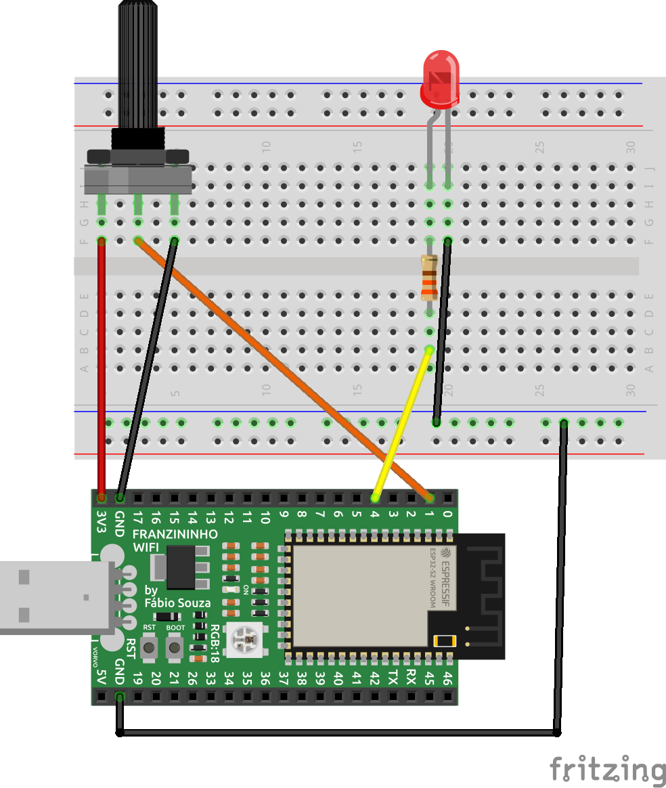
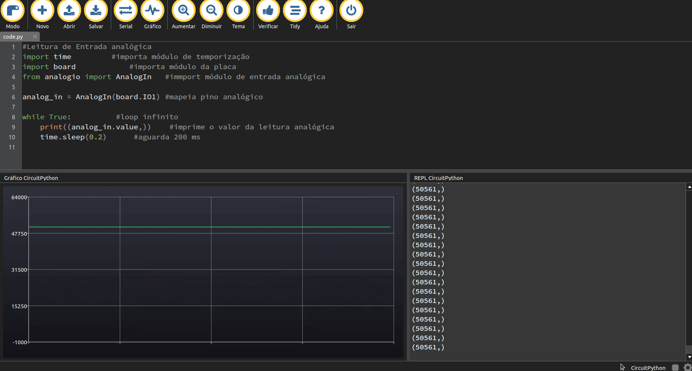
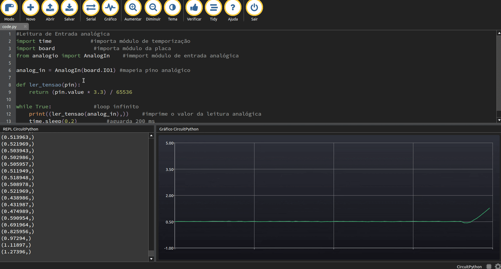
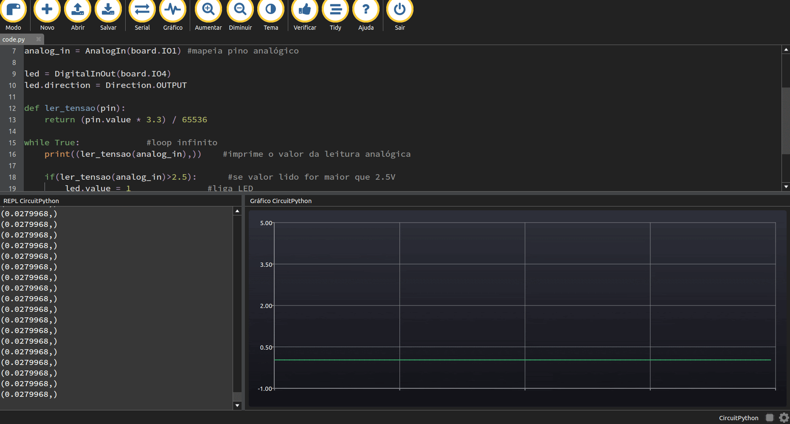

Neste exemplo aprenderemos como usar as entradas analógicas. Veremos qual módulo precisamos usar e como fazer a leitura do valor analógico usando um potenciômetro. Ao final faremos um exemplo para ligar e desligar um LED a partir do valor lido na entrada analógica. Assim, ao final dessa etapa você estará apto para ler sensores analógicos.

## Materiais necessários

- 1 Placa Franzininho WiFi com CircuitPython;
- 1 Protoboard;
- 1 potenciômetro de 10K;
- 1 LED vermelho de 3 mm;
- 1 Resistor 330 Ω;
- Jumpers.
  
## Circuito

Para os primeiros exemplos, faça a seguinte montagem:



## Código

Digite o código abaixo no arquivo code.py que está no diretório CIRCUITPY:
```python
#Leitura de Entrada analógica -  Exemplo 2
import time            #importa módulo de temporização
import board            #importa módulo da placa
from analogio import AnalogIn    #immport módulo de entrada analógica

analog_in = AnalogIn(board.IO1) #mapeia pino analógico

while True:             #loop infinito
    print((analog_in.value,))    #imprime o valor da leitura analógica
    time.sleep(0.2)         #aguarda 200 ms
```
Salve o arquivo e teste o funcionamento girando o potenciômetro e no Mu Editor visualize os dados no terminal serial e no gráfico:



Note que os valores de conversão AD são exibidos no terminal e no gráfico.

Agora faremos um exemplo para converter esses valores em tensão.

Digite o seguinte código:
```python
#Leitura de Entrada analógica - Exemplo 2
import time            #importa módulo de temporização
import board            #importa módulo da placa
from analogio import AnalogIn    #import módulo de entrada analógica

analog_in = AnalogIn(board.IO1) #mapeia pino analógico

def ler_tensao(pin):
    return (pin.value * 3.3) / 65536

while True:             #loop infinito
    print((ler_tensao(analog_in),))    #imprime o valor da leitura analógica
    time.sleep(0.2)         #aguarda 200 ms
```

Salve o arquivo e teste o funcionamento girando o potenciômetro e no Mu Editor visualize os dados no terminal serial e no gráfico:



Note que exibimos agora  o valor de tensão.

### Análise do código (Exemplos 1 e 2)

Para acessar os pinos da placa precisamos importar o módulo board:
```python
import board
```
Como precisaremos de intervalos de temporização importamos o módulo time:
```python
import time
```
Trabalharemos como entradas analógicas nesse exemplo, assim, precisamos importar o seguinte módulo em analogio:
```python
from analogio import AnalogIn #import módulo de entrada analógica
```
A Franzininho Wifi possui diversas entradas analógicas. Para esse exemplo usamos a entrada analógica no pino IO1
```python
analog_in = AnalogIn(board.IO1) #mapeia pino analógico
```
No loop infinito fazemos a leitura da conversão AD lendo o valor presente no pino em intervalos de 200 ms. No primeiro exemplos fizemos apenas a impressão do valor convertido:
```python
while  True: #loop infinito  
    print((analog_in.value,))  #imprime o valor da leitura analógica  
    time.sleep(0.2) #aguarda 200 ms
```  

Já no segundo exemplo fizemos uma função que converte o valor lido no pino em tensão:
```python
def  ler_tensao(pin):  
    return (pin.value * 3.3) / 65536  
  
while  True: #loop infinito  
    print((ler_tensao(analog_in),))  #imprime o valor da leitura analógica  
    time.sleep(0.2) #aguarda 200 ms
```

Agora faremos uma aplicação para ligar e desligar um LED dependo do valor lido no potenciômetro.

Digite o seguinte código:
```python
#Leitura de Entrada analógica - Exemplo 3
import time            #importa módulo de temporização
import board            #importa módulo da placa
from analogio import AnalogIn    #immport módulo de entrada analógica
from digitalio import DigitalInOut, Direction

analog_in = AnalogIn(board.IO1) #mapeia pino analógico

led = DigitalInOut(board.IO4)
led.direction = Direction.OUTPUT

def ler_tensao(pin):
    return (pin.value * 3.3) / 65536

while True:             #loop infinito
    print((ler_tensao(analog_in),))    #imprime o valor da leitura analógica
    
    if(ler_tensao(analog_in)>2.5):      #se valor lido for maior que 2.5V
        led.value = 1               #liga LED
    else:                   #se não
        led.value =0               #desliga o LED
    
    time.sleep(0.2)         #aguarda 200 ms
```

Salve o arquivo e teste o funcionamento girando o potenciômetro. Verifique se o LED acenderá quando ultrapassar o valor de 2,5V (exibido no terminal). Quando abaixo de 2,5V o LED deve apagar.




### Análise do código (Exemplo 3)

Nesse exemplo adicionamos uma saída digital para controlar um LED.

:::tip Dica
Se você ainda não sabe trabalhar com entradas analógicas. Consulte o exemplo [Entradas e Saídas Digitais](https://franzininho.github.io/docs-franzininho-site/docs/franzininho-wifi/exemplos-circuitpython/entradas-saidas-digitais).
:::

No loop principal fizemos um teste para verificar o valor de tensão da entrada analógico, caso acima de 2,5V liga o LED e abaixo de 2,5 V desliga o LED.
```python
while  True: #loop infinito  
    print((ler_tensao(analog_in),))  #imprime o valor da leitura analógica  
  
    if(ler_tensao(analog_in)>2.5): #se valor lido for maior que 2.5V  
        led.value = 1  #liga LED  
    else:  #se não  
        led.value =0  #desliga o LED  
    
    time.sleep(0.2) #aguarda 200 ms
```

## Conclusão

Neste exemplo, aprendemos como fazer a leitura de uma entrada analógica. Para você ler outras entradas pode seguir o mesmo padrão. Porém, é importante verificar se o pino possui essa funcionalidade.

Com esse recurso poderemos ler diversos sensores analógicos como de temperatura, acelerômetro, som, etc.


:::tip Desafio
Faça a leitura de outro potenciômetro usando outra entrada analógica. Exiba no gráfico o valor dos 2 potenciômetros em simultâneo.
:::

| Autor | Diana Santos |
|-------|--------------|
| Autor | [Fábio Souza](https://github.com/FBSeletronica) |
| Data: | 16/09/201    |