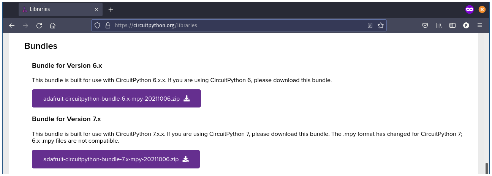

Nesse exemplo aprenderemos a ler valores de distância com o sensor HC-SR04 usando o CircuitPython.

## Materiais necessários

Identifique os seguintes materiais necessários para este projeto:

- 1 Franzininho WiFi.
- 1 Sensor de Distância Ultrassônico HC-SR04.
- 1 Protoboard.
- Cabos de ligação.

## Circuito

A próxima etapa consiste em realizar a montagem da maneira indicada pela figura a seguir:


A tabela abaixo resume as conexões entre o sensor e a Franzininho: 

|  HC-SR04   | Franzininho WiFi |
|:----------:|:----------------:|
|    Echo    |       GPIO35     |
|    Trig    |       GPIO36     |
|     Vcc    |        5v        |
|     Gnd    |        GND       |

## Código

Neste exemplo, vamos fazer o uso de uma biblioteca que implementa os métodos necessários para uso do sensor.

As bibliotecas para o CircuitPython podem ser obtidas através do endereço <https://circuitpython.org/libraries>. Escolha e baixe o arquivo de acordo com a versão do CircuitPyhthon que você tem instalado na Franzininho WiFi.



Em seguida, copie o arquivo diretamente para a pasta lib do sistema de arquivos da Franzininho WiFi:
- adafruit_hcsr04.mpy

Implemente o programa abaixo no arquivo **code.py** que está localizado na pasta raiz da Franzininho WiFi.

```python
import board
import time
import adafruit_hcsr04

sonar = adafruit_hcsr04.HCSR04(trigger_pin=board.IO36, echo_pin=board.IO35, timeout=0.5)

while True:
    try:
        print((sonar.distance,))
    except RuntimeError:
        print("Retrying!")
    time.sleep(0.1)
```

## Análise do código


Para acessar os pinos da placa precisamos importar o módulo **board**:
```python
import board
```

Como precisaremos fazer o uso do sleep, importamos o módulo **time**:
```python
import time
```

A biblioteca que vamos utilizar para realizar as leituras do sensor é o **adafruit_hcsr04**, importaremos esse módulo:
```python
import adafruit_hcsr04
```

Em seguida criamos uma instância da classe HCSR04, passando como parâmetro **trigger_pin** sendo o pino 36, o **echo_pin** o pino 35 e o **timeout** sendo 0.5 segundos.
O **trigger_pin** (em português: Gatilho) tem a função de disparar uma espécie de onda sonora ultrassônica, a qual irá colidir com algum obstáculo e retorna para o sensor fazendo com que o pino **echo_pin** envie pulsos para a Franzininho, o tempo desse processo será convertido em distância. O parâmetro **timeout** é o tempo máximo de leitura do sensor, que nesse caso é 0.5 segundos.
Conforme podemos observar na pinagem, disponível em <https://franzininho.github.io/docs-franzininho-site/docs/franzininho-wifi/franzininho-wifi> 

```python
sonar = adafruit_hcsr04.HCSR04(trigger_pin=board.IO36, echo_pin=board.IO35, timeout=0.5)
```

No loop infinito fazemos a leitura do valor de distância a cada **0.1 segundos** através dos método `sonar.distance`, e imprimimos o valor lido no terminal serial. O valor retornado de `sonar.distance` tem a unidade de medida centímetros.

```python
while True:
    try:
        print((sonar.distance,))
    except RuntimeError:
        print("Retrying!")
    time.sleep(0.1)
```

## Resultado

A figura a seguir exibe os valores lidos no terminal serial(REPL):


:::info
Se tiver alguma dúvida consulte a comunidade Franzininho no [Discord](https://discord.gg/H5kENmWGaz)
:::

| Autor | [Wallace Brito](mailto:wallacejsb@gmail.com) |
|-------|--------------|
| Data: | 31/10/2021   |
