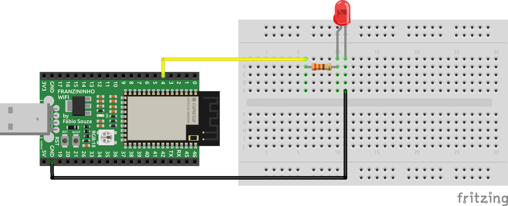

Nesse primeiro  exemplo faremos um blink LED, nosso “Hello, World!” com a placa Franzininho WiFi programada em CircuitPython. Assim, aquecemos os motores para explorar diversas aplicações com CircuitPython na Franzininho WiFi.


## Materiais necessários
- 1 Placa Franzininho Wifi com CircuitPython;
- 1 Protoboard;
- 1 LED vermelho 3 mm;
- 1 resistor 330 Ω;
- Jumpers.

Circuito
Nosso primeiro circuito é bem simples. Realize a seguinte montagem:



## Código

Digite o código abaixo no arquivo code.py que está no diretório CIRCUITPY e salve o arquivo:

Obs. Provavelmente você encontrará outro código no arquivo code.py. Apague-o e insira o código novo.

```python
""" Hello, World! (Pisca LED)"""
import board
import timefrom digitalio import DigitalInOut, Direction

# Configurando o pino do LED, o led que configurei foi o pino 4 = IO4
led = DigitalInOut(board.IO4)
led.direction = Direction.OUTPUT

#loop infinito - executando sempre
while True:    
    led.value = True
    time.sleep(0.5)
    led.value = False
    time.sleep(0.5)
```

Finalizando a edição do arquivo, salve-o.
Após salvar o arquivo o LED pisca em intervalos de 0,5 segundos. (Blink LED)


## Análise do código

Para acessar os pinos da placa precisamos importar o módulo board:

```python
import board
```
Como  precisaremos de intervalos de temporização importamos o módulo sleep:


```
import time
```

O LED foi conectado ao pino 4(IO4) da Franzininho WiFi. Como o LED é um atuador, preciamos configurar o pino como uma saída digital. Para isso, precisamos importar os seguintes módulos:
from digitalio import DigitalInOut, Direction

```
from digitalio import DigitalInOut, Direction
```

Com os módulos importados podemos acessar as funções de configuração do pino digital:

```python
led = DigitalInOut(board.IO4)
led.direction = Direction.OUTPUT
```
Note que primeiro mapeamos o pino e depois  configuramos a direção.

Para que o LED fique piscando infinitamente em intervalos de 500 ms, fazemos um loop infinito com o laço while. O valor do LED é invertido a cada 0,5 s loop:

```python
while True:    
    led.value = True
    time.sleep(0.5)
    led.value = False
    time.sleep(0.5)
```

:::tip Sugestão
Altere o tempo de intervalo para 0.1 e 1 e observe o efeito.
:::


## Conclusão

Neste primeiro exemplo de programação da  Franzininho WiFi com o CircuitPython fizemos um código simples em Python para piscar o LED em intervalos de 0,5 segundos. Esse exemplo serviu para nos ensinar como importar as bibliotecas, configurar o pino como saída digital e criar um loop infinito para piscar o LED. Você pode alterar o intervalo de tempo alterando o parâmetro na função sleep.
Com esse exemplo dominado, podemos passar para a próxima etapa.
