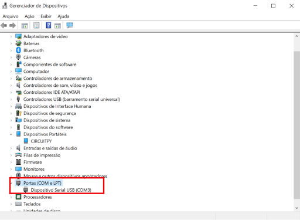

O CircuitPython não exige ferramentas específicas para programação. Um simples editor de texto já é suficiente. Porém, para facilitar e dar maior produtividade a codificação podemos usar algumas ferramentas.


Recomendamos as seguintes ferramentas para trabalhar com o CircuitPython:

-   [Mu Editor](https://codewith.mu/)
-   [Thonny IDE](https://thonny.org/)
-   [VS Code](https://code.visualstudio.com/)


Nesse tutorial focaremos no Mu Editor pela simplicidade e facilidade do seu uso. Abaixo exibimos o processo de instalação para os sistemas operacionais [Windows](#windows) e [Linux](#linux).

## Windows

### Instalando o Mu Editor


Para a instalação do Mu Editor no Windows você deve seguir os seguintes passos:

Passo 1: Acesse o site [https://codewith.mu/](https://codewith.mu/) e clique em Download:


Passo 2: Clique na opção Windows Installer.


Passo 3: Salve-o em seu computador.


Passo 4: Aguarde até terminar o download e após isso clique em abrir o arquivo que você acabou de baixar.


Passo 5: Após baixar o programa, dê dois cliques e então irá aparecer uma tela onde você terá que aceitar os termos de uso do software, clique na caixa de seleção e pressione Install e aguarde a instalação.


Passo 8: Procure em seu computador: Mu Editor


Passo 9: Ao abrir o programa aguarde, está é a tela de inicio do Mu Editor.


Passo 10: Após isso escolha CircuitPython, conforme a imagem abaixo:
 se por acaso ele não abrir, clique em "Modo".


Passo 11: Pronto, agora é só se divertir!


### Instalação de terminal serial para acesso ao REPL

A seguir apresentaremos a instalação de terminal serial para acesso ao REPL através da comunicação serial.


Instalaremos o terminal serial Putty para nossos exemplos. Faça o download em: [https://www.putty.org/](https://www.putty.org/)

No site, clique na primeira opção


Veja qual é o seu sistema. No meu caso é de 64bits por isso vou clicar na opção de 64 bits x86. Após isso é só salvar.


Após realizar o download, dê dois cliques no arquivo. Será aberta a janela conforme a figura abaixo. Clique em next e depois em install:


Novamente clique em install:


Aguarde e clique em finish:


Pronto finalizamos a etapa de configuração. O próximo passo é abrir o programa PuTTy em seu computador, mais abaixo estarei explicando os primeiros passos com ele.


Como citei acima, abra o programa PuTTY


Então abrirá uma janela conforme a imagem acima. Enquanto isso, vamos até o gerenciador de dispositivos.


Vá em Portas (COM e LTP). Aqui você encontra em qual porta a placa está conectada. Clicando para expandir você verá Dispositivo Serial USB (COM3)




Agora faremos algumas alterações, conforme a imagem abaixo, em COM 1 altere para COM3 e selecione a opção Serial e clique em open.


Então aparecerá uma tela, similar a um terminal. Pressione Ctrl + C para entrar no interpretador Python da placa:


Agora que a placa já está conectada, podemos enviar alguns comandos para ela executar através do REPL.


Digite print(“Olá, Mundo!”) e dê o enter.


Executamos acima o comando print. Você pode testar outras mensagens trocando o texto que está entre aspas.


Podemos também executar algumas operações matemáticas.


Também podemos ter acesso às funções do CircuitPython para acesso ao hardware. Vamos ver quais pinos a Franzininho WiFi possui disponível?

Digite import board, dê enter. Digite dir(board) e dê o enter.


Esses são os pinos que trabalharemos para nossas aplicações.


Essa foi apenas uma experiência rápida para acesso ao REPL. Essa ferramenta nos ajudará a testar códigos ou dispositivos rapidamente.

Para editar códigos maiores e projetos que você precisa salvar, recomendamos que edite no arquivo code.py

Para acessar esse arquivo, abra o dispositivo de armazenamento (CIRCUITPY):


## Linux

### Instalando o Mu Editor

Para a instalar o Mu Editor no Linux você deve seguir os passos a seguir:

Passo 1: Acesse o site [https://codewith.mu/](https://codewith.mu/) e clique em Download:


Passo 2: Clique na opção Python Package (Linux or Native Python)


Passo 3: Abra seu terminal e digite o comando abaixo, ele vai instalar bibliotecas do python, aguarde até finalizar:

pip3 install mu-editor==1.1.0b5


Passo 4: Agora digite este comando:

```
mu-editor
```

Passo 5: Pronto, agora é só se divertir!


### Instalação de terminal serial para acesso ao REPL

A seguir apresentaremos a instalação de terminal serial para acesso ao REPL através da comunicação serial.


Instale um terminal, por exemplo, para instalar o picocom, digite os comandos abaixo:

```
sudo apt-get update  
sudo apt-get install picocom
```

Para acessar a Franzininho WiFi através do REPL usando o terminal serial no Linux, o primeiro passo é conectar a placa Franzininho Wifi em seu computador e logo irá aparecer algo parecido com um dispositivo de pendrive, conforme a imagem abaixo:


Agora abriremos o terminal Serial e a porta serial que a placa está conectada. Abra o terminal de comandos e digite o seguinte comando: picomcom /dev/ttyACM0 de enter.


Agora pressione Ctrl+C no teclado e então aparecerá >>>


Pronto, estamos na placa Franzininho WiFi e podemos enviar comandos diretamente para ela.

Digite: print(“Hello World”) e aperte o enter (você pode escrever qualquer coisa nas aspas, então aparecerá o que você escreveu:


Note que estamos executando comando Python através do REPL.

Agora faremos uma operação matemática, digite um numero, escolha uma operação matemática e digite outro valor, aperte o enter e observe o resultado:


Agora digite o seguinte código no terminal:

```
import board  
dir(board)
```

Então aparecerá o conjunto de pinos disponíveis na Franzininho Wifi.


Esse foi apenas uma experiência rápia para acesso ao REPL. Essa ferramenta nos ajudará a testar códigos ou dispositivos rapidamente.

Para editar códigos maiores e projetos que você precisa salvar, recomendamos que edite no arquivo code.py

Para acessar esse arquivo, abra o dispositivo de armazenamento (CIRCUITPY):


Agora veremos o que é possível fazer com o CircuitPyhton. Bora lá?

| Autor | Diana Santos |
|-------|--------------|
| Autor | [Fábio Souza](https://github.com/FBSeletronica) |
| Data: | 16/09/201    |