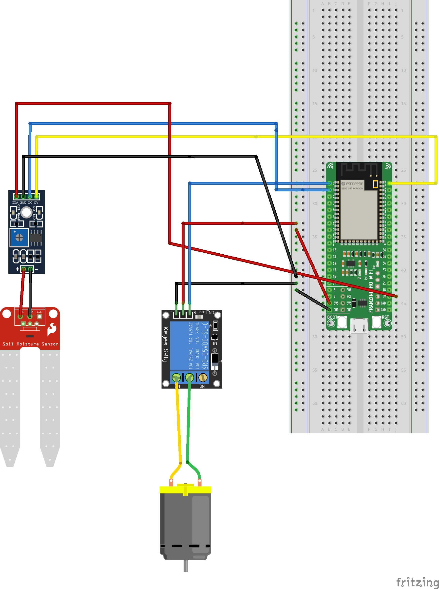

Um sistema de irrigação automático é uma solução para ajudar a manter de forma sistemática a irrigação 
de suas plantas. 

Esse sistema permite programar as regras de acordo com as necessidades das plantas. Isso garante uma economia 
de água e tempo, para quem possui um jardim ou horta e para grandes sistemas de irrigação 
na agricultura.

Agora vamos descrever um exemplo de um sistema de irrigação automatico possível de construir de forma simples mas com grande
poder de automação.

## **Materiais Usados**

- 1 Placa Franzininho WiFi
- 1 Sensor de umidade do solo - Higrômetro com saida digital e analogica
- 1 Protoboard de 830 pontos
- 1 Mini bomba de água submersa 5v
- 1 Relé 5v
- Cabos Jumpers - Macho/Macho e Macho/Femea

## **Circuito Eletrônico**

Para o exemplo que vamos ver a seguir, realize a seguinte montagem:



**Observações:**
- O relé é conectado a 5V da placa
- Cabos azuis: saídas digitais
- Cabos vermelhos: VCC
- Cabos pretos: GND

## **Código-fonte**

Para iniciar, é necessário já ter seguido o tutorial de**Primeiros passos**, que também se encontra na página da Franzininho em documentação,
ter o CircuitPython instalado na placa e para esse projeto utilizamos o Mu editor. Para obter esse ambiente basta seguir os passos em **Instalando as ferramentas**.


A partir daqui consideramos que os primeiros passos de instalação e do ambiente foram concluídos. 
Abaixo está o código do sistema na placa usando CircuitPython, você pode copiar e colar o código fonte na sua IDE.

```python
import board
import time

from digitalio import DigitalInOut, Direction, Pull
from analogio import AnalogIn  

relay = DigitalInOut(board.IO0)
relay.switch_to_output()

humid_analog = AnalogIn(board.IO1)       
humid_digital = DigitalInOut(board.IO4)   
humid_digital.direction = Direction.INPUT 

relay.value = True

wait_time = 1
watering_time = 1

dry_value = 51130

while True:
    try:
        print("humid (Digital value):", humid_digital.value)
        print("humid (Analogic value):", humid_analog.value)

        time.sleep(1);

        if humid_analog.value > dry_value :
            print("Starting watering...")

            relay.value = False

            time.sleep(watering_time)
            print("Finishing watering.")

        else:
            relay.value = True
            time.sleep(wait_time)

    except RuntimeError as e:
        print("Read failure")

    time.sleep(1)
```

Após terminar de escrever, e analisar no ambiente de desenvolvimento. Basta salvar e apertar no serial para executar no mu-editor. Caso esteja utilizando outra IDE, basta executá-la no ambiente escolhido.

## **Entendendo o Código Fonte**

O primeiro módulo que vamos importar, é o board. Ele possibilita o acesso aos pinos da placa:

```python
import board
```

Este módulo fornece várias funções relacionadas ao tempo:

```python
import time
```
O digitalio é um módulo que contém classes para fornecer acesso a IO digital básico:

```python
from digitalio import DigitalInOut, Direction, Pull
```

Cria um objeto e conecta o objeto com uma entrada analógica:

```python
from analogio import AnalogIn 
```

Agora, vamos atribuir o relé:

```python
relay = DigitalInOut(board.IO0)
relay.switch_to_output()
```

Atribuimos as entradas analógicas e digitais do sensor de umidade do solo na porta 1, sendo esta uma porta analógica e na porta 4 a digital do franzinho. Configurando também o pino como entrada digital:

```python
humid_analog = AnalogIn(board.IO1)        # analog
humid_digital = DigitalInOut(board.IO4)   # digital
humid_digital.direction = Direction.INPUT
```

O relé foi configurado para usar a porta "sempre fechada",então precisamos defini-lo com o valor verdadeiro para que o relé fique inativo:

```python
relay.value = True
```
Período de tempo para verificar o sistema. O controle desse período de tempo para manter a rega da planta depende da voltagem que alimenta a bomba:

```python
wait_time = 1
watering_time = 1
```

Adaptado de acordo com o sensor de umidade do solo, é necessario fazer laguns testes na sua terra para saber o valor da terra que vai ser utilizada:

```python
dry_value = 51130
```


Por fim, dentro do **while True**, o nosso loop, faremos com que os sensores leiam continuamente e imprima os valores lidos do sensor de umidade do solo:

```python
while True:
    try:

        print("humid (Digital value):", humid_digital.value)
        print("humid (Analogic value):", humid_analog.value)

        time.sleep(1);
```

Já na condição abaixo, caso o sensor receba um valor que indique que a terra está seca, entramos no condicional if e conectamos o relé no "sempre fechado",
e é por isso que adicionar um Falso a "sempre fechado", signinifica aberto. Então a bomba é acionada realizando a irrigação:

```python
if humid_analog.value > dry_value :
            print("Starting watering...")

            relay.value = False

            time.sleep(watering_time)
            print("Finishing watering.")

```
Se o nível estiver OK, apenas nos certificamos de que o relé esteja fechado:

```python
        else:
            relay.value = True
            time.sleep(wait_time)

```
E colocamos o sensor para dormir novamente:
```python
    time.sleep(1)
```


Também é possivel encontrar o codigo em https://github.com/GiulianeEC/SystemOfIrrigation_Franzininho

## **Conclusão**

No decorrer da explicação, aprendemos a como montar de maneira simples um protótipo de irrigação automatizado.

| Autor | Giuliane Eulália Corrêa |
|-------|-------------|
| Data: | 28/01/2023  |


