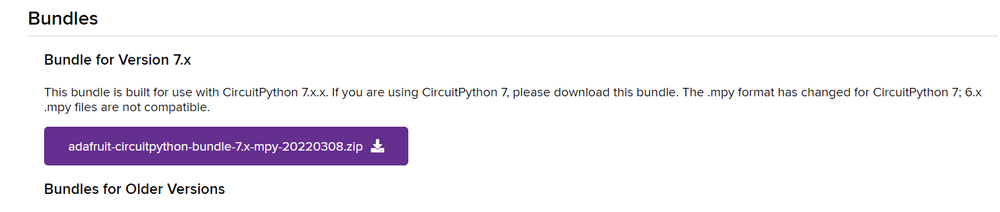

Neste artigo vamos aprender a usar o PWM no CircuitPython, uma técnica muito usada para controle de potência. Veja como é fácil aplicar.

PWM é abreviação para, Pulse Width Modulation – que significa – Modulação por Largura de Pulso. Essa é uma técnica onde, uma saída digital é usada para simular uma saída analógica. Isso acontece por meio de mudanças constantes de sinal, que são imperceptíveis e, dessa maneira o componente conectado a esse pino apenas tira uma média de quanto tempo está em estado alto e baixo. Quanto mais tempo ligado, maior o valor e, consequentemente, quando menor tempo ligado, menor o valor.

Neste exemplo, vamos aprender a usar PWM com CircuitPython na Franzininho WiFi.

## Materiais necessários

- 1 Placa Franzininho WiFi com CircuitPython;
- 1 Protoboard;
- 1 LED;
- 1 potenciômetro de 10 kΩ;
- 1 resistor de 220 Ω ou 330 Ω;
- Jumpers.

## Circuito

Para os nossos primeiros experimentos, realize a seguinte montagem:


Figura 1 – Circuito para teste de PWM com CircuitPython na Franzininho WiFi


## Código para PWM com CircuitPython

Para esse código, utilizaremos a biblioteca simpleio, que será necessária para realizarmos a conversão de valores. As bibliotecas do CircuitPython podem ser encontradas no seguinte endereço: https://circuitpython.org/libraries. Faça o download, de acordo com a versão do CircuitPython instalada na sua Franzininho WiFi.



Após baixar o arquivo, copie a pasta desejada para a pasta de arquivos da Franzininho WiFi:

    simpleio.mpy

Escreva o código abaixo no arquivo code.py, que está localizado no diretório da Franzininho:

```python
import pwmio
import math
import simpleio
from analogio import AnalogIn
from time import sleep

potIn = board.IO2
pot = AnalogIn(potIn)

LED = board.IO4
led = pwmio.PWMOut(LED)

def converter(pin):
    pinValue = pin.value
    mapValue = math.trunc(simpleio.map_range
               (pinValue, 536, 51355, 0, 65535))
    print('Valor Original: ', pinValue,
          'Valor Convertido: ', mapValue)
    return mapValue

while True:
    potValue = converter(pot)
    led.duty_cycle = potValue
    sleep(0.1)
```

Depois de finalizar a edição do código, salve. Execute o programa.

Utilizaremos o módulo board para acessarmos os pinos da Franzininho:

```python
import board
```

E para configurarmos os pinos PWM, é necessário importarmos o pwmio:

```python
import pwmio
```

Além disso, será necessário a biblioteca math, para “eliminar” as casas decimais:

```python
import math
```

Como dito anteriormente, usaremos o módulo simpleio:

```python
import simpleio
```

Ademais, importaremos a função AnalogIn do módulo analogio para, configuramos o potenciômetro como uma entrada analógica:

```python
from analogio import AnalogIn
```

Também, iremos chamar a função sleep, da biblioteca time, pois precisaremos de intervalos de temporização:

```python
from time import sleep
```

Agora, após importarmos todas os módulos que vamos utilizar, vamos configurar os pinos. Primeiro, vamos associar o GPIO2 a uma variável chamada potIn. Após isso, vamos criar um objeto chamado pot e configurá-lo como uma entrada analógica:

```python
LED = board.IO4
led = pwmio.PWMOut(LED)
```

Configurações iniciais encerradas! Depois disso, vamos criar uma função chamada converte. Como parâmetro, essa função receberá o pino que estamos realizando a leitura:


```python
def converter(pin):
```

Dentro da função, realizaremos a leitura do valor do potenciômetro, que será armazenada na variável pinValue:

```python
pinValue = pin.value
```

Além disso, vamos converter o valor do potenciômetro para o valor aceito pelos pinos PWM. Para isso, vamos usar a função simpleio.map_range. Os parâmetros dessa função são: valor bruto (no caso, o valor recebido naquele instante), valor mínimo de entrada, valor máximo de entrada, valor mínimo de saída e valor máximo de saída. E, vamos precisar da função math.trunc, que eliminará as casas decimais. Todas essas informações ficarão armazenadas na variável mapValue:

```python
mapValue = math.trunc(simpleio.map_range
               (pinValue, 536, 51355, 0, 65535))
```

Colocaremos o print apenas para visualizarmos a conversão:

```python
print('Valor Original: ', pinValue,
          'Valor Convertido: ', mapValue)
    return mapValue
```
E a função nos retornará o valor de mapValue:
```python
return mapValue
```

E por fim, o loop. Dentro do while True, vamos associar o valor retornado pela função converte a variável potValue e mandar esse valor para o led. Para enviarmos um valor para o componente, utilizamos a função duty_cycle, que é o ciclo de trabalho, ou seja, quanto tempo o sinal estará ligado ou não. Também, colocaremos um delay:

```python
while True:
    potValue = converter(pot)
    led.duty_cycle = potValue
    sleep(0.1)
```

## Conclusão

Nesse exemplo, aprendemos a como usar os pinos PWM com CircuitPython e, como controlá-los através de um potenciômetro. Além disso, aprendemos a como mapear valores. No próximo exemplo, vamos aprender a como usar Servos Motores.
Outros artigos da série.

| Autor | Mateus Adriano Ventura Vieira |
|-------|--------------|
| Data: | 09/05/2022  |
