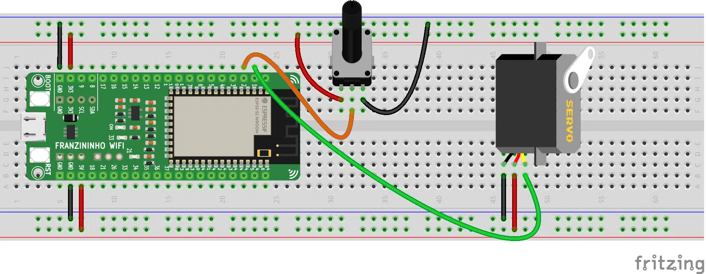
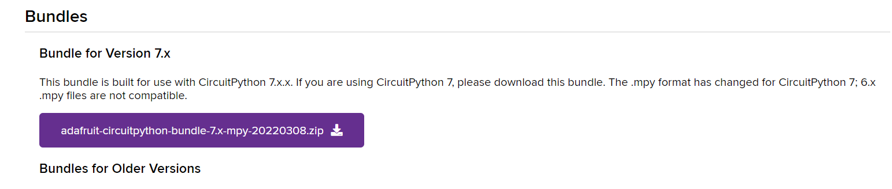

Um servo motor é um pequeno motor de corrente contínua. Diferentemente dos demais motores DC, onde apenas controlamos a velocidade de giro, conseguimos controlar a posição de um servo, através do PWM.

O servo que vamos utilizar nesse exemplo, tem a resolução de meia volta, ou seja, de 0° a 180°.

## **Materiais Necessários**

- 1 Placa Franzininho WiFi com CircuitPython;
- 1 Micro servo 9g;
- 1 Protoboard;
- 1 potenciômetro de 10 kΩ;
- Jumpers.

## **Circuito**

Para os exemplos que vamos ver a seguir, realize a seguinte montagem:



**Observação:** o servo deve ser conectado ao 5V da placa. E, caso deseje usar mais de dois servos, uma fonte externa deve ser usada.

## **Códigos**

Assim como quando aprendemos a usar PWM, vamos importar o módulo simpleio. Também, vamos importar um novo módulo para trabalharmos com o servo motor.

Para ter acesso a esses módulos, acesse o endereço: [https://circuitpython.org/libraries](https://circuitpython.org/libraries). Faça o download, de acordo com a versão do CircuitPython instalada na sua Franzininho WiFi.



Após finalizar o download, importe os dois módulos para a pasta de arquivos da Franzininho WiFi:

- **simpleio.mpy**;
- **adafruit_motor**.

### **Exemplo 1**

No primeiro exemplo, vamos aprender a como programar um servo motor usando CircuitPython. Para isso, copie o código abaixo:

```python
import board
import pwmio
from adafruit_motor import servo 
from time import sleep

pin = board.IO1
pwm = pwmio.PWMOut(pin, frequency = 50)

my_servo = servo.Servo(pwm)

while True:
    for angle in range(0, 180, 10): 
        my_servo.angle = angle
        sleep(0.1)
    for angle in range(180, 0, -10): 
        my_servo.angle = angle
        sleep(0.1)
```

Salve e execute o código.

### **Exemplo 2**

Já nesse exemplo, vamos controlar o posicionamento do servo através de um potenciômetro. E para isso, vamos usar alguns recursos que aprendemos anteriormente. Escreva o código abaixo:

```python
import board
import pwmio
from adafruit_motor import servo
import simpleio
import math
from analogio import AnalogIn
from time import sleep

pin = board.IO1
pwm = pwmio.PWMOut(pin, frequency = 50)
my_servo = servo.Servo(pwm)

potPin = board.IO2
pot = AnalogIn(potPin)

def converter(pin):
    pinValue = pin.value
    mapValue = math.trunc(simpleio.map_range
               (pinValue, 536, 51355, 0, 180))
    return mapValue

while True:
    angle = converter(pot)
    my_servo.angle = angle
    sleep(0.1)
```

Após terminar de escrever, salve o código e teste-o.

## **Análise dos Códigos**

### **Exemplo 1**

O primeiro módulo que vamos importar, é o **board**. Ele possibilita o acesso aos pinos da placa:

```python
import board
```

Para conseguirmos usar os pinos PWM, precisamos do módulo **pwmio**:

```python
import pwmio
```

Também, será necessário a biblioteca auxiliar **adafruit_motor.servo**. Ela será útil para controlar o servo com base na saída PWM:

```python
from adafruit_motor import servo
```

E, por último, precisaremos da função **sleep** do módulo **time**, para intervalos de temporização:

```python
from time import sleep
```

Agora, vamos atribuir o GPIO1 da placa a variável pin:

```python
pin  =  board.IO1
```

Também, configuraremos esse pino como uma saída PWM. Repare, que diferente do LED, precisamos informar a frequência, pois, por padrão ela está configurada com 500Hz e o padrão do servo motor é 50Hz:

```python
pwm  =  pwmio.PWMOut(pin,  frequency  =  50)
```

Além disso, vamos criar o objeto **my_servo** e atribuir o pino **pwm** a ele:

```python
my_servo  =  servo.Servo(pwm)
```

Por fim, dentro do **while True**, o nosso loop, faremos com que o servo se mova continuamente. Para isso, usaremos a estrutura de repetição **for** e o comando **range( )**, que gera uma lista.

Como parâmetros do primeiro laço, vamos informar o valor inicial (0), valor final(180) e o intervalo de contagem, ou seja, de 10 em 10. Dentro do laço, esse valor será enviado para o servo a cada 0.1 segundos:

```python
while True:
    for angle in range(0, 180, 10): 
        my_servo.angle = angle
        sleep(0.1)
```

Já no segundo laço, faremos o mesmo. Porém, invés de incrementar de 10 em 10, a contagem será decrescente:

```python
for angle in range(180, 0, -10): 
        my_servo.angle = angle
        sleep(0.1)
```

**Exemplo 2**

Além dos módulos que já usamos no primeiro exemplo, precisaremos importar **simpleio**, para usarmos a função de mapeamento:

```python
import simpleio
```

Vamos precisar também da biblioteca **math**:

```python
import math
```

E, da função **AnalogIn** da biblioteca **analogio**:

```python
from analogio import AnalogIn
```

Além de configurarmos o servo, também vamos configurar o potenciômetro. Para isso, primeiro vamos atribuir o GPIO2 a variável potPin:

```python
potPin  =  board.IO2
```

Por fim, vamos atribuir esse pino ao objeto **pot** como uma entrada analógica:

```python
pot  =  AnalogIn(potPin)
```

Agora, vamos criar uma função chamada **converte**. Essa função receberá como parâmetro o pino que estamos lendo:

```python
def converter(pin):
```

Dentro da função, faremos a leitura do valor enviado pelo potenciômetro e armazená-la na variável **pinValue**:

```python
pinValue  =  pin.value
```

Ademais, converteremos o valor da leitura para graus. Para tal, usaremos a função **simpleio.map_range**. Os parâmetros dessa função são: valor bruto (valor da leitura naquele instante), valor mínimo de entrada, valor máximo de entrada, valor mínimo de saída e valor máximo de saída. Também, precisaremos da função **math.trunc**, que eliminará as casas decimais. Todas essas informações ficarão armazenadas na variável **mapValue**:

```python
mapValue = math.trunc(simpleio.map_range(pinValue, 536, 51355, 0, 180))
```

E, a função nos retornará o valor de **mapValue**:

```python
return  mapValue
```

No laço de repetição infinita, **while True**, atribuiremos o valor retornado pela função **converte** a variável **angle**. Esse valor será enviado para o servo motor a cada 0.1 segundos:

```python
while True:
    angle = converter(pot)
    my_servo.angle = angle
    sleep(0.1)
```

## **Conclusão**

No decorrer da explicação, aprendemos a como usar um servo motor de uma maneira simples utilizando CircuitPython. Também, pudemos ver como usar um potenciômetro para controlar a movimentação dos nossos servos.

| Autor | Mateus Adriano Ventura Vieira |
|-------|--------------|
| Data: | 17/05/2022  |
