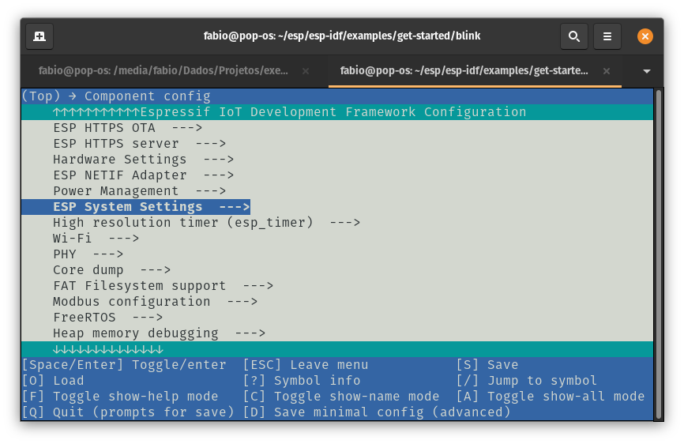

Este documento tem como objetivo ajudá-lo a configurar o ESP-IDF (Espressif IoT Development Framework) para trabalhar com a Franzininho WiFi que usa o ESP32-S2 da Espressif.

Ao final, faremos um exemplo simples para compilar, gravar e monitorar usando o ESP-IDF, assim, garantiremos que tudo estará funcionando.

## Introdução

Para essa configuração, vamos instalar o ESP-IDF e usá-lo através de linha de comando. Caso você queira usar o IDF integrado a ambientes de desenvolvimento integrado (IDE) como VScode e Eclipse, confira os seguintes links:

- [Eclipse Plugin](https://github.com/espressif/idf-eclipse-plugin)
- [VS Code Extension](https://github.com/espressif/vscode-esp-idf-extension)

Você poderá instalar o ESP-IDF no seu sistema operacional preferido (Linux, Windows, macOS).

Para a experiência completa, você precisará de uma placa Franzininho WiFi, Computador: com Windows, Linux ou macOS

## Passo 1 - Instalação dos pré-requisitos

Algumas ferramentas precisam ser instaladas no computador antes de prosseguir para as próximas etapas. Siga os links abaixo para obter as instruções para o seu sistema operacional:

- [Windows](https://docs.espressif.com/projects/esp-idf/en/latest/esp32s2/get-started/windows-setup.html)
- [Linux](https://docs.espressif.com/projects/esp-idf/en/latest/esp32s2/get-started/linux-setup.html)
- [Mac OS](https://docs.espressif.com/projects/esp-idf/en/latest/esp32s2/get-started/macos-setup.html)

É muito importante a instalação de todos os pré-requisitos.

## Passo 2 - Instalação do ESP-IDF

Nessa etapa vamos instalar o ESP-IDF e conjunto de ferramentas e bibliotecas. Vamos usar o código mantido pela Espressif no repositório do [ESP-IDF](https://github.com/espressif/esp-idf)

O ESP-IDF é o framework oficial da Espressif para o desenvolvimento de aplicações parar toda a família ESP32. O procedimento apresentado aqui servirá para trabalhar com toda a família ESP32. Porém, vamos dar foco ao ESP32-S2 que é usado na Franzininho WiFi.

### Linux e macOS

Abra o terminal e execute:

```bash
mkdir -p ~/esp
cd ~/esp
git clone --recursive https://github.com/espressif/esp-idf.git
```

O ESP-IDF será baixado no seguinte repositório `~/esp/esp-idf`.

### Windows

Além de instalar as ferramentas, o [ESP-IDF Tools Installer para Windows](https://docs.espressif.com/projects/esp-idf/en/latest/esp32s2/get-started/windows-setup.html#get-started-windows-tools-installer) apresentado no passo 1 ele também baixa uma cópia do ESP-IDF. Dessa forma você não precisará baixar o ESP-IDF agora, se já tiver baixado anteriormente junto aos pré-requisitos.

Se desejar fazer o download do ESP-IDF sem a ajuda do ESP-IDF Tools Installer, consulte [estas instruções](https://docs.espressif.com/projects/esp-idf/en/latest/esp32s2/get-started/windows-setup-scratch.html#get-esp-idf-windows-command-line).

### Instalando O ESP-IDF e ferramentas

Além do ESP-IDF, você também precisa instalar as ferramentas usadas pelo ESP-IDF, como compilador, depurador, pacotes Python, etc.

#### Windows

O ESP-IDF Tools Installer para Windows apresentado no passo 1 instala todas as ferramentas necessárias.

Se você deseja instalar as ferramentas sem a ajuda do ESP-IDF Tools Installer, abra o Prompt de Comando e siga estas etapas:

```bash
cd %userprofile%\esp\esp-idf
install.bat
```

Ou no Windows PowerShell

```bash
cd ~/esp/esp-idf
./install.ps1
```

#### Linux e macOS

No Linux ou macOS há um script para instalação.Abra o terminal e execute:

```bash
cd ~/esp/esp-idf
./install.sh
```

Ou se tiver usando o Fish:
```bash
cd ~/esp/esp-idf
./install.fish
```

### Configurando as variáveis de ambientes

As ferramentas instaladas ainda não foram adicionadas à variável de ambiente PATH. Para tornar as ferramentas utilizáveis na linha de comando, algumas variáveis de ambiente devem ser definidas. ESP-IDF fornece alguns scripts que ajudam nesse processo.

#### Windows

O ESP-IDF Tools Installer para Windows cria um atalho “ESP-IDF Command Prompt” no menu Iniciar. Este atalho abre o Prompt de Comando e configura todas as variáveis de ambiente necessárias. Você pode abrir este atalho e prosseguir para a próxima etapa.

Caso não funcione e você precise configurar manualmente, execute os seguintes comandos:

**Prompt de Comando**:

```bash
%userprofile%\esp\esp-idf\export.bat
```

**Windows PowerShell**:

```bash
.$HOME/esp/esp-idf/export.ps1
```

#### Linux e macOS

No terminal execute:

```bash
. $HOME/esp/esp-idf/export.sh
```

Ou no Fish(suportado apenas em versões a partir da 3.0.0):
```bash
. $HOME/esp/esp-idf/export.fish
```

:::important Importante
Você precisa fazer isso toda vez que iniciar o terminal para usar o ESP-IDF.
:::

## Passo 3 - Criando um novo projeto

Agora que já temos as ferramentas instaladas, vamos fazer um exemplo para validar o funcionamento das mesmas. Vamos executar o exemplo blink que já vem no IDF.

### Copiando um projeto exemplo

Vamos copiar o projeto blink para preservarmos o exemplo presente na pasta do IDF:

#### Windows

```bash
cd %userprofile%\esp
xcopy /e /i %IDF_PATH%\examples\get-started\blink blink
```

#### Linux e macOS

```bash
cd ~/esp
cp -r $IDF_PATH/examples/get-started/blink .
```

Fique a vontade para testar os outros exemplos também.

O sistema de compilação ESP-IDF não oferece suporte a espaços nos caminhos para o ESP-IDF ou para projetos.

### Configuração

Agora vamos configurar o target para qual será compilado e já fazer uma configuração no menuconfig. No nosso caso vamos trabalhar com o ESP32-S2:

#### Windows

```bash
cd %userprofile%\esp\blink
idf.py set-target esp32s2
idf.py menuconfig
```

#### Linux e macOS

```bash
cd ~/esp/blink
idf.py set-target esp32s2
idf.py menuconfig
```

Será aberto o menuconfig:


Acesse a opção Component config --->


Em seguida ESP System Settings  --->


Agora selecione Channel for console output (Default: UART0)  --->


E por fim, selecione (X) USB CDC:


Salve(S), Enter, enter, Saia do menu(ESC)

Essa configuração permitirá que usemos a USB no próximo upload.

:::important Importante
Sempre que iniciar um projeto novo faça essas configuração para que continue usando a USB como interface de programação.

:::

    
Para mais detalhes acesse:
<iframe src="https://www.youtube.com/embed/zg9IMDaoImA" title="YouTube video player" frameborder="0" allow="accelerometer; autoplay; clipboard-write; encrypted-media; gyroscope; picture-in-picture" allowfullscreen></iframe>

### Compilando o projeto em modo DFU

A primeira compilação nós vamos fazer usando o modo DFU, que já vem por padrão no ESP32-S2 permitindo o upload através da USB:

Para crie a imagem DFU:

```bash
idf.py dfu
```

A primeira compilação pode demorar um pouco. Da até pra ir pegar um café ;)

Após a compilação, conecte a Franzininho WiFi no computador. Antes de fazermos o upload é necessário entrar no modo DFU. Para entrar no modo DFU pressione as teclas na seguinte sequencia:

1. pressione e segure a tecla BOOT
2. pressione rapidamente e solte a tecla RESET
3. solte a tecla BOOT

Dessa forma a placa entrará no modo DFU e poderá receber o firmware através da USB.

Para fazer a gravação, digite:

```bash
idf.py dfu-flash
```

:::tip Dica
Caso a gravação através da USB não funcione, veja esse [link com as instruções de configurações da USB](https://docs.espressif.com/projects/esp-idf/en/latest/esp32s2/api-guides/dfu.html#udev-rule-linux-only)
:::

Após alguns segundos a placa estará gravada.

Pressione novamente o botão RESET.

### Compilação, gravação e monitor em modo normal

Agora você poderá compilar, gravar e monitorar usando a porta USB. Esse processo é idêntico ao que fazemos para desenvolver com o ESP32:

Compilar:

```bash
idf.py build
```

Gravar:

```bash
idf.py -p PORT [-b BAUD] flash
```

Monitorar:

```bash
idf.py -p /dev/ttyUSB0 monitor
```

Maravilha, você configurou o ambiente para trabalhar com o ESP-IDF.

Caso queira trabalhar com a extensão para VSCODE, confira o video:

<iframe src="https://www.youtube.com/embed/rxMg_zxO0q0" title="YouTube video player" frameborder="0" allow="accelerometer; autoplay; clipboard-write; encrypted-media; gyroscope; picture-in-picture" allowfullscreen></iframe>
