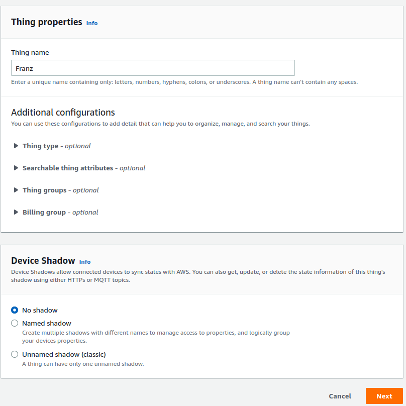
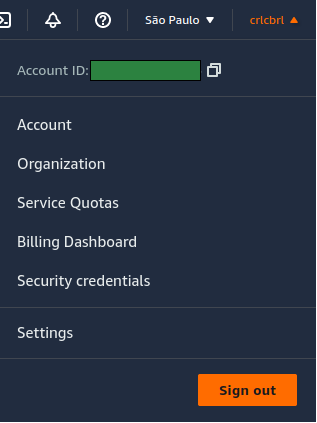
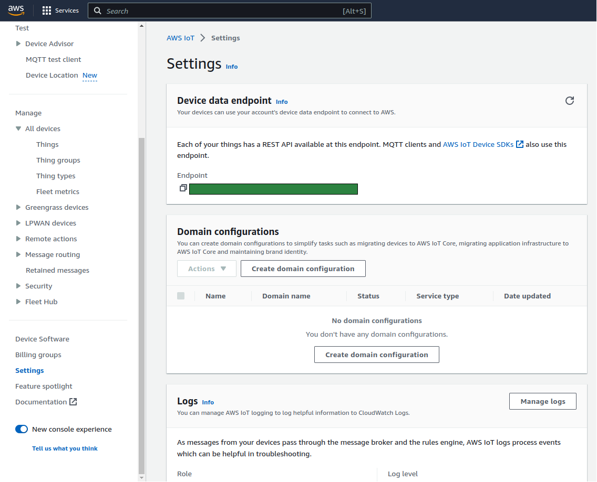
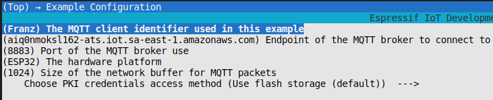
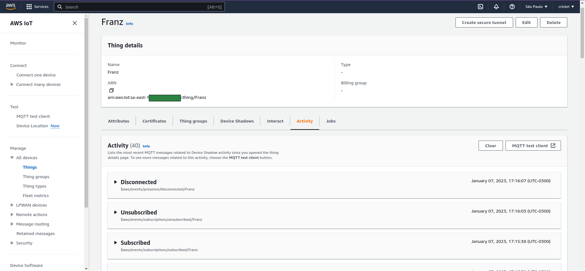
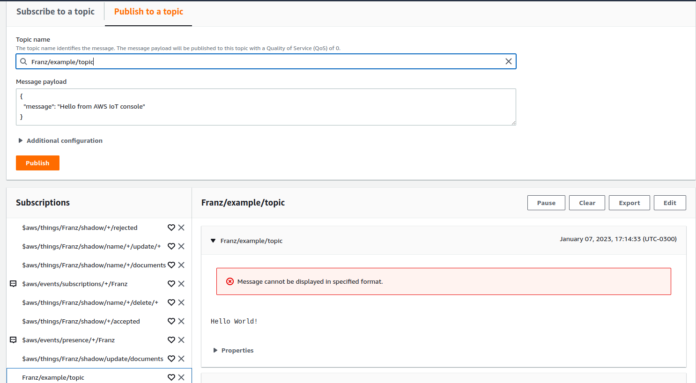

### Introdução

Neste tutorial exploraremos a utilização do AWS IoT Core para conectar a placa Franzininho WiFi à nuvem utilizando o ESP-IDF. Além do IoT Core, a AWS oferece várias outras formas de conectar um dispositivo, como AWS IoT Greengrass Stream Manager ou AWS IoT SiteWise. Esses outros serviços para ingestão e visualização de dados podem ser vistos nesse [link](https://aws.amazon.com/pt/blogs/iot/7-patterns-for-iot-data-ingestion-and-visualization-how-to-decide-what-works-best-for-your-use-case/).

### AWS IOT Core

O AWS IoT Core é o broker de mensagens que permite conectar dispositivos IoT com a nuvem AWS e seus diversos serviços. Através dele, podemos criar, configurar e gerenciar nossos dispositivos.

Atualmente suporta os seguintes protocolos de comunicação:

- MQTT
- MQTT over WSS (Websockets Secure)
- HTTPS
- LoRaWAN

Resumidamente, o serviço se baseia em:

- **Things:** Dispositivos (“coisas”) que queremos conectar;
- **Jobs:** Ações remotas que você pode agendar para realizar operações nos seus dispositivos, como atualizações de firmware;
- **Rules:** Regras através das quais podemos direcionar as mensagens recebidas pelo broker para outros serviços da AWS, por exemplo, para armazenar dados no DynamoDB.
- **Segurança:** onde é possível gerenciar os certificados de autorização, políticas (policies) e papeis (roles) de autenticação.

### Parte 1 - Criando a Franzininho na AWS

Para seguir o tutorial, você deve ter acesso ao console da AWS. Para começar, vamos criar uma nova “coisa” (thing) para representar nossa Franzininho na nuvem. Certifique-se que você está na região mais próxima antes de começar, selecionando-a no menu do canto superior direito. Para o Brasil, a região é sa-east-1.

1. Na AWS, procure pelo serviço IoT Core (`Service > Internet of Things >  IoT core`) e crie uma nova “coisa” em `Manage > All devices > Things > Create new thing`.

2. Vamos criar apenas um dispositivo (_Create a single thing_), mas saiba que também é possível criar vários de uma vez (_Create many things_). Você precisará especificar as propriedades desse dispositivo:

- Thing name: o nome do seu dispositivo para identificá-lo de forma única. Escolha sabiamente, pois essa propriedade não pode ser alterada depois que o dispositivo é criado.
- Configurações adicionais: podem ser utilizadas para detalhar, organizar, gerenciar e pesquisar os dispositivos, como tipo, atributos ou grupos.
- Device shadow permite que o estado do seu dispositivo fique disponível para outros serviços mesmo que ele não esteja conectado.

Por enquanto, basta preencher o nome e prosseguir. Chamarei o meu carinhosamente de Franz.



3. Para conseguir se autenticar ao serivço da AWS, cada dispositivo deve ter um certificado. Utilizaremos o gerado automaticamente (_Auto-generate a new certificate_), mas você também tem a opção de utilizar certificados próprios.

4. Para gerenciar o nível de acesso desse certificado aos recursos, é preciso criar uma política de autorização (_policy_), que é uma lista de ações permitidas ou proibidas para aquele certificado. Você pode criar uma política direto dessa aba, em _Create policy_, ou pela barra de navegação do IoT Core em _Security > Policies_.

Uma _policy_ deve ter um nome e uma ou mais declarações (_statements_). Cada declaração é composta por um **efeito** de uma **ação** à um **recurso**.

O **efeito** pode ser de permissão (_allow_) ou proibição (_deny_).

As possíveis **ações** desse serviço são várias, mas utilizaremos as seguintes principais:

- _iot:Connect:_ permite a conexão do dispositivo ao serviço;
- _iot:Publish:_ permite que o dispositivo publique mensagens no broker;
- _iot:Receive:_ permite que o dispositivo receba mensagem do broker;
- _iot:Subscribe:_ permite que o dispositivo se inscreva nos tópicos do broker.

E o **recurso** é o nome do serviço da AWS que a ação vai se utilizar, neste caso _arn:aws:iot:**region**:**account-id**_.

Você pode adicionar policies já existentes utilizando a aba _Policy Examples_ ou criá-las manualmente. Para este exemplo, utilizei as seguintes políticas:

```bash
{
  "Version": "2012-10-17",
  "Statement": [
    {
      "Effect": "Allow",
      "Action": "iot:Connect",
      "Resource": "arn:aws:iot:sa-east-1:<account-id>:client/${iot:Connection.Thing.ThingName}"
    },
    {
      "Effect": "Allow",
      "Action": "iot:Publish",
      "Resource": "arn:aws:iot:sa-east-1:<account-id>:client/${iot:Connection.Thing.ThingName}"
    },
    {
      "Effect": "Allow",
      "Action": "iot:Subscribe",
      "Resource": "arn:aws:iot:sa-east-1:<account-id>:topicfilter/${iot:Connection.Thing.ThingName}/*"
    },
    {
      "Effect": "Allow",
      "Action": "iot:Publish",
      "Resource": "arn:aws:iot:sa-east-1:<account-id>:topic/${iot:Connection.Thing.ThingName}/*"
    },
    {
      "Effect": "Allow",
      "Action": "iot:Receive",
      "Resource": "arn:aws:iot:sa-east-1:<account-id>:topic/${iot:Connection.Thing.ThingName}/*"
    }
  ]
}
```

Altere o `<account-id>` para o número da sua conta, disponível no menu do canto superior direito.



5. Por fim, baixe os arquivos de certificados e chaves que a AWS criou automaticamente para autenticar esse dispositivo. Este é o único momento que você conseguirá baixar as chaves para esse certificado, então guarde-as com carinho para utilizá-los no próximo passo.

### Parte 2 - Conectando a Franzininho com ESP-IDF

Agora que temos nosso dispositivo configurado, precisamos escrever o firmware para conectá-lo. A própria Espressif disponibiliza um SDK para comunicação com AWS IoT baseada no FreeRTOS. Para utilizar, basta clonar o repositório, preferencialmente direto na pasta de componentes do seu diretório de instalação.

```bash
git clone https://github.com/espressif/esp-aws-iot <esp-dir-path>/esp-idf/components
```

Dentro desse componente, já são disponibilizados alguns exemplos para utilizar com a AWS. Vamos começar utilizando o exemplo básico de MQTT em `examples/mqtt/tls_mutual_auth`.

Para configurar, utilizaremos o _menuconfig_:

1.  Nas configurações do exemplo (_Example Configuration_), insira o nome do dispositivo exatamente como foi criado na AWS (Franz, no meu caso) e o endpoint do broker MQTT, que está disponível no menu `AWS IoT > Settings > Device endpoint` na sua conta do AWS. As demais configurações podem ser deixadas como padrão.




2.  Nas configurações de rede (_Example Connection Configuration_), insira as configurações da sua rede Wi-Fi (SSID e senha)

3.  O método padrão de autenticação com a AWS é utilizando credenciais PKI embarcadas no diretório certs/. Lembra dos certificados que foram gerados automaticamente ao criar um dispositivo? É aqui que você vai colocá-los para embarcar no dispositivo. Copie o certificado, a chave **privada** e um dos certificados de root que você tinha armazenado anteriormente.

```bash
cp certificate.pem.crt main/certs/client.crt
cp private.pem.key main/certs/client.key
cp AmazonRootCAx.pem main/certs/root_cert_auth.pem
```

Com tudo configurado, é só buildar e passar pra placa (siga o tutorial em [Primeiros passos](https://docs.franzininho.com.br/docs/franzininho-wifi/exemplos-espidf/primeiros-passos)). Este exemplo se conecta ao broker MQTT, se sobrescreve no tópico `CLIENT_IDENTIFIER "/example/topic”` (Franz/example/topic, por exemplo) e publica mensagens de Hello World.

Sua conexão foi estabelecida com sucesso caso receba a mensagem a seguir:

```bash
I (7329) coreMQTT: Connection accepted.
I (7339) coreMQTT: Received MQTT CONNACK successfully from broker.
I (7349) coreMQTT: MQTT connection established with the broker.
I (7349) coreMQTT: MQTT connection successfully established with broker.
```

### Parte 3 - Monitorando a Franzininho

Agora que a Franzininho está conectado, podemos monitorar sua atividade pelo console da AWS.

- Você pode ver as mensagens mais recentes em `Manage > Things > Nome do seu dispositivo > Activity`.



- E você também pode interagir através do MQTT Test Client, por exemplo, publicando no tópico `CLIENT_IDENTIFIER "/example/topic”` que estamos inscritos.



A mensagem recebida pode ser vista na Franzininho:

```bash
I (17668) coreMQTT: Packet received. ReceivedBytes=66.
I (17668) coreMQTT: De-serialized incoming PUBLISH packet: DeserializerResult=MQTTSuccess.
I (17668) coreMQTT: State record updated. New state=MQTTPublishDone.
I (17678) coreMQTT: Incoming QOS : 0.
I (17678) coreMQTT: Incoming Publish Topic Name: Franz/example/topic matches subscribed topic.
Incoming Publish message Packet Id is 0.
Incoming Publish Message : {
  "message": "Hello from AWS IoT console"
}.
```

E é isso, agora você pode brincar de Internet das Coisas com sua Franzininho WiFi utilizando a AWS!
