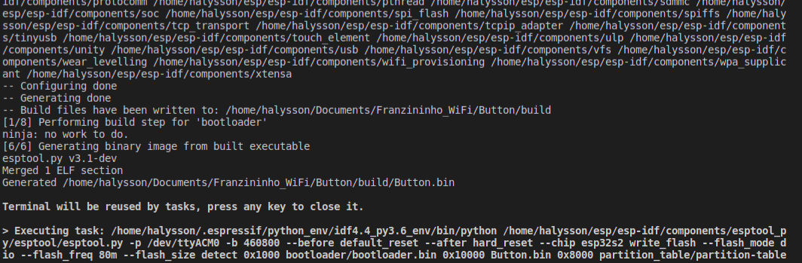
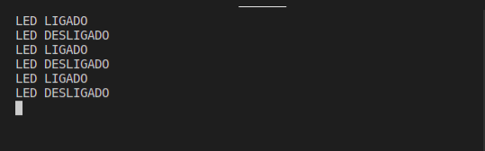

Continuando com o ESP-IDF na Franzininho WiFi, vamos explorar o periférico GPIO como entrada digital. O objetivo é ler o estado do botão BOOT (GPIO 0) e usá-lo para controlar o LED onboard (GPIO 21), enquanto o estado é enviado pelo monitor serial.

Ao final você saberá configurar pinos como entrada e saída digital e aplicar resistor de pull-up interno do ESP32-S2 — sem nenhum componente externo.

## Recursos Necessários

- Franzininho WiFi
- Computador com ESP-IDF instalado e configurado

## Desenvolvimento

O programa lê o estado do botão BOOT conectado ao GPIO 0 e controla o LED onboard no GPIO 21. O botão usa pull-up interno: quando pressionado o nível é LOW (0), quando solto é HIGH (1).

### Código

Crie um novo projeto no ESP-IDF e substitua o conteúdo do `main.c` pelo código abaixo:

```c
#include <stdio.h>
#include "freertos/FreeRTOS.h"
#include "freertos/task.h"
#include "driver/gpio.h"

#define BTN 0
#define LED 21

#define ON  1
#define OFF 0

void app_main(void)
{
    gpio_reset_pin(LED);
    gpio_set_direction(LED, GPIO_MODE_OUTPUT);

    gpio_reset_pin(BTN);
    gpio_set_direction(BTN, GPIO_MODE_INPUT);
    gpio_pullup_en(BTN);

    bool last_state_btn = false;

    while (1) {
        bool state_btn = gpio_get_level(BTN);

        if (!state_btn && !last_state_btn) {
            gpio_set_level(LED, ON);
            printf("LED LIGADO\n");
            last_state_btn = true;
        } else if (state_btn && last_state_btn) {
            gpio_set_level(LED, OFF);
            printf("LED DESLIGADO\n");
            last_state_btn = false;
        }

        vTaskDelay(1 / portTICK_PERIOD_MS);
        fflush(stdout);
    }
}
```

Você encontra o projeto completo no GitHub: [Button](https://github.com/Franzininho/exemplos-esp-idf/tree/main/exemplos/Button)

Caso ainda não tenha instalado o ESP-IDF, acesse o [guia de primeiros passos](primeiros-passos).

### Compilação e gravação

:::important Console USB CDC
Em projetos novos, configure o console para **USB CDC** antes de gravar:
**Component config → ESP System Settings → Channel for console output → (X) USB CDC**

Sem essa configuração, a porta USB não funcionará para monitoração.
:::

Configure o target (se ainda não tiver feito):

```bash
idf.py set-target esp32s2
```

Compile, grave e abra o monitor com um único comando (substitua `/dev/ttyACM0` pela sua porta):

```bash
idf.py -p /dev/ttyACM0 flash monitor
```

Ao final da compilação você verá algo semelhante a:



## Resultados

No monitor serial, pressione e solte o botão BOOT para ver a saída:



## Conclusão

Com este exemplo você aprendeu a configurar um pino como entrada digital, aplicar pull-up interno via software e ler o estado de um botão com `gpio_get_level()`. O mesmo padrão se aplica a qualquer sensor digital: sensores de vibração, infravermelho, som, entre outros.

## Próximos passos

- [Entrada analógica com ESP-IDF](entrada-analogica) — leitura de sinal analógico com o conversor AD do ESP32-S2
