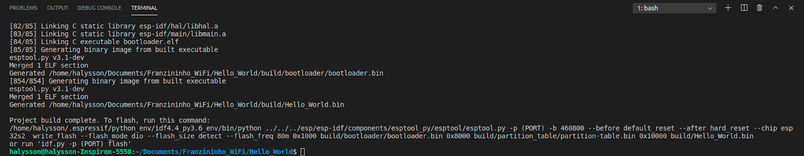
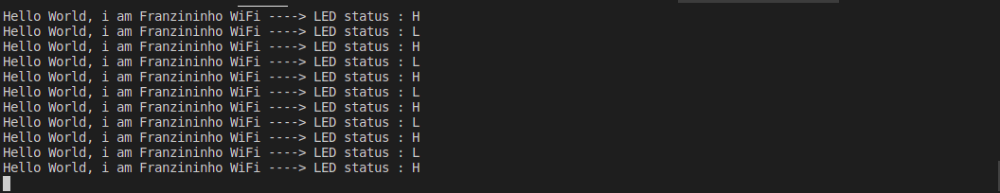

Neste exemplo vamos fazer o clássico “Hello World” com a Franzininho WiFi usando o ESP-IDF. O objetivo é explorar as GPIOs como saída digital, enviar mensagens pelo monitor serial e entender a estrutura básica de um projeto ESP-IDF.

Ao final você saberá como organizar um projeto no IDF e estará pronto para os próximos exemplos.

## Recursos Necessários

- Placa Franzininho WiFi
- Computador com ESP-IDF instalado e configurado

## Desenvolvimento

Vamos usar a Franzininho WiFi para controlar o LED onboard conectado à GPIO 21, ligando e desligando em 1 Hz, enquanto enviamos mensagens pelo monitor serial. Quem vem do Arduino vai reconhecer o exemplo — é o Blink com saída de texto.

### Código

Crie um novo projeto no ESP-IDF e substitua o conteúdo do `main.c` pelo código abaixo:

```c
#include <stdio.h>
#include "freertos/FreeRTOS.h"
#include "freertos/task.h"
#include "driver/gpio.h"

#define LED 21

char status[2] = {'L', 'H'};

void app_main(void)
{
    gpio_reset_pin(LED);
    gpio_set_direction(LED, GPIO_MODE_OUTPUT);

    printf("Exemplo - Hello World\n");

    int i = 0;

    for (;;) {
        i = i ^ 1;
        gpio_set_level(LED, i);
        printf("Hello World, i am Franzininho WiFi ----> LED status: %c\n", status[i]);
        vTaskDelay(1000 / portTICK_PERIOD_MS);
        fflush(stdout);
    }
}
```

Você encontra o projeto completo na documentação da Franzininho: [Hello_World](https://github.com/Franzininho/exemplos-esp-idf/tree/main/exemplos/Hello_World)

Caso ainda não tenha instalado e configurado o ESP-IDF, acesse o [guia de primeiros passos](primeiros-passos).

### Compilação e gravação

:::important Console USB CDC
Em projetos novos, configure o console para **USB CDC** antes de gravar:
**Component config → ESP System Settings → Channel for console output → (X) USB CDC**

Sem essa configuração, a porta USB não funcionará para monitoração.
:::

Configure o target (se ainda não tiver feito):

```bash
idf.py set-target esp32s2
```

Compile, grave e abra o monitor com um único comando (substitua `/dev/ttyACM0` pela sua porta):

```bash
idf.py -p /dev/ttyACM0 flash monitor
```

Ao final da compilação você verá algo semelhante a:



### Resultados

No monitor serial, a saída deve ser semelhante a esta:



## Conclusão

Com este exemplo você aprendeu a estrutura básica de um projeto ESP-IDF: includes, definição de pinos, `app_main()` e o loop principal com `vTaskDelay()`. A função `gpio_reset_pin()` configura o pino para uso como GPIO e `gpio_set_direction()` define a direção.

A partir daqui você pode aplicar a mesma lógica a outros sensores digitais (vibração, infravermelho, som) e explorar os demais periféricos do ESP32-S2.

## Próximos passos

- [Entrada digital com ESP-IDF](entrada-digital) — leitura de botão e controle de LED
