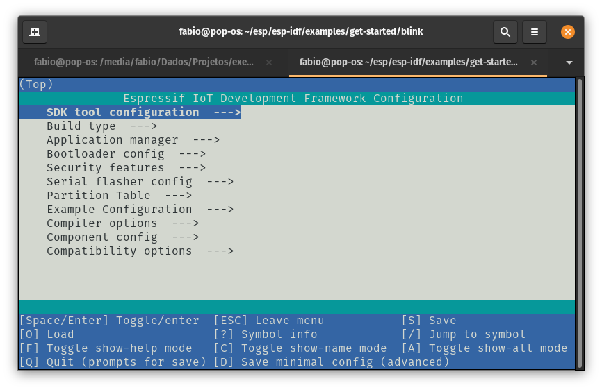
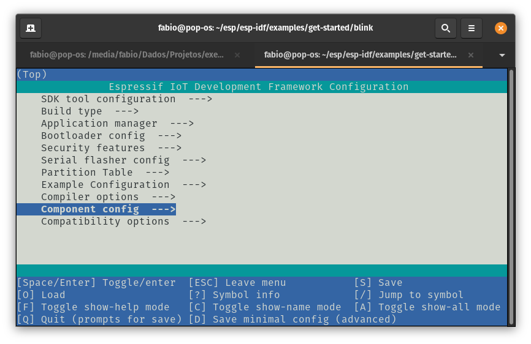
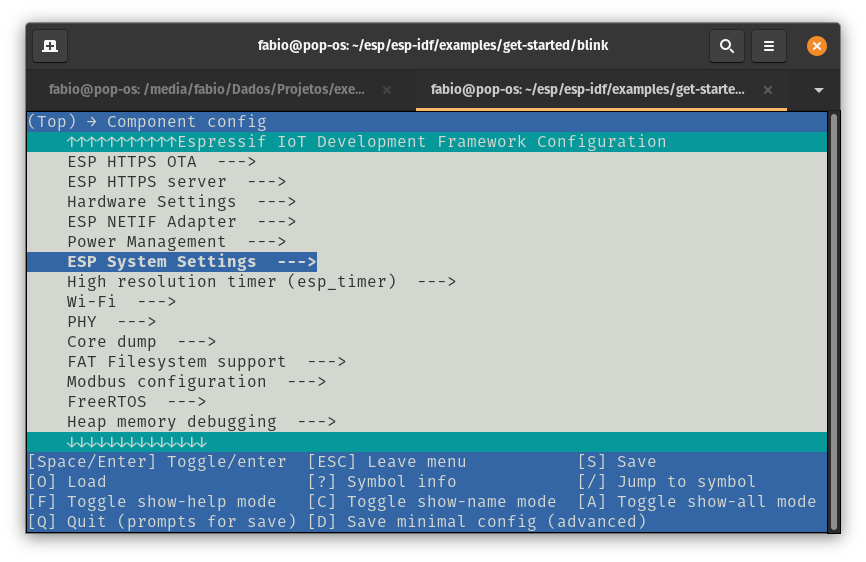
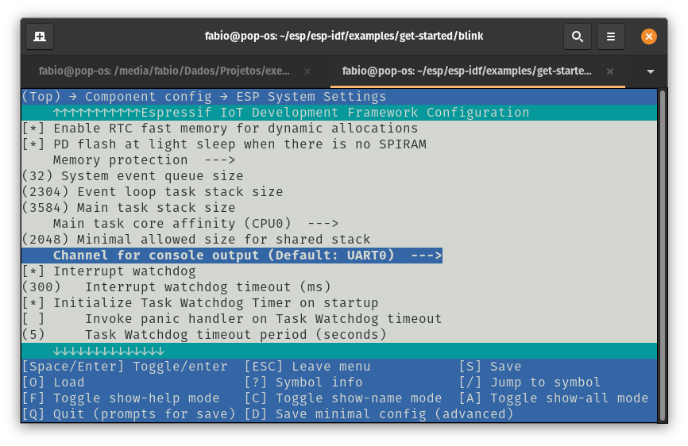
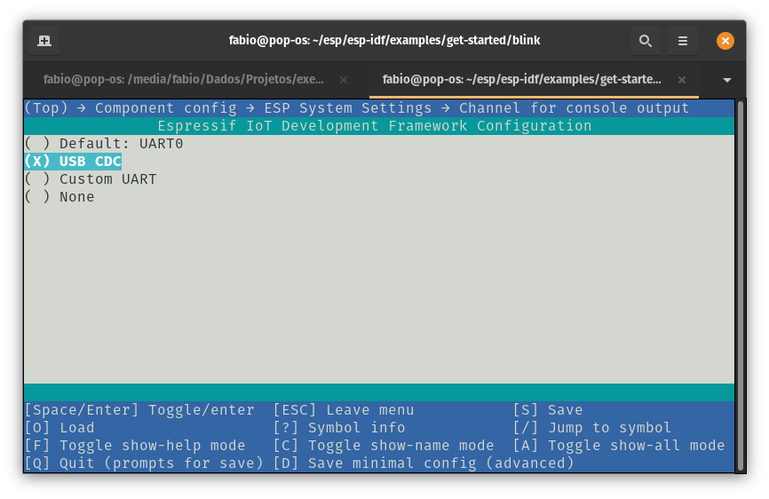
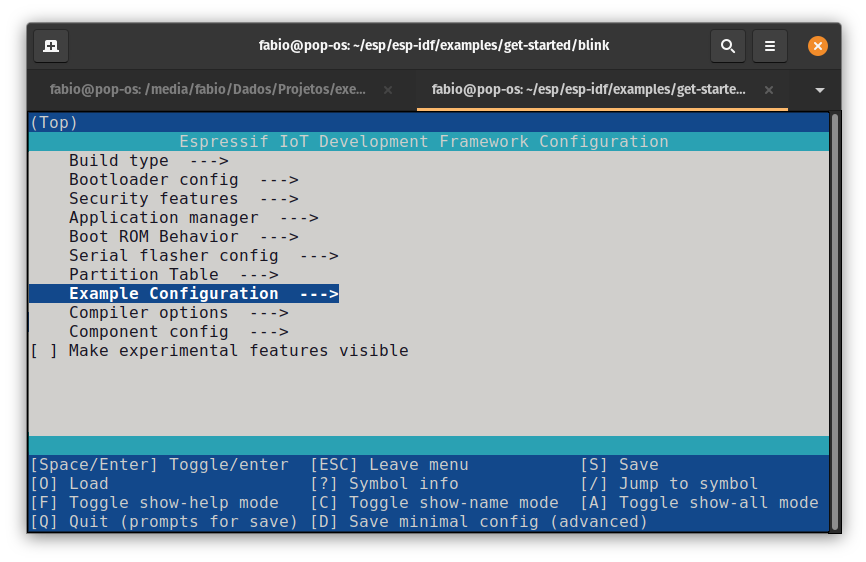
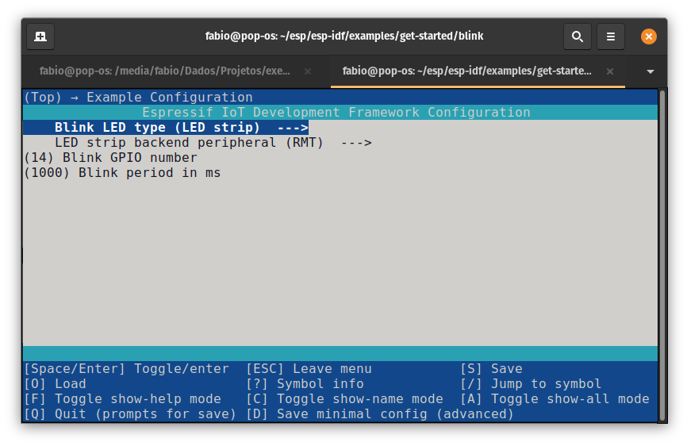
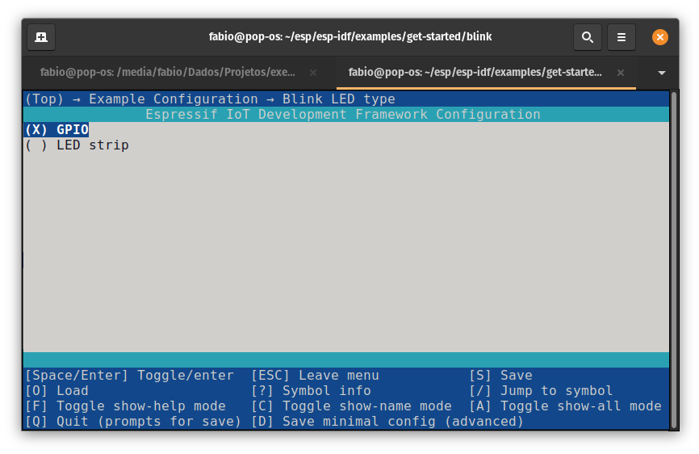
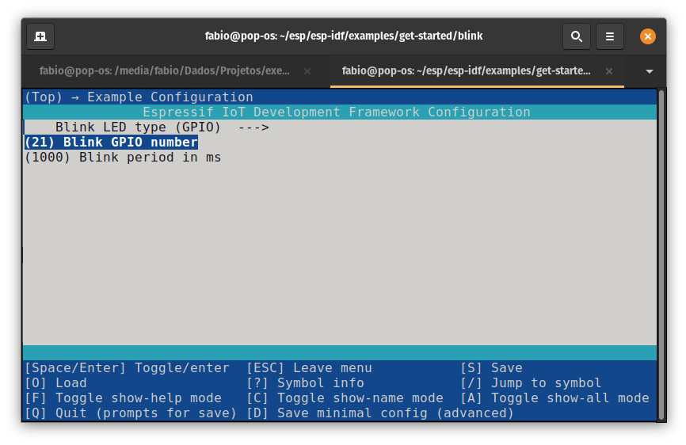

Este guia vai ajudá-lo a configurar o ESP-IDF (Espressif IoT Development Framework) v5.4 para trabalhar com a Franzininho WiFi, que usa o ESP32-S2 da Espressif. Ao final, você terá compilado, gravado e monitorado o exemplo blink via USB — validando que todo o ambiente está funcionando.

## Pré-requisitos

### Hardware

- Franzininho WiFi
- Cabo USB Micro

### Software

- Python 3.9 ou superior
- Git
- (Linux) Nenhum driver adicional necessário — o ESP32-S2 usa USB nativa
- (Windows/macOS) Veja o Passo 1 para os pré-requisitos de cada sistema

## Introdução

Para essa configuração, vamos instalar o ESP-IDF e usá-lo através de linha de comando. Caso você queira usar o IDF integrado a ambientes de desenvolvimento integrado (IDE) como VS Code e Eclipse, confira os seguintes links:

- [Eclipse Plugin](https://github.com/espressif/idf-eclipse-plugin)
- [VS Code Extension](https://github.com/espressif/vscode-esp-idf-extension)

Você poderá instalar o ESP-IDF no seu sistema operacional preferido (Linux, Windows, macOS).

## Passo 1 - Instalação dos pré-requisitos

Algumas ferramentas precisam ser instaladas no computador antes de prosseguir. Siga os links abaixo para as instruções do seu sistema operacional:

- [Windows](https://docs.espressif.com/projects/esp-idf/en/v5.4/esp32s2/get-started/windows-setup.html)
- [Linux](https://docs.espressif.com/projects/esp-idf/en/v5.4/esp32s2/get-started/linux-macos-setup.html#step-1-install-prerequisites)
- [macOS](https://docs.espressif.com/projects/esp-idf/en/v5.4/esp32s2/get-started/linux-macos-setup.html#step-1-install-prerequisites)

É muito importante instalar todos os pré-requisitos antes de continuar.

## Passo 2 - Instalação do ESP-IDF

Nessa etapa vamos instalar o ESP-IDF v5.4 e o conjunto de ferramentas e bibliotecas. Vamos usar o repositório oficial mantido pela Espressif no [GitHub](https://github.com/espressif/esp-idf).

O ESP-IDF é o framework oficial da Espressif para toda a família ESP32. O procedimento aqui é focado no ESP32-S2 usado na Franzininho WiFi.

### Linux e macOS

Abra o terminal e execute:

```bash
mkdir -p ~/esp
cd ~/esp
git clone -b v5.4 --recursive https://github.com/espressif/esp-idf.git
```

O ESP-IDF será instalado em `~/esp/esp-idf`.

### Windows

O [ESP-IDF Tools Installer para Windows](https://docs.espressif.com/projects/esp-idf/en/v5.4/esp32s2/get-started/windows-setup.html#get-started-windows-tools-installer) apresentado no Passo 1 também baixa o ESP-IDF. Se você usou o installer, pode pular a etapa de clone do repositório.

Se desejar fazer o download manualmente, consulte [estas instruções](https://docs.espressif.com/projects/esp-idf/en/v5.4/esp32s2/get-started/windows-setup-scratch.html#get-esp-idf-windows-command-line).

### Instalando as ferramentas do ESP-IDF

Além do ESP-IDF, você também precisa instalar as ferramentas usadas por ele: compilador, depurador, pacotes Python, etc.

**Windows:** O ESP-IDF Tools Installer instala todas as ferramentas automaticamente. Se preferir instalar manualmente, abra o Prompt de Comando:

```bash
cd %userprofile%\esp\esp-idf
install.bat
```

Ou no Windows PowerShell:

```bash
cd ~/esp/esp-idf
./install.ps1
```

**Linux e macOS:**

```bash
cd ~/esp/esp-idf
./install.sh
```

Ou, se estiver usando o Fish:

```bash
cd ~/esp/esp-idf
./install.fish
```

### Configurando as variáveis de ambiente

As ferramentas instaladas ainda não estão no PATH. Para usá-las na linha de comando, você precisa carregar o script de configuração.

**Windows:** O ESP-IDF Tools Installer cria um atalho "ESP-IDF Command Prompt" no menu Iniciar que configura todas as variáveis automaticamente. Basta abrí-lo para trabalhar.

Caso precise configurar manualmente:

```bash
# Prompt de Comando
%userprofile%\esp\esp-idf\export.bat

# Windows PowerShell
.$HOME/esp/esp-idf/export.ps1
```

**Linux e macOS:**

```bash
. $HOME/esp/esp-idf/export.sh
```

Ou no Fish (a partir da versão 3.0.0):

```bash
. $HOME/esp/esp-idf/export.fish
```

:::important Importante
Você precisa executar o `export.sh` toda vez que abrir um novo terminal antes de usar o ESP-IDF.
:::

:::tip Dica: crie um alias para agilizar
Para não precisar digitar o caminho completo toda vez, adicione um alias ao seu `~/.bashrc` ou `~/.zshrc`:

```bash
alias get_idf='. $HOME/esp/esp-idf/export.sh'
```

Depois, basta digitar `get_idf` no terminal para ativar o ESP-IDF.
:::

## Passo 3 - Criando e configurando o projeto

Agora que o ambiente está instalado, vamos usar o exemplo blink para validar tudo.

### Copiando o projeto exemplo

Copie o projeto blink para preservar o original na pasta do IDF:

**Windows:**

```bash
cd %userprofile%\esp
xcopy /e /i %IDF_PATH%\examples\get-started\blink blink
```

**Linux e macOS:**

```bash
cd ~/esp
cp -r $IDF_PATH/examples/get-started/blink .
```

:::important
O ESP-IDF não suporta espaços nos caminhos de projetos. Use apenas letras, números, hifens e underscores nos nomes de diretório.
:::

### Identificando a porta USB

Conecte a Franzininho WiFi ao computador e verifique em qual porta ela apareceu:

**Linux:**

```bash
ls /dev/ttyACM*
```

O ESP32-S2 com USB CDC aparece normalmente como `/dev/ttyACM0`.

**macOS:**

```bash
ls /dev/cu.usbmodem*
```

**Windows:** Abra o Gerenciador de Dispositivos e procure em "Portas (COM e LPT)".

Anote a porta — você vai precisar dela no Passo 4.

### Configuração via menuconfig

Configure o target e abra o menuconfig:

**Windows:**

```bash
cd %userprofile%\esp\blink
idf.py set-target esp32s2
idf.py menuconfig
```

**Linux e macOS:**

```bash
cd ~/esp/blink
idf.py set-target esp32s2
idf.py menuconfig
```

Será aberto o menuconfig:



Acesse a opção **Component config --->**



Em seguida **ESP System Settings --->**



Selecione **Channel for console output (Default: UART0) --->**



E selecione **(X) USB CDC:**



:::important Importante
Sempre configure o console para **USB CDC** em projetos novos para a Franzininho WiFi. Sem isso, a porta USB não funcionará para monitoração e upload no fluxo normal de desenvolvimento.
:::

Pressione **ESC** até voltar à tela inicial e acesse **Example Configuration --->**



Acesse **Blink LED type (...) --->**



Selecione **GPIO:**



Volte à tela anterior (ESC) e configure **Blink GPIO number** com o valor **21** para controlar o LED21 da Franzininho WiFi:



Pressione **Q** e **Y** para sair do menuconfig salvando as configurações.

Para mais detalhes sobre essa configuração, assista ao vídeo:

<iframe src="https://www.youtube.com/embed/zg9IMDaoImA" title="Configuração do ESP-IDF para Franzininho WiFi" frameborder="0" allow="accelerometer; autoplay; clipboard-write; encrypted-media; gyroscope; picture-in-picture" allowfullscreen></iframe>

## Passo 4 - Compilando, gravando e monitorando

:::note Primeira gravação
Na **primeira vez** que gravar a placa, é necessário entrar no modo boot manualmente. Pressione e **segure** **BOOT**, aperte e solte **RESET** e então solte **BOOT**. A partir da segunda gravação, o processo é automático.
:::

Nos comandos abaixo, substitua `/dev/ttyACM0` pela porta identificada no Passo 3. No macOS, use o caminho `/dev/cu.usbmodem*`.

### Compilar

```bash
idf.py build
```

### Gravar

```bash
idf.py -p /dev/ttyACM0 flash
```

### Monitorar

```bash
idf.py -p /dev/ttyACM0 monitor
```

Use **Ctrl+]** para encerrar o monitor.

### Compilar, gravar e monitorar de uma vez

Para agilizar o ciclo de desenvolvimento, use o comando combinado:

```bash
idf.py -p /dev/ttyACM0 flash monitor
```

Esse comando compila (se houver alterações), grava e já abre o monitor em sequência.

Parabéns, você configurou o ambiente ESP-IDF para a Franzininho WiFi!

Para trabalhar com a extensão do VS Code, assista ao vídeo:

<iframe src="https://www.youtube.com/embed/rxMg_zxO0q0" title="ESP-IDF com VS Code para Franzininho WiFi" frameborder="0" allow="accelerometer; autoplay; clipboard-write; encrypted-media; gyroscope; picture-in-picture" allowfullscreen></iframe>

## Próximos passos

Com o ambiente configurado, explore o próximo exemplo:

- [Hello World com ESP-IDF](hello-world.md) — entenda a estrutura de um projeto ESP-IDF e seus componentes básicos
