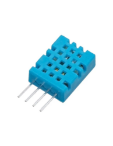
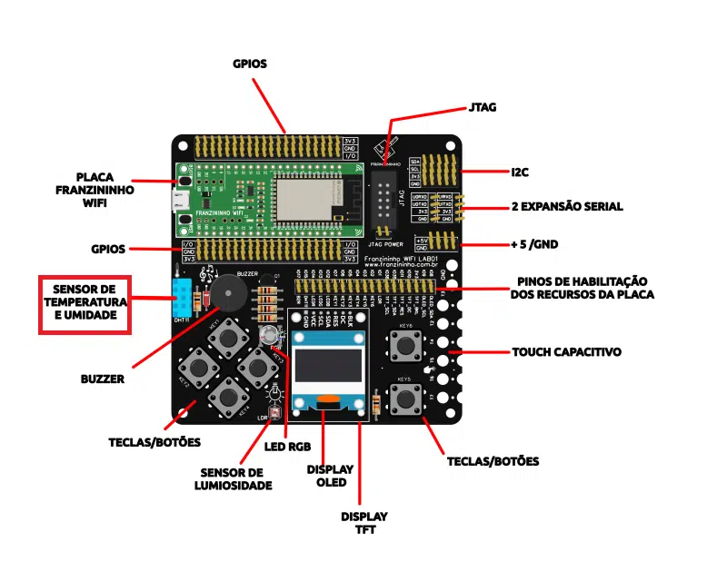
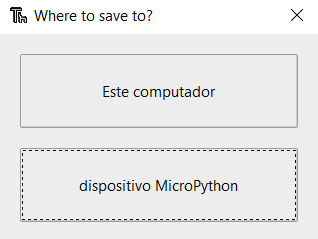
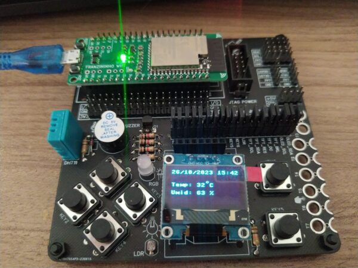

## Introdução

Neste artigo, exploraremos como utilizar o sensor DHT11, presente na Franzininho WiFi Lab01, em conjunto com um display OLED para criar um sistema de monitoramento de temperatura em tempo real utilizando MicroPython.

Detalharemos como os coletar dados de temperatura e umidade e, em seguida, exibir essas informações no display OLED, juntamente da data e hora. O intuito é ter uma nova atualização a cada minuto para acompanhar as variações do ambiente observado.


## Sensor DTH11

O sensor DHT11 é um dispositivo projetado para medir com precisão a temperatura e a umidade do ambiente, por meio de uma saída digital. Embutido em seu encapsulamento, há um microcontrolador de 8 bits, que contribui para a alta performance do módulo.

A principal característica do DHT11 é o elemento resistivo NTC, que é responsável pela medição precisa da temperatura. Com isso, o sensor demonstra uma resposta rápida às variações ambientais, além de possuir uma ótima capacidade de resistir a interferências externas.

O dispositivo opera em uma faixa de medição de temperatura de 0 a 50ºC e em uma faixa de umidade de 20 a 80%.



Figura 1 – Sensor DHT11



Figura 2 – Localização do sensor DHT11 na Franzininho WiFi Lab01

## Recursos necessários

Para iniciar o trabalho com os GPIOs, é essencial possuir o diagrama de pinos da placa à disposição, pois isso permitirá que você identifique tanto os nomes quanto as funções associadas a cada um deles.

| Pino | Recurso      |
|------|--------------|
| IO1  | LDR          |
| IO2  | BT6          |
| IO3  | BT5          |
| IO4  | BT4          |
| IO5  | BT3          |
| IO6  | BT2          |
| IO7  | BT1          |
| IO8  | OLED_SDA     |
| IO9  | OLED_SCL     |
| IO10 | TFT_DC       |
| IO11 | TFT_RES      |
| IO12 | LED AZUL     |
| IO13 | LED VERDE    |
| IO14 | LED VERMELHO |
| IO15 | DHT11        |
| IO17 | BUZZER       |
| IO35 | TFT_SDA      |
| IO36 | TFT_SCL      |

Tabela 1 – Franzininho WiFi Lab01 pinout

### Upload da biblioteca OLED com o Thonny IDE

A biblioteca para escrever no display OLED não faz parte da biblioteca padrão do MicroPython. Portanto, você precisa fazer o upload da biblioteca na sua placa Franzininho WiFi para poder utilizá-la.

Para adicionar a biblioteca usando o Thonny IDE, siga os passos abaixo:

1.  Crie um novo arquivo no Thonny e copie o código da biblioteca:
```python
#MicroPython SSD1306 OLED driver, I2C and SPI interfaces created by Adafruit

import time
import framebuf

# register definitions
SET_CONTRAST        = const(0x81)
SET_ENTIRE_ON       = const(0xa4)
SET_NORM_INV        = const(0xa6)
SET_DISP            = const(0xae)
SET_MEM_ADDR        = const(0x20)
SET_COL_ADDR        = const(0x21)
SET_PAGE_ADDR       = const(0x22)
SET_DISP_START_LINE = const(0x40)
SET_SEG_REMAP       = const(0xa0)
SET_MUX_RATIO       = const(0xa8)
SET_COM_OUT_DIR     = const(0xc0)
SET_DISP_OFFSET     = const(0xd3)
SET_COM_PIN_CFG     = const(0xda)
SET_DISP_CLK_DIV    = const(0xd5)
SET_PRECHARGE       = const(0xd9)
SET_VCOM_DESEL      = const(0xdb)
SET_CHARGE_PUMP     = const(0x8d)


class SSD1306:
    def __init__(self, width, height, external_vcc):
        self.width = width
        self.height = height
        self.external_vcc = external_vcc
        self.pages = self.height // 8
        # Note the subclass must initialize self.framebuf to a framebuffer.
        # This is necessary because the underlying data buffer is different
        # between I2C and SPI implementations (I2C needs an extra byte).
        self.poweron()
        self.init_display()

    def init_display(self):
        for cmd in (
            SET_DISP | 0x00, # off
            # address setting
            SET_MEM_ADDR, 0x00, # horizontal
            # resolution and layout
            SET_DISP_START_LINE | 0x00,
            SET_SEG_REMAP | 0x01, # column addr 127 mapped to SEG0
            SET_MUX_RATIO, self.height - 1,
            SET_COM_OUT_DIR | 0x08, # scan from COM[N] to COM0
            SET_DISP_OFFSET, 0x00,
            SET_COM_PIN_CFG, 0x02 if self.height == 32 else 0x12,
            # timing and driving scheme
            SET_DISP_CLK_DIV, 0x80,
            SET_PRECHARGE, 0x22 if self.external_vcc else 0xf1,
            SET_VCOM_DESEL, 0x30, # 0.83*Vcc
            # display
            SET_CONTRAST, 0xff, # maximum
            SET_ENTIRE_ON, # output follows RAM contents
            SET_NORM_INV, # not inverted
            # charge pump
            SET_CHARGE_PUMP, 0x10 if self.external_vcc else 0x14,
            SET_DISP | 0x01): # on
            self.write_cmd(cmd)
        self.fill(0)
        self.show()

    def poweroff(self):
        self.write_cmd(SET_DISP | 0x00)

    def contrast(self, contrast):
        self.write_cmd(SET_CONTRAST)
        self.write_cmd(contrast)

    def invert(self, invert):
        self.write_cmd(SET_NORM_INV | (invert & 1))

    def show(self):
        x0 = 0
        x1 = self.width - 1
        if self.width == 64:
            # displays with width of 64 pixels are shifted by 32
            x0 += 32
            x1 += 32
        self.write_cmd(SET_COL_ADDR)
        self.write_cmd(x0)
        self.write_cmd(x1)
        self.write_cmd(SET_PAGE_ADDR)
        self.write_cmd(0)
        self.write_cmd(self.pages - 1)
        self.write_framebuf()

    def fill(self, col):
        self.framebuf.fill(col)

    def pixel(self, x, y, col):
        self.framebuf.pixel(x, y, col)

    def scroll(self, dx, dy):
        self.framebuf.scroll(dx, dy)

    def text(self, string, x, y, col=1):
        self.framebuf.text(string, x, y, col)


class SSD1306_I2C(SSD1306):
    def __init__(self, width, height, i2c, addr=0x3c, external_vcc=False):
        self.i2c = i2c
        self.addr = addr
        self.temp = bytearray(2)
        # Add an extra byte to the data buffer to hold an I2C data/command byte
        # to use hardware-compatible I2C transactions.  A memoryview of the
        # buffer is used to mask this byte from the framebuffer operations
        # (without a major memory hit as memoryview doesn't copy to a separate
        # buffer).
        self.buffer = bytearray(((height // 8) * width) + 1)
        self.buffer[0] = 0x40  # Set first byte of data buffer to Co=0, D/C=1
        self.framebuf = framebuf.FrameBuffer1(memoryview(self.buffer)[1:], width, height)
        super().__init__(width, height, external_vcc)

    def write_cmd(self, cmd):
        self.temp[0] = 0x80 # Co=1, D/C#=0
        self.temp[1] = cmd
        self.i2c.writeto(self.addr, self.temp)

    def write_framebuf(self):
        # Blast out the frame buffer using a single I2C transaction to support
        # hardware I2C interfaces.
        self.i2c.writeto(self.addr, self.buffer)

    def poweron(self):
        pass


class SSD1306_SPI(SSD1306):
    def __init__(self, width, height, spi, dc, res, cs, external_vcc=False):
        self.rate = 10 * 1024 * 1024
        dc.init(dc.OUT, value=0)
        res.init(res.OUT, value=0)
        cs.init(cs.OUT, value=1)
        self.spi = spi
        self.dc = dc
        self.res = res
        self.cs = cs
        self.buffer = bytearray((height // 8) * width)
        self.framebuf = framebuf.FrameBuffer1(self.buffer, width, height)
        super().__init__(width, height, external_vcc)

    def write_cmd(self, cmd):
        self.spi.init(baudrate=self.rate, polarity=0, phase=0)
        self.cs.high()
        self.dc.low()
        self.cs.low()
        self.spi.write(bytearray([cmd]))
        self.cs.high()

    def write_framebuf(self):
        self.spi.init(baudrate=self.rate, polarity=0, phase=0)
        self.cs.high()
        self.dc.high()
        self.cs.low()
        self.spi.write(self.buffer)
        self.cs.high()

    def poweron(self):
        self.res.high()
        time.sleep_ms(1)
        self.res.low()
        time.sleep_ms(10)
        self.res.high()
```

1.  Acesse Arquivo > Salvar como e selecione o dispositivo MicroPython.



2.  Nomeie o arquivo como “ssd1306.py” e clique em OK para salvá-lo na placa.

E é apenas isso, a biblioteca foi carregada na sua placa. Agora, você pode usar suas funcionalidades no seu código, importando a biblioteca.

## Código

Com a Franzininho WiFi Lab01 conectada ao seu computador, abra o Thonny e crie um novo arquivo contendo o código a seguir:

```python
from machine import Pin, SoftI2C
import ssd1306, dht, framebuf, time

# atribuição de pinos da Franzininho 
i2c = SoftI2C(scl=Pin(9), sda=Pin(8))

# configurando display
oled_width = 128
oled_height = 64
oled = ssd1306.SSD1306_I2C(oled_width, oled_height, i2c)

# criando símbolo para representar graus no display
degree = bytearray([0x00, 0x0e, 0x11, 0x11, 0x0e, 0x00, 0x00, 0x00])
fb = framebuf.FrameBuffer(degree, 8, 8, framebuf.MONO_HLSB)

# configurando DHT
d = dht.DHT11(Pin(15))

while True:
    # coletando dados de umidade e temperatura
    d.measure()
    temperatura = d.temperature() # em °C
    umidade= d.humidity() # em % 

    temperatura_str="Temp: "+str(temperatura)
    umidade_str="Umid: "+str(umidade)+" %"
    
    #coletando data e hora atual
    current_time = time.localtime()
    formatted_time = "{:02d}/{:02d}/{} {:02d}:{:02d}".format(current_time[2], current_time[1], current_time[0], current_time[3], current_time[4])

    # limpa display
    oled.fill(0)
    
    # exibição no display
    oled.text(formatted_time, 0, 0)
    oled.framebuf.blit(fb, 63, 20)
    oled.text(temperatura_str+ " " + "C", 0, 25)
    oled.text(umidade_str, 0, 40)
    oled.show()
    time.sleep(60)
```

Vamos começar com “`from machine import Pin, SoftI2C`“. Para poder ser acessado os pinos da placa e utilizar a comunicação I2C para configurar o display. Além disso, importe a biblioteca “`ssd1306`”, que foi previamente instalada na sua placa, e framebuf para utilizar o display oled.

Também é preciso importar a biblioteca “`dht`” para trabalhar com o sensor DHT11 e “`time`” para adicionar atrasos ao programa.

De acordo com a tabela de pinagem, os pinos SCL e SDA do OLED são os pinos 9 e 8, respectivamente. Assim, o I2C é configurado. Em seguida, definimos a largura e altura do display, que no caso são 128×64. Com todas essas informações, crie uma variável chamada ‘`oled`‘ para controlar o display. Esta variável recebe a largura e altura do OLED, bem como os pinos I2C que definimos anteriormente.

O display é utilizado para exibir a temperatura e a umidade medidos pelo sensor, e também a data e hora atual. No entanto, o display não é compatível com o símbolo de grau (º) de temperatura, por essa razão foi preciso criar o símbolo utilizando um bitmap.

Com o pino do dht configurado, dentro do loop, iniciamos a coleta da temperatura e da umidade local. Em seguida, o valor medido é convertido em string para ser possível exibir no display.

Para obter a data e hora atuais, utilizamos a função ‘localtime’ da biblioteca “time”, que retorna o ano, mês, dia, hora, minuto, segundo, dia da semana (variando de 0 a 6, onde 0 é segunda-feira e 6 é domingo) e o dia do ano (varia de 1 a 366). Para apresentar essas informações no formato comum, foi criada a variável ‘`formatted_time`‘ que organiza a data e hora no formato ‘`dd/mm/aaaa, hh:mm`‘

Assim, a exibição no display inicia com a data e hora atuais, seguidas pelas leituras de temperatura e umidade. O bitmap que representa o símbolo de grau (°) é inserido entre o valor da temperatura e a unidade de medida Celsius (°C).

A cada 60 segundos, as medições de temperatura e umidade são atualizadas e exibidas novamente no display. Para garantir que a nova informação seja exibida corretamente, o display é limpo antes de cada atualização.

A saída do display é a mostrada na abaixo:



Figura 3 – Saída do display.

## Conclusão

Neste artigo, vimos como coletar medições de temperatura e umidade com o sensor DHT11 e como apresentar essas informações de maneira eficaz em um display OLED. Além disso, integramos a exibição da data e hora atual, criando um sistema completo de monitoramento ambiental em tempo real com MicroPython.


| Autor | Sthefania Fernandes|
|-------|--------------|
| Data: | 17/11/2023    |