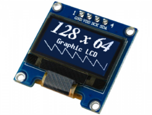
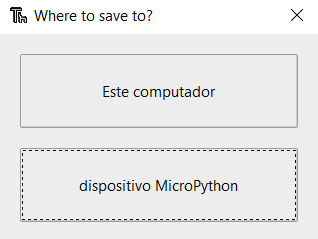
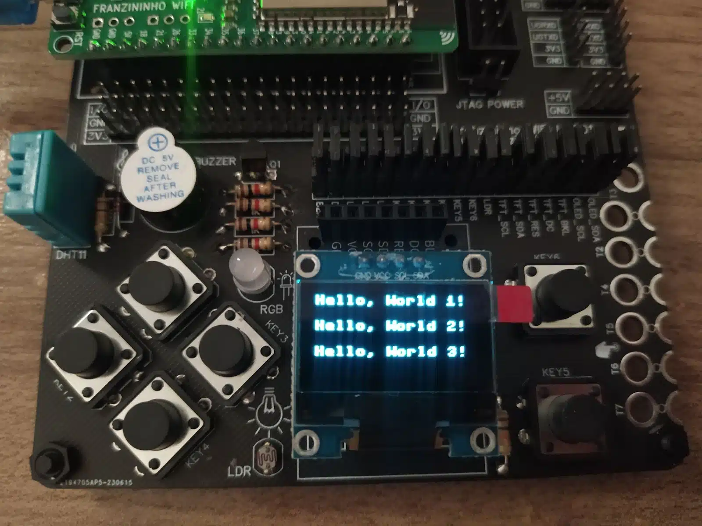
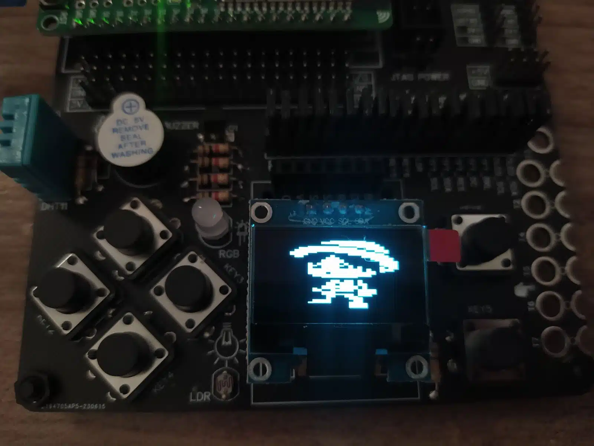

## Introdução

Um valioso aliado das placas de desenvolvimento são os displays: eles permitem que você visualize dados e oferecem um feedback imediato (sem a necessidade de monitores de computador), além de viabilizar a criação de interfaces de usuário personalizadas.

A Franzininho WiFi Lab01 conta com um display OLED SSD1306 e neste artigo vamos entender como aproveitar ao máximo essa tela.


## Display OLED SSD1306

O display OLED SSD1306 é um tipo de display de tecnologia OLED (Organic Light-Emitting Diode) que usa o controlador SSD1306. Esses displays são conhecidos por sua alta qualidade de imagem e eficiência energética, o que os torna populares em projetos eletrônicos DIY, dispositivos vestíveis, projetos de IoT e muitas outras aplicações.

Diferente dos displays LCD convencionais, os displays OLED não requerem uma fonte de luz de fundo, pois cada pixel em um display OLED emite sua própria luz. Isso resulta em níveis de contraste mais elevados, cores mais vibrantes e um ângulo de visão amplo.

Características do display SSD1306:

-   **Resolução**: 128×64, 128×32 ou 96×16 pixels.
-   **Comunicação**: I2C ou SPI
-   **Alimentação**: 3,3V ou 5V
-   Suporte a diversas linguagens de programação



Figura 1 – Display OLED SSD1306

## Recursos necessários

Para iniciar o trabalho com os GPIOs, é essencial possuir o diagrama de pinos da placa à disposição, pois isso vai permitir que você identifique tanto os nomes quanto as funções associadas a cada um deles.

| Pino | Recurso      |
|------|--------------|
| IO1  | LDR          |
| IO2  | BT6          |
| IO3  | BT5          |
| IO4  | BT4          |
| IO5  | BT3          |
| IO6  | BT2          |
| IO7  | BT1          |
| IO8  | OLED_SDA     |
| IO9  | OLED_SCL     |
| IO10 | TFT_DC       |
| IO11 | TFT_RES      |
| IO12 | LED AZUL     |
| IO13 | LED VERDE    |
| IO14 | LED VERMELHO |
| IO15 | DHT11        |
| IO17 | BUZZER       |
| IO35 | TFT_SDA      |
| IO36 | TFT_SCL      |

Tabela 1 – Franzininho WiFi Lab01 pinout

### Upload da biblioteca OLED com o Thonny IDE

A biblioteca para escrever no display OLED não faz parte da biblioteca padrão do MicroPython. Portanto, você precisa fazer o upload da biblioteca na sua placa Franzininho WiFi para poder utilizá-la.

Para adicionar a biblioteca usando o Thonny IDE, siga os passos abaixo:

1.  Crie um novo arquivo no Thonny e copie o código da biblioteca:
```python
#MicroPython SSD1306 OLED driver, I2C and SPI interfaces created by Adafruit

import time
import framebuf

# register definitions
SET_CONTRAST        = const(0x81)
SET_ENTIRE_ON       = const(0xa4)
SET_NORM_INV        = const(0xa6)
SET_DISP            = const(0xae)
SET_MEM_ADDR        = const(0x20)
SET_COL_ADDR        = const(0x21)
SET_PAGE_ADDR       = const(0x22)
SET_DISP_START_LINE = const(0x40)
SET_SEG_REMAP       = const(0xa0)
SET_MUX_RATIO       = const(0xa8)
SET_COM_OUT_DIR     = const(0xc0)
SET_DISP_OFFSET     = const(0xd3)
SET_COM_PIN_CFG     = const(0xda)
SET_DISP_CLK_DIV    = const(0xd5)
SET_PRECHARGE       = const(0xd9)
SET_VCOM_DESEL      = const(0xdb)
SET_CHARGE_PUMP     = const(0x8d)


class SSD1306:
    def __init__(self, width, height, external_vcc):
        self.width = width
        self.height = height
        self.external_vcc = external_vcc
        self.pages = self.height // 8
        # Note the subclass must initialize self.framebuf to a framebuffer.
        # This is necessary because the underlying data buffer is different
        # between I2C and SPI implementations (I2C needs an extra byte).
        self.poweron()
        self.init_display()

    def init_display(self):
        for cmd in (
            SET_DISP | 0x00, # off
            # address setting
            SET_MEM_ADDR, 0x00, # horizontal
            # resolution and layout
            SET_DISP_START_LINE | 0x00,
            SET_SEG_REMAP | 0x01, # column addr 127 mapped to SEG0
            SET_MUX_RATIO, self.height - 1,
            SET_COM_OUT_DIR | 0x08, # scan from COM[N] to COM0
            SET_DISP_OFFSET, 0x00,
            SET_COM_PIN_CFG, 0x02 if self.height == 32 else 0x12,
            # timing and driving scheme
            SET_DISP_CLK_DIV, 0x80,
            SET_PRECHARGE, 0x22 if self.external_vcc else 0xf1,
            SET_VCOM_DESEL, 0x30, # 0.83*Vcc
            # display
            SET_CONTRAST, 0xff, # maximum
            SET_ENTIRE_ON, # output follows RAM contents
            SET_NORM_INV, # not inverted
            # charge pump
            SET_CHARGE_PUMP, 0x10 if self.external_vcc else 0x14,
            SET_DISP | 0x01): # on
            self.write_cmd(cmd)
        self.fill(0)
        self.show()

    def poweroff(self):
        self.write_cmd(SET_DISP | 0x00)

    def contrast(self, contrast):
        self.write_cmd(SET_CONTRAST)
        self.write_cmd(contrast)

    def invert(self, invert):
        self.write_cmd(SET_NORM_INV | (invert & 1))

    def show(self):
        x0 = 0
        x1 = self.width - 1
        if self.width == 64:
            # displays with width of 64 pixels are shifted by 32
            x0 += 32
            x1 += 32
        self.write_cmd(SET_COL_ADDR)
        self.write_cmd(x0)
        self.write_cmd(x1)
        self.write_cmd(SET_PAGE_ADDR)
        self.write_cmd(0)
        self.write_cmd(self.pages - 1)
        self.write_framebuf()

    def fill(self, col):
        self.framebuf.fill(col)

    def pixel(self, x, y, col):
        self.framebuf.pixel(x, y, col)

    def scroll(self, dx, dy):
        self.framebuf.scroll(dx, dy)

    def text(self, string, x, y, col=1):
        self.framebuf.text(string, x, y, col)


class SSD1306_I2C(SSD1306):
    def __init__(self, width, height, i2c, addr=0x3c, external_vcc=False):
        self.i2c = i2c
        self.addr = addr
        self.temp = bytearray(2)
        # Add an extra byte to the data buffer to hold an I2C data/command byte
        # to use hardware-compatible I2C transactions.  A memoryview of the
        # buffer is used to mask this byte from the framebuffer operations
        # (without a major memory hit as memoryview doesn't copy to a separate
        # buffer).
        self.buffer = bytearray(((height // 8) * width) + 1)
        self.buffer[0] = 0x40  # Set first byte of data buffer to Co=0, D/C=1
        self.framebuf = framebuf.FrameBuffer1(memoryview(self.buffer)[1:], width, height)
        super().__init__(width, height, external_vcc)

    def write_cmd(self, cmd):
        self.temp[0] = 0x80 # Co=1, D/C#=0
        self.temp[1] = cmd
        self.i2c.writeto(self.addr, self.temp)

    def write_framebuf(self):
        # Blast out the frame buffer using a single I2C transaction to support
        # hardware I2C interfaces.
        self.i2c.writeto(self.addr, self.buffer)

    def poweron(self):
        pass


class SSD1306_SPI(SSD1306):
    def __init__(self, width, height, spi, dc, res, cs, external_vcc=False):
        self.rate = 10 * 1024 * 1024
        dc.init(dc.OUT, value=0)
        res.init(res.OUT, value=0)
        cs.init(cs.OUT, value=1)
        self.spi = spi
        self.dc = dc
        self.res = res
        self.cs = cs
        self.buffer = bytearray((height // 8) * width)
        self.framebuf = framebuf.FrameBuffer1(self.buffer, width, height)
        super().__init__(width, height, external_vcc)

    def write_cmd(self, cmd):
        self.spi.init(baudrate=self.rate, polarity=0, phase=0)
        self.cs.high()
        self.dc.low()
        self.cs.low()
        self.spi.write(bytearray([cmd]))
        self.cs.high()

    def write_framebuf(self):
        self.spi.init(baudrate=self.rate, polarity=0, phase=0)
        self.cs.high()
        self.dc.high()
        self.cs.low()
        self.spi.write(self.buffer)
        self.cs.high()

    def poweron(self):
        self.res.high()
        time.sleep_ms(1)
        self.res.low()
        time.sleep_ms(10)
        self.res.high()
```

2.  Acesse Arquivo > Salvar como e selecione o dispositivo MicroPython.



1.  Nomeie o arquivo como “ssd1306.py” e clique em OK para salvá-lo na placa.

E é apenas isso, a biblioteca foi carregada na sua placa. Agora, você pode usar suas funcionalidades no seu código, importando a biblioteca.

## Código

### Hello, world no Display

Com a Franzininho WiFi conectada ao seu computador, abra o Thonny e crie um novo arquivo contendo o código a seguir:
```python
from machine import Pin, SoftI2C
import ssd1306

# atribuição de pinos da Franzininho
i2c = SoftI2C(scl=Pin(9), sda=Pin(8))

# configurando display
oled_width = 128
oled_height = 64
oled = ssd1306.SSD1306_I2C(oled_width, oled_height, i2c)

# exibição no display
oled.text('Hello, World 1!', 0, 0)
oled.text('Hello, World 2!', 0, 20)
oled.text('Hello, World 3!', 0, 40)
       
oled.show()
```
Vamos começar o código com `from machine import Pin, SoftI2C`. Para poder ser acessado os pinos da placa e utilizar a comunicação I2C para configurar o display. Além disso, importe a biblioteca “ssd1306” que foi previamente instalada na sua placa.

Conforme a tabela de pinagem, os pinos SCL e SDA do OLED são os pinos 9 e 8, respectivamente. Assim, o I2C é configurado. Em seguida, definimos a largura e altura do display, que no caso são 128×64.

Com todas essas informações, crie uma variável chamada ‘oled’ para controlar o display. Esta variável recebe a largura e altura do OLED, bem como os pinos I2C que definimos anteriormente.

Após inicializar o display OLED, você só precisa usar a função text() no ‘oled’ para escrever texto. A função text() aceita os seguintes argumentos, respectivamente:

-   **Mensagem**: deve ser do tipo String.
-   **Posição X**: onde o texto começa horizontalmente.
-   **Posição Y**: onde o texto é exibido verticalmente.
-   **Cor do texto**: pode ser preto ou branco. Este parâmetro é opcional e por padrão a cor é branca.
    -   0 = preto
    -   1 = branco”

No exemplo, estamos exibindo três strings, todas começando na coordenada x=0 e variando o valor em y, o que faz com que cada frase seja escrita em uma linha abaixo da anterior.

Após as chamadas da função text(), é necessário chamar a função show() para atualizar o OLED. A saída do display é a mostrada na abaixo:



Figura 2 – Saída do texto no display.

### Exibindo uma imagem no display

Neste exemplo, veremos como exibir uma imagem (bitmap) no Display OLED SSD1306. Para isso, recomendo procurar por ‘arte em pixel’, pois é mais fácil de exibir no display. Você também pode criar suas próprias imagens usando software de edição de fotos como o Adobe Photoshop, Gimp ou outro que suporte arte em pixel.

É importante ressaltar que ao usar um display OLED SSD1306, algumas considerações são essenciais. A imagem que você deseja exibir deve ter as seguintes características:

-   **Tamanho Compatível**: A imagem deve ter um tamanho igual ou menor do que a resolução do display OLED SSD1306, no caso 128×64 pixels.
-   **Escala de Cinza ou Monocromática**: O display OLED SSD1306 é monocromático, o que significa que ele só pode exibir imagens em preto e branco (1 bit por pixel) ou, em alguns casos, em escala de cinza limitada. Portanto, a imagem deve estar na escala de cinza ou ser monocromática.

Entretanto, a imagem não pode ser diretamente inserida no display, é necessário converter o formato da imagem bitmap em código. Uma solução prática para realizar essa conversão é usar o [Lucky Resistor](https://luckyresistor.me/applications/micropython-bitmap-tool/#0-user-interface), uma ferramenta de software que converte diversos formatos de imagens bitmap em código para incorporar facilmente no seu projeto em MicroPython.

Assim, com a Franzininho WiFi Lab01 conectada ao seu computador, abra o Thonny e crie um novo arquivo contendo o código a seguir:

```python
from machine import Pin, SoftI2C
import ssd1306
import framebuf

# Franzininho Pin assignment
i2c = SoftI2C(scl=Pin(9), sda=Pin(8))

oled_width = 128 # Largura da tela OLED
oled_height = 64 # Altura da tela OLED
oled = ssd1306.SSD1306_I2C(oled_width, oled_height, i2c)

luffy_image = bytearray(b'\x00\x00\x00\x00\x00\x00\x00\x00\x00\x00\x00\x00\x00\x00\x00\x00\x00\x00\x00\x00\x00\x00\x00\x00\x00\x00\x00\x00\x00\x00\x00\x00\x00\x00\x00\x00\x00\x00\xff\xff\xff\xff\x00\x00\x00\x00\x00\x00\x00\x00\x00\x00\x00\xff\xff\xff\xff\xff\xff\x00\x00\x00\x00\x00\x00\x00\x00\x00\x00\xff\xff\xff\xff\xff\xff\x00\x00\x00\x00\x00\x00\x00\x00\x00\x00\x00\x00\xff\xff\xff\xff\xf0\x00\x00\x00\x00\x00\x00\x00\x00\x00\x00\x00\xff\xff\xff\xff\xf0\x00\x00\x00\x00\x00\x00\x00\x0f\xff\xff\xff\x00\x00\xff\xff\xff\x00\x00\x00\x00\x00\x00\x0f\xff\xff\xff\xff\xff\xff\x00\xff\xff\x00\x00\x00\x00\x00\x00\x0f\xff\xff\xff\xff\xff\xff\x00\xff\xff\x00\x00\x00\x00\x00\x00\xff\xff\xff\xff\xff\xff\xff\xff\x00\xff\xf0\x00\x00\x00\x00\x00\xff\xff\xff\xff\xff\xff\xff\xff\x00\xff\xf0\x00\x00\x00\x00\x0f\xff\xff\xf0\x00\x0f\xff\xff\xff\xff\x00\xf0\x00\x00\x00\x00\x0f\xff\xf0\x00\x00\x00\x00\xff\xff\xff\xff\x00\x00\x00\x00\x00\x0f\xff\xf0\x00\x00\x00\x00\xff\xff\xff\xff\x00\x00\x00\x00\x00\x00\xff\x00\x00\x00\xf0\x00\x00\x0f\xff\xff\xf0\x00\x00\x00\x00\x00\xff\x00\x00\x00\xf0\x00\x00\x0f\xff\xff\xf0\x00\x00\x00\x00\x00\x00\x00\x00\x0f\xff\x00\x00\x00\x0f\xff\xff\x00\x00\x00\x00\x00\x00\x00\x00\x0f\xff\x00\x00\x00\x0f\xff\xff\x00\x00\x00\x00\x00\x00\x00\x00\xff\xff\xf0\x00\x00\x00\xff\xff\x00\x00\x00\x00\x00\x00\x00\x00\xff\xff\xf0\x00\x00\x00\x0f\xff\xf0\x00\x00\x00\x00\x00\x00\x00\xff\xff\xf0\x00\x00\x00\x0f\xff\xf0\x00\x00\x00\x00\x00\x0f\x0f\xff\xff\x0f\x00\x00\x00\x0f\xff\xf0\x00\x00\x00\x00\x00\x0f\x0f\xff\xff\x0f\x00\x00\x00\x0f\xff\xf0\x00\x00\x00\x00\x00\x0f\xf0\xff\xff\xf0\xf0\x00\x00\x00\xff\xf0\x00\x00\x00\x00\x00\x0f\x00\xff\xff\x00\xf0\xf0\x00\x0f\x0f\xf0\x00\x00\x00\x00\x00\x0f\x00\xff\xff\x00\xf0\xf0\x00\x0f\x0f\xf0\x00\x00\x00\x00\x00\x0f\xff\xff\xff\xff\xff\xf0\xf0\x0f\xff\x00\x00\x00\x00\x00\x00\x0f\xff\xff\xff\xff\xff\xf0\xf0\x0f\xff\x00\x00\x00\x00\x00\x00\x0f\xff\xff\xff\xff\xff\xf0\xff\x0f\x00\x00\x00\x00\x00\x00\x00\x0f\xff\xf0\xff\xff\xff\xff\xff\x00\x00\x00\x00\x00\x00\x00\x00\x0f\xff\xf0\xff\xff\xff\xff\xff\x00\x00\x00\x00\x00\x00\x00\x00\x00\xff\xff\xff\xff\xff\xff\xf0\x00\x00\x00\x00\x00\x00\x00\x00\x00\xff\xff\xff\xff\xff\xff\xf0\x00\x00\x00\x00\x00\x00\x00\x00\x00\x00\xff\xff\xff\xff\x00\x00\x00\x00\x00\x00\x00\x00\x00\x00\x00\x00\x00\x00\x00\x00\x00\x00\x00\x00\x00\x00\x00\x00\x00\x00\x00\x00\x00\x00\x00\x00\x00\x00\x00\x00\x00\x00\x00\x00\x00\x00\x00\x00\x00\xff\x0f\xf0\xf0\x00\x00\x00\x00\x00\x00\x00\x00\x00\x00\x00\x00\xff\x0f\xf0\xf0\x00\x00\x00\x00\x00\x00\x00\x00\x00\x00\x00\x0f\xff\xff\xf0\xf0\x00\x00\x00\x00\x00\x00\x00\x00\x00\x00\x00\x0f\xf0\xff\xf0\xff\x00\x00\x00\x00\x00\x00\x00\x00\x00\x00\x00\x0f\xf0\xff\xf0\xff\x00\x00\x00\x00\x00\x00\x00\x00\x00\x00\x00\xff\xff\xff\xff\x0f\x00\x00\x00\x00\x00\x00\x00\x00\x00\x00\x00\xff\xff\xff\xff\x0f\x00\x00\x00\x00\x00\x00\x00\x00\x00\x00\xf0\xff\xf0\xff\xff\x0f\x00\x00\x00\x00\x00\x00\x00\x00\x00\x00\xff\x00\xff\xff\xf0\xff\xff\x00\x00\x00\x00\x00\x00\x00\x00\x00\xff\x00\xff\xff\xf0\xff\xff\x00\x00\x00\x00\x00\x00\x00\x00\x00\x00\xff\xf0\x00\x00\xff\xff\x00\x00\x00\x00\x00\x00\x00\x00\x00\x00\xff\xf0\x00\x00\xff\xff\x00\x00\x00\x00\x00\x00\x00\x00\x00\x00\xff\xff\xff\xf0\xff\xf0\x00\x00\x00\x00\x00\x00\x00\x00\x00\x00\x0f\xf0\x0f\xf0\xff\xf0\x00\x00\x00\x00\x00\x00\x00\x00\x00\x00\x0f\xf0\x0f\xff\x00\x00\x00\x00\x00\x00\x00\x00\x00\x00\x00\x00\x0f\x00\x00\xff\xf0\x00\x00\x00\x00\x00\x00\x00\x00\x00\x00\x00\x0f\x00\x00\xff\xf0\x00\x00\x00\x00\x00\x00\x00\x00\x00\x00\xff\xff\x00\x00\x0f\xf0\x00\x00\x00\x00\x00\x00\x00\x00\x00\x00\xff\xff\x00\x00\x0f\xf0\x00\x00\x00\x00\x00\x00\x00\x00\x00\x0f\xff\xff\x00\x00\xff\xf0\x00\x00\x00\x00\x00\x00\x00\x00\x00\x00\x00\x00\x00\x00\xff\xff\x00\x00\x00\x00\x00\x00\x00\x00\x00\x00\x00\x00\x00\x00\xff\xff\x00\x00\x00\x00\x00\x00\x00\x00\x00\x00\x00\x00\x00\x00\xff\xff\x00\x00\x00\x00\x00\x00\x00\x00\x00\x00\x00\x00\x00\x00\xff\xff\x00\x00\x00\x00\x00\x00\x00\x00\x00\x00\x00\x00\x00\x00\x00\x00\x00\x00\x00\x00\x00\x00\x00\x00\x00\x00\x00\x00\x00\x00\x00\x00\x00\x00\x00\x00\x00\x00\x00\x00\x00\x00\x00\x00\x00\x00\x00\x00\x00\x00\x00\x00\x00\x00')

fb = framebuf.FrameBuffer(luffy_image, 128, 64, framebuf.MONO_HLSB)

oled.framebuf.fill(0)
oled.framebuf.blit(fb, 8, 0)

oled.show()
```

Vamos começar com “from machine import Pin, SoftI2C”. Para poder ser acessado os pinos da placa e utilizar a comunicação I2C para configurar o display. Também importe a biblioteca “ssd1306” que foi previamente instalada na sua placa.

Além disso, o framebuf também precisa ser importado. Essa biblioteca oferece recursos essenciais para controlar e manipular diretamente o display, permitindo superar as limitações da biblioteca SSD1306, que oferece apenas funcionalidades básicas de exibição no display OLED.

De acordo com a tabela de pinagem, os pinos SCL e SDA do OLED são os pinos 9 e 8, respectivamente. Assim, o I2C é configurado.Em seguida, definimos a largura e altura do display, que no caso são 128×64.

Com todas essas informações, crie uma variável chamada ‘oled’ para controlar o display. Esta variável recebe a largura e altura do OLED, bem como os pinos I2C que definimos anteriormente.

Em seguida, temos a definição da imagem “luffy_image” já convertida no formato bytearray, que é uma representação da imagem na forma de um array de bytes, onde cada byte contém informações sobre os pixels da imagem.

Agora é possível configurar como a imagem será exibida no display. Na função FrameBuffer passamos a imagem, seu tamanho (largura x altura) e o formato dos pixels como “MONO_HLSB”, isso significa que os pixels são monocromáticos (preto e branco) e organizados no formato Horizontal Line Sequential Bit (HLSB). Em outras palavras, os pixels são organizados de maneira que cada byte contém 8 pixels horizontais adjacentes.

Existem outros dois formatos em que os pixels podem ser organizados:

-   MONO_HMSB: Horizontal Line Sequential Bit (HMSB) é semelhante ao HLSB, mas a ordem dos bits em cada byte é invertida. Esse formato é usado em alguns displays que têm uma ordem específica para os bits.
-   MONO_VLSB: Vertical Line Sequential Bit (VLSB) é um formato em que os pixels são organizados de maneira vertical, com cada byte contendo um único pixel por coluna, e a próxima coluna de pixels é armazenada no byte seguinte. Esse formato é eficaz para displays que são atualizados de maneira vertical.

A função fill() preenche o display com zeros, apagando qualquer coisa que possa estar na tela. Depois, com a operação de “blit” a imagem é copiada com um deslocamento de 8 pixels horizontalmente e 0 pixels verticalmente. Isso significa que a imagem será exibida começando a 8 pixels da margem esquerda do display OLED, sem mover verticalmente.

Por fim, é necessário chamar a função show() para atualizar o OLED. A saída do display é a mostrada na abaixo:



Figura 3 – Saída da imagem no display

## Conclusão

Neste artigo, exploramos como trabalhar com telas OLED na Franzininho WiFi. Desde as funcionalidades mais básicas, como escrever texto na tela, até a exibição de imagens bitmap, fomos capazes de desvendar o potencial criativo e informativo dessas telas.

À medida que você avança em seus projetos com a Franzininho WiFi Lab01, lembre-se de que você tem à sua disposição um recurso poderoso para melhorar a usabilidade de suas criações. Aqui fica a sugestão de usar sua criatividade e criar projetos mais complexos para exibir no seu display.