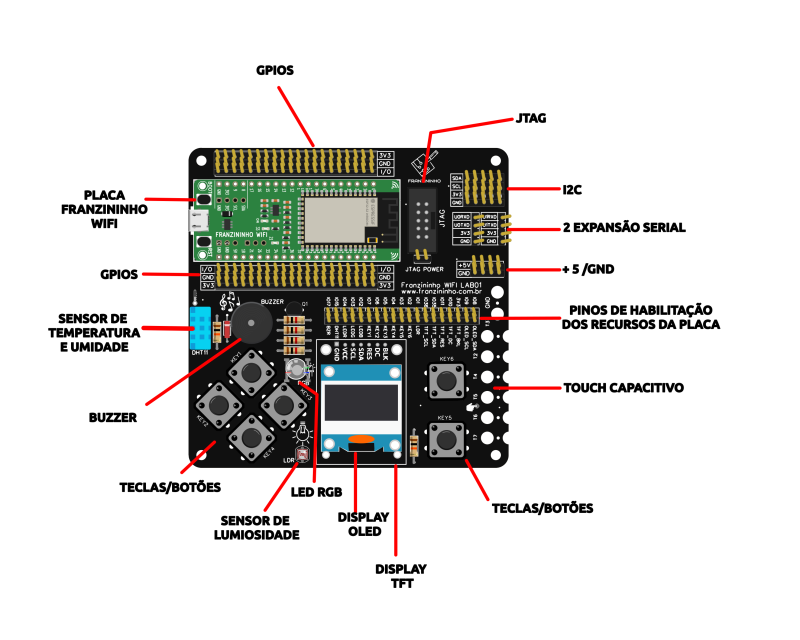
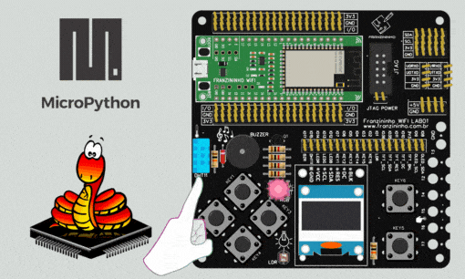

## Introdução

A Franzininho WiFi conta com pinos que podem operar em dois modos: OUTPUT e INPUT. Além disso, é possível usar resistores internos nos pinos configurados como Pull-Up ou Pull-Down para os pinos configurados como entradas.

Neste artigo, vamos explorar como utilizar o MicroPython para controlar os pinos de I/O.

Para isso vamos criar um código para manipular os LEDs e botões da placa Franzininho WiFi LAB01, permitindo criar funcionalidades personalizadas e interativas.

## Recursos necessários

Para iniciar o trabalho com os GPIOs, é essencial possuir o diagrama de pinos da placa Franzininho WiFI LAB01 à disposição, pois isso permitirá que você identifique tanto os nomes quanto as funções associadas a cada um deles.

Tabela 1 – Franzininho WiFi LAB01 mapeamento de pinos

| Pino | Recurso      |
|------|--------------|
| IO1  | LDR          |
| IO2  | BT6          |
| IO3  | BT5          |
| IO4  | BT4          |
| IO5  | BT3          |
| IO6  | BT2          |
| IO7  | BT1          |
| IO8  | OLED_SDA     |
| IO9  | OLED_SCL     |
| IO10 | TFT_DC       |
| IO11 | TFT_RES      |
| IO12 | LED AZUL     |
| IO13 | LED VERDE    |
| IO14 | LED VERMELHO |
| IO15 | DHT11        |
| IO17 | BUZZER       |
| IO35 | TFT_SDA      |
| IO36 | TFT_SCL      |

Nesta prática iremos utilizar o LED RGB e os botões da [Franzininho WiFi LAB01](https://docs.franzininho.com.br/docs/franzininho-wifi-lab01), conforme destacado na Figura abaixo:

Figura 1 – Resumo dos recursos da placa

### Módulos do MicroPython

O [machine](https://docs.micropython.org/en/latest/library/machine.html) contém funções específicas relacionadas ao hardware de uma placa em particular. A maioria das funções neste módulo permitem obter acesso direto e irrestrito aos blocos de hardware em um sistema, como: pinos, I2C, UART, SPI, ADC.

No MicroPython, como no Python, é possível importar apenas parte de uma biblioteca, ao invés de importar a biblioteca inteira. Um recurso útil que utilizaremos bastante.

A biblioteca **‘utime’** é uma versão projetada para microcontroladores da biblioteca ‘time’. Essa biblioteca é útil para inserir os atrasos necessários em muitos projetos.

**Obs**: se você esquecer e usar `import time` , não se preocupe: o MicroPython usará automaticamente a biblioteca `utime` em seu lugar.

## Código

Com a Franzininho WiFi conectada ao seu computador, abra o Thonny e crie um novo arquivo contendo o código a seguir:
    

Para criar o programa que controla o LED RGB, começamos com a instrução `from machine import Pin`. Isso instrui o MicroPython a importar apenas a função `Pin` da biblioteca `machine`, em vez de importar a biblioteca inteira. Dessa forma, teremos acesso apenas à funcionalidade necessária para controlar os pinos da placa.

É importante enfatizar que o Micropython é case-sensitive, isso significa que se você digitar `pin` a biblioteca não será reconhecida, então se atente no uso das letras maiúsculas e minúsculas.

Em seguida, vamos nomear os LEDs e associá-los aos pinos da placa como saída (`Pin.OUT`). Consultando a tabela de pinos da Franzininho WiFi LAB01, identificamos que o pino 12 é responsável pela cor azul do LED RGB, o pino 13 pela cor verde e o pino 14 pela cor vermelha. Com isso fazemos a atribuição setando todos os pinos como saída.

De forma semelhante, realizamos o mesmo procedimento com os botões. Ao consultar a tabela de pinos, identificamos que o pino 7 corresponde ao botão 1, o pino 6 ao botão 2 e o pino 5 ao botão 3. É importante lembrar que esses dispositivos operam com a configuração pull-up, e essa informação deve ser incluída no programa.

Por último, o loop principal monitora constantemente o estado dos botões para determinar se o LED deve ser ligado. Há uma pequena pausa de 100 milissegundos entre cada atualização do LED em resposta ao estado dos botões. Esses atrasos são usados para evitar que a leitura dos botões e as alterações nos LEDs aconteçam muito rapidamente e possam ser difíceis de perceber.

Se você não possui a Franzininho WiFi LAB01 para testar o projeto, é possível testar o programa utilizando a montagem do circuito em uma protoboard.

Pressione as teclas e verifique que os leds acenderão conforme a tecla pressionada:

## Conclusão

Neste artigo, explicamos o funcionamento básico dos pinos de I/O da Franzininho WiFi usando a placa de aplicação Franzininho WiFi LAB01. Exploramos as bibliotecas e funções essenciais que nos permitem configurar esses pinos e acessar seus estados lógicos.

Encorajamos que continue desenvolvendo suas habilidades de programação e eletrônica, adaptando o código e criando projetos mais complexos. Isso permitirá explorar todo o potencial da Franzininho WiFi LAB01 com o MicroPython.

| Autor | Sthefania Fernandes|
|-------|--------------|
| Data: | 17/11/2023    |