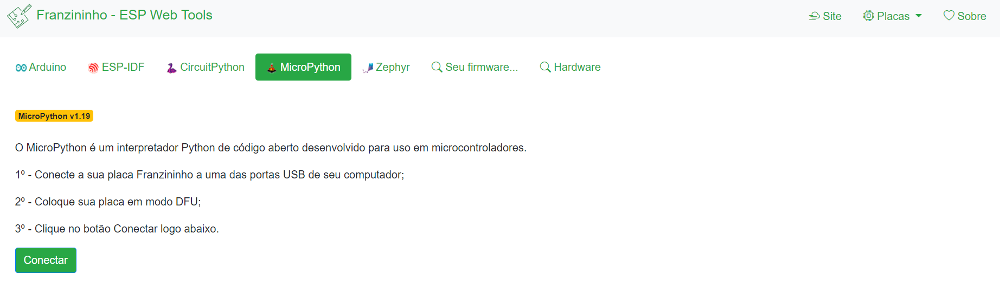
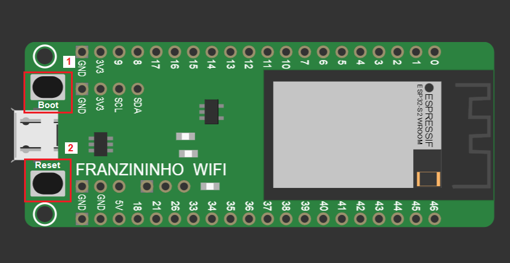
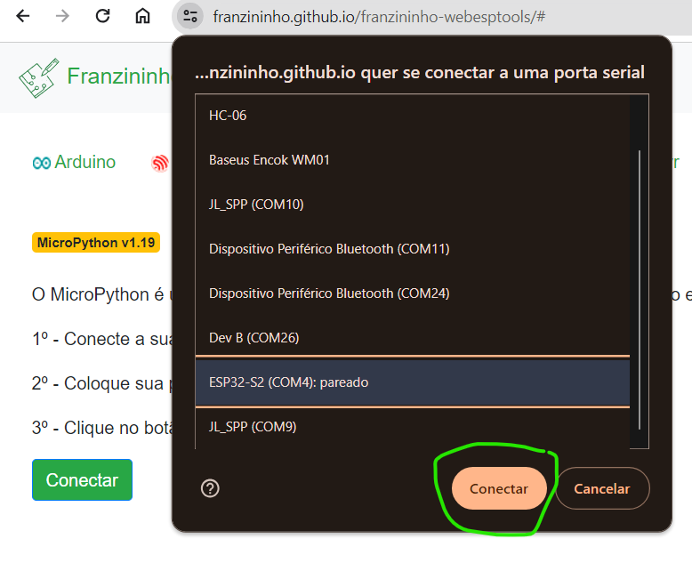
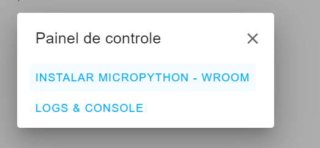
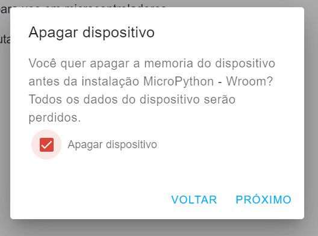
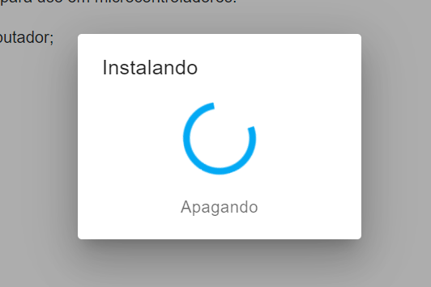
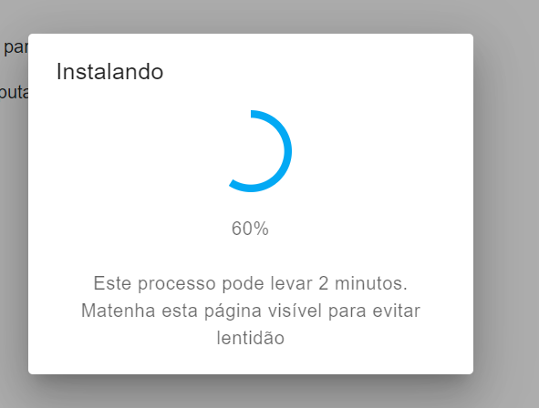
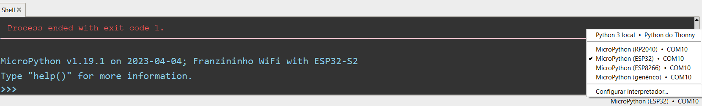

A Franzininho WIFI é uma placa de desenvolvimento de hardware de código aberto, baseada no ESP32-S2 e criada no Brasil. A sua finalidade principal é tornar o desenvolvimento de projetos eletrônicos mais acessível a makers, entusiastas e desenvolvedores brasileiros.

A placa pode ser programada de várias maneiras, adequando-se tanto a iniciantes quanto a desenvolvedores experientes.

A Franzininho WiFi pode ser programada de diversas formas, entre elas as mais comuns são:

-   ESP-IDF, Arduino, CircuitPython e **MicroPython**

A Franzininho WiFi LAB01 é uma placa de expansão para a placa Franzininho WiFi, com a proposta de ser um laboratório para auxiliar no ensino e aprendizagem do ESP32, baseada na Franzininho WiFi. Ela vem com diversos recursos onboard que facilitam o desenvolvimento de atividades e experiências.

Nessa série de artigos, vamos explorar a programação em MicroPython com a Franzininho WiFi LAB01. Primeiramente, é preciso entender que o [MicroPython](https://micropython.org/) é uma implementação completa da linguagem Python 3 para rodar em hardware embarcado.

Assim, para poder programar a sua placa Franzininho WiFi com MicroPython é preciso, primeiro, gravar o firmware do MicroPython nela. Para facilitar a instalação do MicroPython, vamos usar a ferramenta de gravação através do browser, criada pela comunidade Franzininho: [franzininho.github.io](https://franzininho.github.io/franzininho-webesptools/#) (funciona no Chrome e similares). Aproveitamos para agradecer ao Ewerton Sousa pela contribuição com essa ferramenta.

A seguir apresentamos os passos para gravação do MicroPython na Franzininho WiFI e a IDE que usaremos nessa serie de artigos.

## Gravando o MicroPython na Franzininho WiFi

Acesse a ferramenta [Franzininho – ESP Web Tools](https://franzininho.github.io/franzininho-webesptools/#). Com essa ferramenta é possível obter o firmware não somente o firmware do Micropython, mas também das outras ferramentas de software que a placa suporta. Então, atente-se para selecionar a aba do MicroPython, conforme exibido abaixo:

Seguindo o tutorial, comece conectando sua placa Franzininho a uma das portas USB de seu computador. Em seguida coloque sua placa em modo DFU que significa executar os seguintes passos:

1.  Pressione e segure o botão boot;
2.  Pressione o botão reset;
3.  Após soltar o reset solte o boot.

Feito isso, clique no botão Conectar do site [franzininho.github.io](https://franzininho.github.io/franzininho-webesptools/#), selecione a placa e clique em conectar:

Com a placa conectada, clique em instalar MicroPython:

Selecione a opção apagar dispositivo:

Clique em instalar e aguarde finalizar a instalação (mantenha a página aberta até o final da instalação):

Uma vez instalado clique novamente no botão de reset para iniciar o MicroPython.

Tudo pronto, agora é possível programar sua Franzininho WiFi LAB01 com MicroPython.

**Observação**: Quando você colocar a placa em modo DFU, o buzzer pode ser ativado, o que pode causar ruído indesejado. Para evitar isso, desconecte o jumper do buzzer (IO17), que é o primeiro da esquerda para a direita.

## Apresentando o Thonny IDE

O Thonny é um IDE popular para Python e MicroPython e é o que recomendamos para a programação da Franzininho WiFi.

Para realizar o download, basta visitar o site [thonny.org](https://thonny.org/) e selecionar o link de download localizado no topo da página, conforme o seu sistema operacional.

Em seguida, inicie o Thonny enquanto a placa ainda estiver conectada via USB. Na parte inferior direita, selecione a opção MicroPython (ESP32). Desta forma, o Thonny irá detectar automaticamente a Franzininho WiFi.

Agora tudo está pronto para iniciar seus projetos com MicroPython na Franzininho WiFi.

| Autor | Sthefania Fernandes|
|-------|--------------|
| Data: | 10/11/2023    |