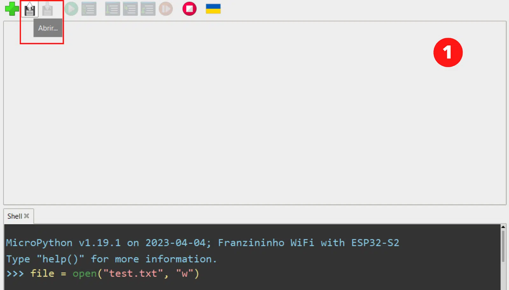
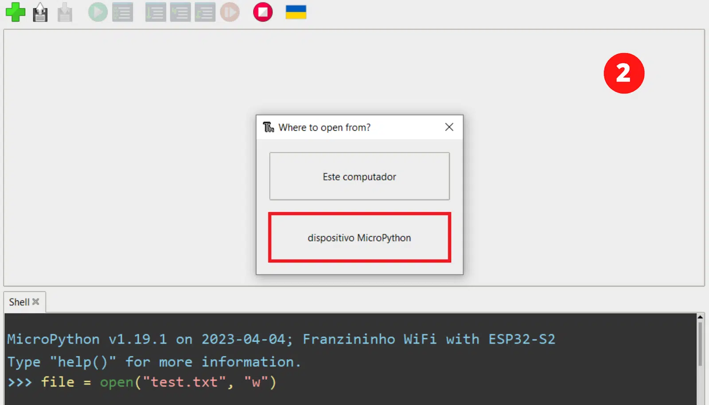
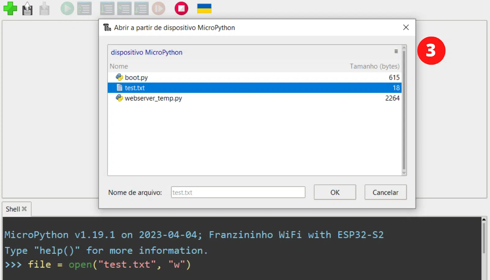
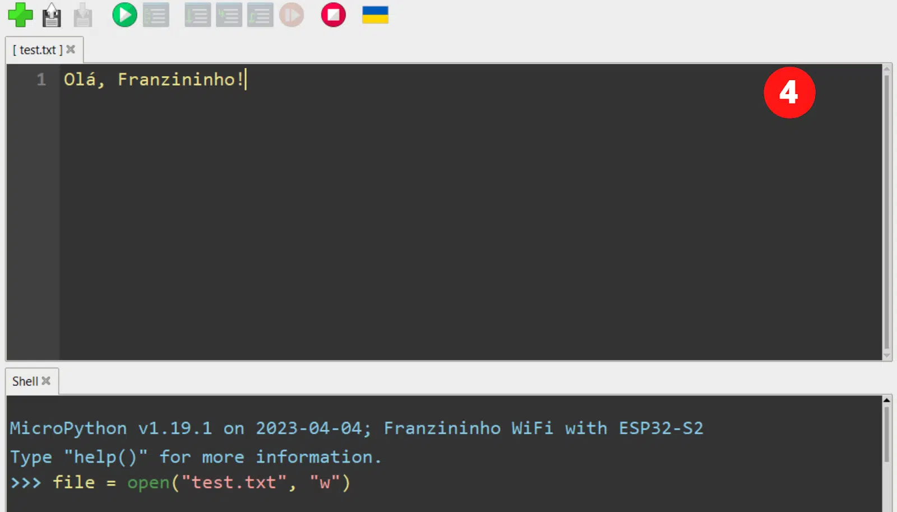

## Introdução

Quando configuramos um sensor para coletar dados, é importante garantir que essas informações sejam devidamente registradas e armazenadas para uso posterior.

Neste artigo veremos como registrar os dados coletados pelo DHT11 presente na placa Franzininho WiFi Lab01, utilizando um sistema que permite criar, gravar e ler arquivos.


## Sistema de arquivos

O sistema de arquivos é onde a sua placa armazena todos os programas que você escreveu. Ele é uma forma de armazenamento não volátil, o que significa que tudo o que você salvar lá permanece mesmo quando você desconectar o cabo micro USB da Franzininho WiFi Lab01.

Para entender isso, conecte a sua Franzininho WiFi Lab01 ao computador e abra o Thonny. Agora, você não irá abrir nenhum programa, então clique na parte inferior da área do Terminal para começar a trabalhar com a sua placa em modo interativo e digite:

```python
file  =  open("test.txt",  "w")
```

Isso instrui o MicroPython a abrir um arquivo chamado “test.txt” para realizar uma escrita (“w” é a instrução de escrita). No momento o arquivo foi aberto mas não há nada nele, então digite:

```python
file.write("Olá, Franzininho!")
```

Ao pressionar o ENTER no final desta linha, você verá o número 18 aparecer como retorno do comando. Isso é o MicroPython confirmando que ele escreveu 18 bytes no arquivo que você abriu. Conte o número de caracteres na mensagem que você escreveu: incluindo as letras, acento, vírgula, espaço e ponto de exclamação, há 18 – cada um dos quais ocupa um byte.
```python
>>>  file  =  open("test.txt",  "w")
>>>  file.write("Olá, Franzininho!")
18
>>>
```

Quando escrevemos um arquivo, é preciso fechá-lo — isso garante que os dados que você informou ao MicroPython para escrever sejam realmente gravados no sistema de arquivos. Se você não fechar o arquivo, os dados podem não ser gravados.
```python
file.close()
```

Agora o arquivo está armazenado com segurança no sistema de arquivos da sua Franzininho WiFi Lab01.

Uma forma de verificar é clicando no ícone “Abrir” na barra de ferramentas do Thonny, depois clicar em “dispositivo MicroPython”, rolar pela lista de arquivos até encontrar test.txt. Clique no arquivo e, em seguida, clique em OK para abri-lo: você verá sua mensagem aparecer em uma nova guia do Thonny.










Há outra forma para ler arquivos — você pode realizar essa tarefa utilizando o MicroPython. Novamente, clique na parte inferior da área do Terminal e insira o seguinte comando:
```python
file  =  open("test.txt")
```

Você poderia digitar `open(“test.txt”, “r”)` mas o MicroPython abre um arquivo em modo de leitura por padrão – então está tudo bem deixar essa parte da instrução de fora. Em seguida, digite:

```python
file.read()
```

Assim você verá a mensagem que você escreveu no arquivo ser exibida na área do Terminal. Observe que dessa forma o uso de acentos pode imprimir uma coisa estranha ao invés do “olá” armazenado, por isso recomenda-se evitar o uso de acentos.
```python
>>>  file  =  open("test.txt")
>>>  file.read()
'Ol\xe1, Franzininho!'
```

Na leitura não é tão importante quanto na escrita fechar, mas é uma boa prática, então recomenda-se que sempre o faça. Então digite:
```python
file.close()
```

## Recursos necessários

Para iniciar o trabalho com os GPIOs, é essencial possuir o diagrama de pinos da placa à disposição, pois isso vai permitir que você identifique tanto os nomes quanto as funções associadas a cada um deles.

| Pino | Recurso      |
|------|--------------|
| IO1  | LDR          |
| IO2  | BT6          |
| IO3  | BT5          |
| IO4  | BT4          |
| IO5  | BT3          |
| IO6  | BT2          |
| IO7  | BT1          |
| IO8  | OLED_SDA     |
| IO9  | OLED_SCL     |
| IO10 | TFT_DC       |
| IO11 | TFT_RES      |
| IO12 | LED AZUL     |
| IO13 | LED VERDE    |
| IO14 | LED VERMELHO |
| IO15 | DHT11        |
| IO17 | BUZZER       |
| IO35 | TFT_SDA      |
| IO36 | TFT_SCL      |

Tabela 1 – Franzininho WiFi Lab01 pinout

## Código

Agora que sabemos como abrir, escrever e ler arquivos, podemos construir um arquivo para guardar os registros de temperatura e umidade coletados pelo sensor DHT11. Assim, com a Franzininho WiFi Lab01 conectada ao seu computador, abra o Thonny e crie um novo arquivo contendo o código a seguir:

```python
import machine
import utime
import dht

d = dht.DHT11(Pin(15))
file = open("temp.txt", "w")

while True:
	d.measure()
	temperatura = d.temperature() # em °C
	umidade= d.humidity() # em %
    
	temperatura_str="Temp: "+str(temperatura)+" ºC\n"
	umidade_str="Umid: "+str(umidade)+" %\n"
   
	file.write(temperatura_str)
	file.write(umidade_str)
    
	file.flush()
	utime.sleep(10)
```

## Explicação do código

A configuração e coleta de dados do sensor DHT11, presente na Franzininho WiFi Lab01, foi explicada em detalhes no artigo “Monitoramento de Temperatura e Umidade na Franzininho WiFi Lab01”. Então vamos focar na escrita no arquivo .txt.

Para organizar o arquivo, adicionamos “+ “\n”” para que cada leitura do sensor seja armazenada em uma linha diferente, deixando o arquivo txt mais organizado.

Um ponto importante a se observar é que não vamos fechar o arquivo, isso porque não poderíamos escrever nele novamente sem reabri-lo e apagar todo seu conteúdo. Mas se o arquivo não é fechado os dados não são salvos no sistema de arquivos.

A solução é esvaziar o arquivo, em vez de fechá-lo, digitando:
```python
file.flush()
```

Quando estamos escrevendo em um arquivo e os dados não estão sendo gravados no sistema de arquivos, eles são armazenados em um buffer – uma área de armazenamento temporário. Quando você fecha o arquivo, o buffer é gravado em um processo conhecido como “esvaziamento” (flushing). Usar “file.flush()” é equivalente a “file.close()”, no sentido de que esvazia o conteúdo do buffer no arquivo. Mas ao contrário de “file.close()”, o arquivo permanece aberto para você gravar mais dados nele posteriormente.

A leitura do sensor é feita a cada 10 segundos e o conteúdo medido é guardado no arquivo “temp.txt”.

Agora, execute o programa e o deixe rodando por 1 minuto ou mais. No terminal, digite o seguinte código para abrir e ler o novo arquivo:
```python
file  =  open("temps.txt")
print(file.read())
```

Dessa vez, colocamos o “file.read()” dentro do “print” isso porque utilizamos o “\n” na escrita do arquivo e ele só funciona como quebra de linha se utilizado no print.

Após esperar alguns segundos, parei a execução e acessei o arquivo. No Shell vemos a leitura da temperatura e umidade que a Franzininho WiFi Lab01 mediu e armazenou.
```python
>>> file = open("temp.txt")
>>> print(file.read())
Temp: 32 ºC
Umid: 58 %
Temp: 32 ºC
Umid: 59 %
Temp: 32 ºC
Umid: 59 %
Temp: 32 ºC
Umid: 60 %
Temp: 32 ºC
Umid: 60 %
Temp: 32 ºC
Umid: 59 %
Temp: 32 ºC
Umid: 59 %
Temp: 32 ºC
Umid: 59 %
Temp: 32 ºC
Umid: 60 %
Temp: 32 ºC
Umid: 60 %
Temp: 32 ºC
Umid: 60 %
Temp: 32 ºC
Umid: 60 %
Temp: 32 ºC
Umid: 60 %
Temp: 32 ºC
Umid: 60 %
```

Lembre-se: se não fechar o arquivo esses dados serão perdidos. Então após a leitura do arquivo, digite:
```python
file.close()
```

## Conclusão

O armazenamento adequado dos dados coletados por sensores, como o DHT11 para medição de umidade e temperatura, garante a preservação das informações medidas e também possibilita uma análise posterior dos dados.

Neste artigo aprendemos como trabalhar com o sistema de arquivos na Franzininho WiFi Lab01 usando a linguagem MicroPython. A capacidade de criar, escrever e ler arquivos permitiu transformar a placa em um _data logger_ capaz de armazenar informações importantes para uso subsequente.

| Autor | Sthefania Fernandes|
|-------|--------------|
| Data: | 04/01/2024    |