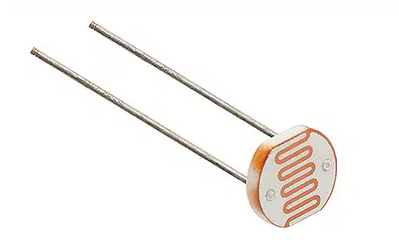
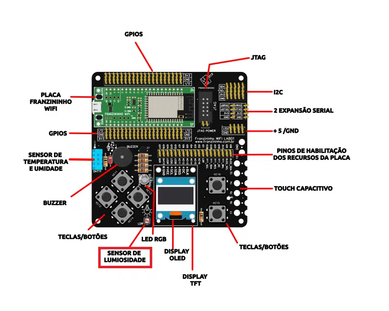

## Introdução

Neste artigo, iremos demonstrar como criar um sistema que opera de forma semelhante ao funcionamento dos postes de luz. Utilizando um sensor de luminosidade (LDR), faremos o controle do acionamento do LED RGB da Franzininho WiFi Lab01.

## Sensor LDR

O sensor LDR (Resistor Dependente de Luz), também conhecido como fotoresistor, é um dispositivo utilizado para medir a intensidade de luz presente no ambiente.

O funcionamento do sensor LDR é baseado no efeito fotocondutivo, que é a capacidade de alguns materiais semicondutores de alterarem sua condutividade elétrica quando expostos à luz. Quando a luz atinge o material do sensor LDR, mais elétrons são liberados, aumentando a condutividade do material e diminuindo sua resistência elétrica. Por outro lado, em ambientes escuros, o número de elétrons gerados é menor, resultando em uma maior resistência elétrica.

Eles são dispositivos simples e de baixo custo, então são muito acessíveis para diferentes projetos. No entanto, é importante destacar que os sensores LDR têm algumas limitações. Por exemplo, sua precisão pode variar com as condições de temperatura e umidade do ambiente.



Figura 1 – Sensor LDR



Figura 2 – Localização do sensor LDR na Franzininho WiFi Lab01

## Recursos necessários

Para iniciar o trabalho com os GPIOs, é essencial possuir o diagrama de pinos da placa à disposição, pois isso vai permitir que você identifique tanto os nomes quanto as funções associadas a cada um deles.


| Pino | Recurso      |
|------|--------------|
| IO1  | LDR          |
| IO2  | BT6          |
| IO3  | BT5          |
| IO4  | BT4          |
| IO5  | BT3          |
| IO6  | BT2          |
| IO7  | BT1          |
| IO8  | OLED_SDA     |
| IO9  | OLED_SCL     |
| IO10 | TFT_DC       |
| IO11 | TFT_RES      |
| IO12 | LED AZUL     |
| IO13 | LED VERDE    |
| IO14 | LED VERMELHO |
| IO15 | DHT11        |
| IO17 | BUZZER       |
| IO35 | TFT_SDA      |
| IO36 | TFT_SCL      |

Tabela 1 – Franzininho WiFi Lab01 pinout

## Código

Com a Franzininho WiFi Lab01 conectada ao seu computador, abra o Thonny e crie um novo arquivo contendo o código a seguir:

```python
import machine
import utime

led_red= machine.Pin(14,machine.Pin.OUT) #definindo o pino 16 como saída digital
ldr= machine.ADC(machine.Pin(1)) #definindo entrada analógica

fator_conversao = 3.3 / (65535)

while True:
	leitura_LDR = ldr.read_u16() * fator_conversao
	utime.sleep(1)
	print(leitura_LDR)

	if leitura_LDR < 1:
   		led_red.value(1)
	else:
    		led_red.value(0)
```

## Explicação do código

Vamos começar com “`import machine`” e “`import utime`” para poder acessar os pinos da placa e para adicionar atrasos ao programa.

Em seguida, configuramos o LED e o LDR, onde o primeiro será uma saída digital e o segundo uma entrada analógica. A seleção dos pinos é feita de acordo com a tabela de pinagem.

Além disso, é feita a conversão do valor lido através do fator de correção. Isso é necessário pois o valor que é exibido no shell é uma representação decimal da saída bruta do conversor analógico-digital – mas não é a forma mais amigável de visualizá-lo. Então o fator de conversão será o resultado da divisão de dois valores: o primeiro número é a tensão máxima possível que o pino pode esperar: 3,3 V, da saída 3V3 do seu Pico; o segundo número é o valor máximo que a leitura de entrada analógica pode ter, que é 65535.

Feito isso, dentro de um loop realizamos a leitura do sensor, utilizando 16 bits de precisão e multiplicando pelo fator de correção. A coleta será feita a cada 1 segundo e será exibida no terminal.

Empiricamente, foi determinado que, caso o valor lido pelo sensor seja inferior a 1, o LED será ligado; caso contrário, ele será desligado. Mas recomendo que faça alguns testes com seu sensor para verificar qual faixa você considera adequada.

## Conclusão

O programa que criamos neste artigo nos permitiu desenvolver um sistema que acende um LED de acordo com as condições de luminosidade do ambiente, replicando uma situação comum em residências automatizadas ou em postes de iluminação pública.


| Autor | Sthefania Fernandes|
|-------|--------------|
| Data: | 19/01/2023    |
