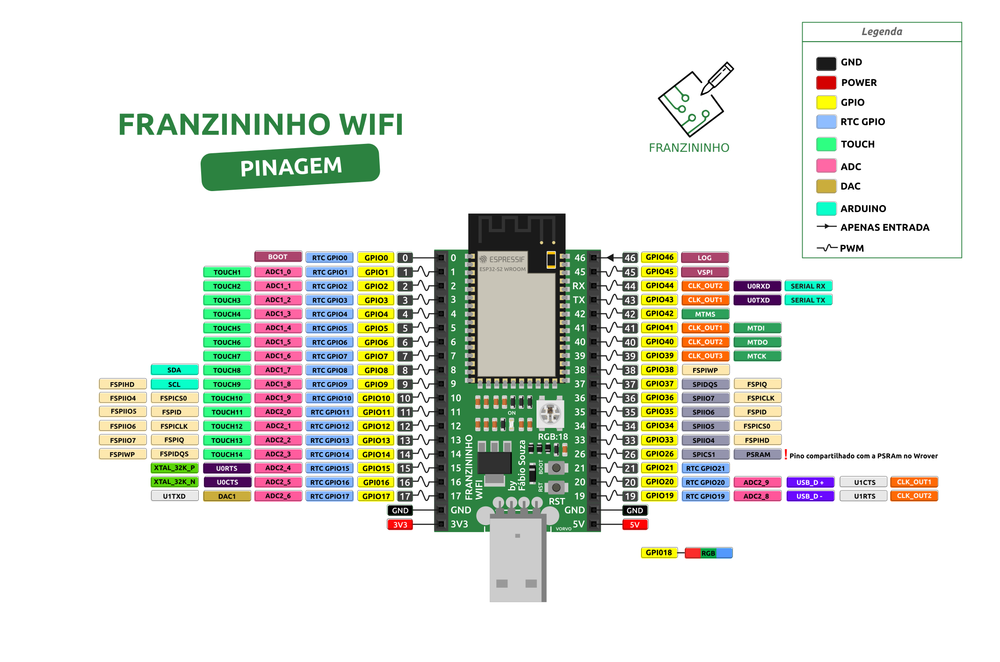

:::caution Atenção
Essa placa foi feita apenas como protótipo. Não está em produção
:::

A Franzininho WiFi Developer Edition é uma placa de desenvolvimento para avaliar os módulos ESP32-S2 (Wroom e Wrover) e desenvolver a nova geração de placas Franzininho. O projeto Franzininho foi criado para desenvolver habilidades em pessoas nas áreas de eletrônica e programação, por meio de atividades no formato DIY e em conjunto com a cultura maker, no Brasil.

Como não existem muitas placas no mercado brasileiro com ESP32-S2, desenvolvemos o Franzininho WiFi Developer Edition (em 2020) para servir como plataforma de desenvolvimento ESP32-S2 e nos ajudar a avaliar e validar aplicações com este SoC.

## Características

- ESP32-S2 module( Wrover ou Wroom): 
  - Xtensa®single-core32-bit LX7 microprocessor, up to 240 MHz
  - 128 KB ROM
  - 320 KB SRAM
  - 16 KB SRAM in RTC
  - 2 MB (8 Mbit) PSRAM ( Only with Wrover Module)
  - WiFi 802.11 b/g/n
- Interfaces: GPIO, SPI, LCD, UART, I2C, I2S, Camera interface, IR, pulse counter, LED PWM, TWAI(compatible with ISO 11898-1), USB 1.1OTG, ADC, DAC, touch sensor, temperature sensor.
- USB Type-A Male
- RGB LED (WS2812) (GPIO 18)
- 40 pin broken out to 2x20 2.54mm header pins(36 GPIO) - Breadboard Friendly
- Reset and DFU (BOOT0) buttons to get into the ROM bootloader (which is a USB serial port so you don’t need a separate cable!)
- Serial debug pins ( TX and RX, for checking the hardware serial debug console)
JTAG pads for advanced debugging access.
- 3.3 V Power On LED
- 3.3 V Regulator
- Power: 
  - Micro USB port (default power supply)
  - 5V and GND header pins
  - 3V3 and GND header pins
- Dimensions: 72 mm x 30 mm
- Works with [ESP-IDF](https://docs.espressif.com/projects/esp-idf/en/latest/esp32s2/get-started/index.html) or [CircuitPython](https://circuitpython.org/)

## Pinout

## Licença

O projeto é um hardware de código aberto e está disponível na licença de hardware aberto do CERN.

A placa Franzininho WiFi Developer Edition é certificada na OSHWA:
 [UID BR000006](https://certification.oshwa.org/br000006.html)

