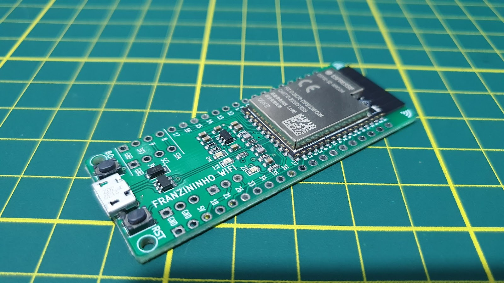
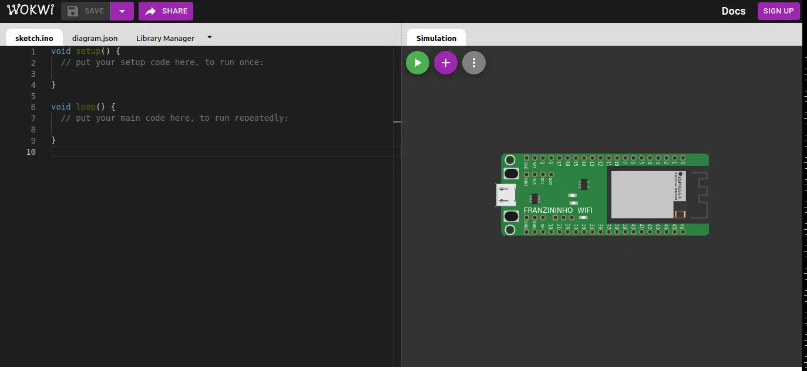
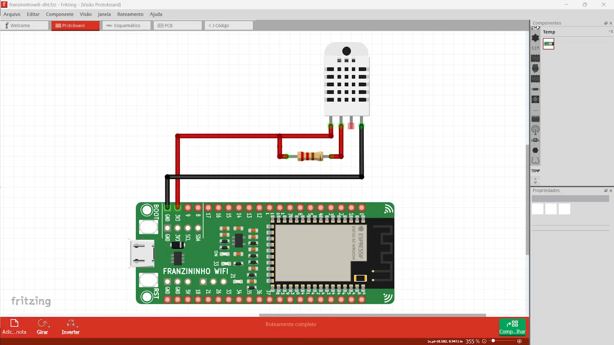

A Franzininho WiFi é uma placa de desenvolvimento de hardware aberto, criada no Brasil, baseada no módulo ESP32-S2. Seu objetivo é tornar o desenvolvimento de projetos eletrônicos com conectividade WiFi mais acessível para makers, estudantes e desenvolvedores.

A placa suporta múltiplos ambientes de programação — de blocos visuais ao C nativo — adequando-se tanto a iniciantes quanto a profissionais experientes.

[Compre sua Franzininho WiFi](https://www.robocore.net/wifi/franzininho-wifi)

## Recursos

A Franzininho WiFi possui os seguintes recursos:

- **Módulo ESP32-S2**
  - Microcontrolador Xtensa® single-core 32-bit LX7, até 240 MHz
  - 128 KB ROM, 320 KB SRAM, 16 KB SRAM no RTC, 4 MB Flash
  - WiFi 802.11 b/g/n (sem Bluetooth)
  - Interfaces: GPIO, SPI, LCD, UART, I2C, I2S, câmera, IR, contador de pulsos, LED PWM, TWAI (CAN), USB 1.1 OTG, ADC, DAC, touch, sensor de temperatura interno
- **Pinout**
  - 40 pinos em 2×20 headers de 2,54 mm
  - 35 GPIOs
  - Compatível com protoboard
- 2 LEDs de uso geral
- Botões: 1× Reset, 1× Boot
- USB: conector Micro USB — OTG 1.1 (sem chip conversor USB-Serial externo)
- **Alimentação**
  - 5 V via conector USB
  - 5 V e GND via pinos
  - 3,3 V e GND via pinos

## Pinout

## Formas de programação

A Franzininho WiFi pode ser programada com os seguintes ambientes e frameworks:

| Ambiente | Nível | Documentação |
| --- | --- | --- |
| Arduino | Iniciante / Intermediário | [Exemplos Arduino](/docs/franzininho-wifi/exemplos-arduino/primeiros-passos) |
| CircuitPython | Iniciante / Intermediário | [Exemplos CircuitPython](/docs/franzininho-wifi/exemplos-circuitpython/primeiros-passos) |
| MicroPython | Iniciante / Intermediário | [Exemplos MicroPython](/docs/franzininho-wifi/exemplos-micropython/primeiros-passos) |
| ESP-IDF | Avançado | [Exemplos ESP-IDF](/docs/franzininho-wifi/exemplos-espidf/primeiros-passos) |
| Zephyr RTOS | Avançado | [Documentação oficial](https://docs.zephyrproject.org/) |
| NuttX RTOS | Avançado | [Documentação oficial](https://nuttx.apache.org/docs/latest/) |

> **Nota:** O ESP32-S2 não possui Bluetooth. Se o seu projeto precisar de Bluetooth, considere usar uma placa baseada em ESP32 ou ESP32-S3.

## Simulação no Wokwi

O [Wokwi](https://wokwi.com/) é um simulador online gratuito de eletrônica que suporta a Franzininho WiFi. Com ele é possível testar projetos sem precisar da placa física, com suporte a simulação de WiFi, analisador lógico virtual e depuração com GDB.

- [Abrir novo projeto no Wokwi](https://wokwi.com/projects/new/franzininho-wifi)
- [Primeiros passos no Wokwi](/docs/franzininho-wifi/wokwi/primeiros-passos)
- [Documentação do Wokwi](https://docs.wokwi.com/pt-BR/)

## Componente para o Fritzing

O [Fritzing](https://fritzing.org/) é uma ferramenta open-source para documentação de circuitos eletrônicos. Disponibilizamos um componente da Franzininho WiFi para facilitar a criação de diagramas de montagem nos seus projetos.

[Baixar componente Fritzing](https://github.com/Franzininho/franzininho-fritzing/tree/master/Franzininho-WiFi)

## Licença

A Franzininho WiFi é um projeto de hardware aberto, licenciado sob a **CERN Open Hardware License**. O projeto do hardware está disponível no GitHub:

[github.com/Franzininho/Franzininho-WiFi](https://github.com/Franzininho/Franzininho-WiFi)
