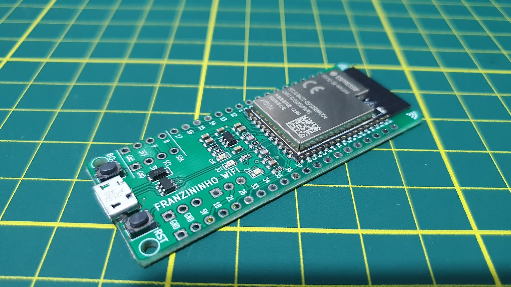

A Franzininho WIFI é uma placa de desenvolvimento de hardware de código aberto, baseada no ESP32-S2 e criada no Brasil. A sua finalidade principal é tornar o desenvolvimento de projetos eletrônicos mais acessível a makers, entusiastas e desenvolvedores brasileiros.

A placa pode ser programada de várias maneiras, adequando-se tanto a iniciantes quanto a desenvolvedores experientes.

Neste texto, apresentaremos os recursos disponíveis, as formas de programação e informações relevantes para aqueles que estão iniciando o uso da Franzininho WiFi ou têm interesse em conhecê-la.

[Compre sua Franzininho WiFi (com frete gratis) clicando neste link](https://sacola.pagseguro.uol.com.br/e9bdf81f-339f-4b36-951c-88c69240e0e7)

## Resumo de recursos da placa Franzininho WiFi:

A Franzininho WiFi possui os seguintes recursos:

-   Módulo ESP32-S2
    -   Microcontrolador Xtensa® single-core32-bit LX7 operando em até 240 MHz
    -   Memórias: 128 KB de ROM, 320 KB de SRAM, 16 KB SRAM no RTC, 4MB de Flash
    -   WiFi 802.11 b/g/n
    -   Interfaces: GPIO, SPI, LCD, UART, I2C, I2S, Camera, IR,contador de pulsos, LED PWM, TWAI(CAN), USB 1.1 OTG, ADC, DAC, touch, sensor de temperatura interno.
-   Pinout:
    -   40 pinos divididos em 2×20 headers de 2,54 mm
    -   35 GPIOs
    -   Compatível com protoboard
-   2 LEDS de uso geral
-   Botões: 1xReset, 1 x Boot
-   USB: conector micro USB – OTG 1.1
-   Alimentação:
    -   5V via conector USB
    -   5V e GND via pinos
    -   3V3 e GND via pinos
-   Formas de programação:
    -   ESP-IDF,
    -   Arduino,
    -   CircuitPyhton,
    -   MicroPython,
    -   Zephyr,
    -   NuttX

## Pinout da Franzininho WiFi

A imagem a seguir exibe o pinout da Franzininho WiFi com mapeamento dos pinos e recursos:

## Licença

A placa Franzininho WiFi é um projeto de hardware de código aberto, licenciado sob a **CERN Open Hardware License**. Essa licença é utilizada em projetos de hardware que são desenvolvidos e disponibilizados como código aberto, permitindo que outras pessoas possam reproduzir e criar derivações do projeto. Para garantir a conformidade com a licença, é importante que os desenvolvedores consultem e sigam os requisitos especificados na mesma antes de reproduzir ou criar derivações do projeto. Dessa forma, podem garantir que estão seguindo as diretrizes corretas e respeitando a licença escolhida para o projeto.

Você encontra o projeto do hardware no Github organização Franzininho: [https://github.com/Franzininho/Franzininho-WiFi](https://github.com/Franzininho/Franzininho-WiFi)

## Simulação da Franzininho WiFi no Wokwi

O Wokwi é uma ferramenta de simulação online e gratuita que permite que desenvolvedores de projetos eletrônicos testem suas criações em um ambiente leve e intuitivo. Com suporte a diversas placas de desenvolvimento, incluindo o Arduino Uno, ESP32, RP2040, e muitas outras, o simulador é um diferencial na área. A ferramenta oferece recursos exclusivos, como simulação de Wi-Fi, Analisador Lógico Virtual, Depuração avançada com GDB, simulação de cartão SD, API dos chips (criação de chips personalizados) e integração com o Visual Studio Code.

A placa Franzininho WiFi também é suportada no simulador. Para começar a criar projetos, acesse a lista de placas suportadas pelo Wokwi e comece a testar suas criações em um ambiente seguro e de fácil acesso. Além disso, compartilhar seus projetos com a comunidade pode ajudar outros desenvolvedores a iniciarem no universo da eletrônica, permitindo que cresçam juntos e desenvolvam soluções cada vez mais inovadoras.

A figura a seguir exibe a Franzininho WiFi no ambiente de simulação do Wokwi:

Entenda melhor sobre a ferramenta, acessando os links abaixo:

[Documentação do Wokwi](https://docs.wokwi.com/pt-BR/)

[Simulação Franzininho WiFi](https://wokwi.com/projects/new/franzininho-wifi)

[Documentação da Franzininho Wokwi](https://docs.franzininho.com.br/docs/franzininho-wifi/wokwi/primeiros-passos)

## Componente para o Fritzing

O [Fritzing](https://fritzing.org/) é uma ferramenta open-source que permite a interação com o hardware, possibilitando a montagem de circuitos eletrônicos, criação de placas de circuito impresso e inclusão do código-fonte do projeto proposto. Com sua riqueza de detalhes e ampla variedade de componentes, o Fritzing é uma opção ideal para documentação de projetos. Para facilitar a documentação de projetos, criamos um [componente para ser adicionado](https://github.com/Franzininho/franzininho-fritzing/tree/master/Franzininho-WiFi) ao Fritzing:

