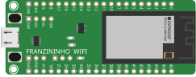

Wokwi é um simulador de eletrônica online. Você pode usá-lo para simular Arduino, ESP32 e muitas outras placas, componentes e sensores populares. Foi desenvolvido para makers, por makers.

A Franzininho WiFi é baseada no chip ESP32-S2 da Espressif, e o Wokwi oferece suporte completo a ela. Você pode usar o simulador para aprender a programá-la, criar protótipos de suas ideias e compartilhar seus projetos com outros makers — sem precisar de hardware físico.


<div style={{textAlign: 'center'}}>

[](https://wokwi.com/projects/new/franzininho-wifi)

</div>

:::tip Dica
Use o Template do Franzininho WiFi clicando na imagem acima para começar um novo projeto no Wokwi.
:::


## Configurando a Plataforma de Compilação

Um projeto no Wokwi é composto por dois elementos:

- **`diagram.json`** — descreve o circuito (placa, componentes e conexões)
- **Arquivos de código** — determinam a plataforma usada (Arduino, CircuitPython ou ESP-IDF)

O `diagram.json` é o ponto de partida de qualquer projeto. Para a Franzininho WiFi, ele deve conter o componente `board-franzininho-wifi`:

```json
{
  "version": 1,
  "author": "Seu Nome",
  "editor": "wokwi",
  "parts": [
    {
      "type": "board-franzininho-wifi",
      "id": "franzininho",
      "top": 0,
      "left": 0,
      "attrs": {}
    }
  ],
  "connections": [],
  "dependencies": {}
}
```

A plataforma é identificada pelo Wokwi com base no arquivo de código adicionado ao projeto:

| Plataforma    | Arquivo principal   |
|---------------|---------------------|
| Arduino       | `sketch.ino`        |
| CircuitPython | `code.py`           |
| ESP-IDF       | `main.c`            |

Para adicionar um arquivo ao projeto no Wokwi, clique no ícone **+** na aba de arquivos do editor e informe o nome do arquivo conforme a tabela acima.

### Arduino

O framework Arduino é a opção mais acessível para iniciantes. O código é escrito em C++ com as abstrações do Arduino (`setup()` e `loop()`).

Adicione um arquivo chamado `sketch.ino` com o conteúdo mínimo:

```cpp
void setup() {
  Serial.begin(115200);
}

void loop() {
  Serial.println("Olá, Franzininho WiFi!");
  delay(1000);
}
```

Todas as bibliotecas compatíveis com ESP32/ESP32-S2 no Arduino IDE também estão disponíveis no simulador.

### CircuitPython

O CircuitPython é uma versão do Python mantida pela Adafruit, voltada para prototipagem rápida. O código é interpretado diretamente — não há etapa de compilação.

Adicione um arquivo chamado `code.py` com o conteúdo mínimo:

```python
import time

while True:
    print("Olá, Franzininho WiFi!")
    time.sleep(1)
```

:::info
No CircuitPython, o arquivo obrigatoriamente deve se chamar `code.py`. Outros nomes não serão reconhecidos como ponto de entrada.
:::

### ESP-IDF

O ESP-IDF (Espressif IoT Development Framework) é o framework nativo da Espressif para chips ESP32. Oferece acesso completo ao hardware e é indicado para projetos que exigem maior controle, desempenho ou uso direto do FreeRTOS.

Adicione um arquivo chamado `main.c` com o conteúdo mínimo:

```c
#include <stdio.h>
#include "freertos/FreeRTOS.h"
#include "freertos/task.h"

void app_main(void) {
    while (1) {
        printf("Olá, Franzininho WiFi!\n");
        vTaskDelay(pdMS_TO_TICKS(1000));
    }
}
```

:::tip Dica
Se você está começando, use o Arduino. Se já tem experiência com ESP32 e precisa de recursos avançados como FreeRTOS, drivers nativos ou otimização de memória, o ESP-IDF é a escolha ideal.
:::

## Saiba mais

[Documentação da Franzininho WiFi no WokWi](https://docs.wokwi.com/parts/board-franzininho-wifi)

Caso queira saber mais sobre outras funcionalidades do simulador, dê uma olhada na lista abaixo. Você pode também consultar a [documentação do Wokwi](https://docs.wokwi.com/) para referências completas sobre componentes e diagramas.

- [Formato do diagram.json](https://docs.wokwi.com/diagram-format)
- [Teclas de Atalho do Editor](https://docs.wokwi.com/keyboard-shortcuts)
- [O Monitor Serial](https://docs.wokwi.com/guides/serial-monitor)
- [Usando o GDB no Wokwi](https://docs.wokwi.com/gdb-debugging)
- [Guia do Analisador Lógico](https://docs.wokwi.com/guides/logic-analyzer)
- [Trabalhando com Bibliotecas](https://docs.wokwi.com/guides/libraries)
- [Simulador ESP32](https://docs.wokwi.com/guides/esp32)
- [Rede WiFi ESP32](https://docs.wokwi.com/guides/esp32-wifi)


## Exemplos no simulador

### Arduino

- [Relógio LCD com cliente (NTP)](https://wokwi.com/projects/323796775459619410)
- [Controle de servo motor](https://wokwi.com/projects/327061759288410708)
- [Misturador de LED RGB (usando 3 potenciômetros)](https://wokwi.com/projects/324682033130373716)
- [Display TFT ILI9341](https://wokwi.com/projects/329013233501340242)
- [MQTT](https://wokwi.com/projects/322524997423727188)
- [NTP](https://wokwi.com/projects/323043284024820308)

### CircuitPython

- [Blink com CircuitPython](https://wokwi.com/projects/313606939786347074)

### ESP-IDF

- [Entrada analógica e saída PWM com ESP-IDF](https://wokwi.com/projects/324615433106752083)
- [FreeRTOS Tasks](https://wokwi.com/projects/324613550740865619)
- [PWM ESP-IDF](https://wokwi.com/projects/329133882849886804)
