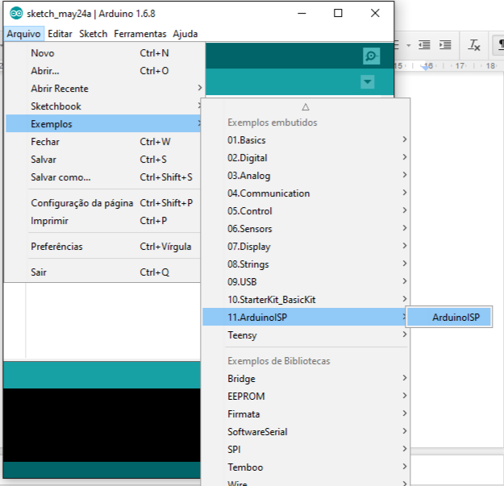

Se você não possui um conversor USB/Serial você pode gravar a Franzino através de um Arduino. Para isso vamos configurar a placa Arduino UNO com programador.

Primeiro, escolha o exemplo ArduinoISP, conforme figura abaixo:

Faça o upload para a placa Arduino UNO que será usada como programador.

Feito o UPLOAD, agora vamos as conexões do Arduino UNO na Franzino:

- Ligue o pino RESET da FRANZINO ao pino 10 do Arduino
- Ligue o pino  11 da FRANZINO ao pino 11 do Arduino
- Ligue o pino 12 da FRANZINO ao pino 12 do Arduino
- Ligue o pino 13 da FRANZINO ao pino 13 do Arduino
- Ligue o pino 5V da FRANZINO no pino 5V do Arduino
- Ligue o pino GND da FRANZINO ao GND do Arduino

## Configurando o avrdude ( se estiver usando o ATmega328 e não o ATmega328P)

A versão 0 da Franzino vem com o ATmega328-PU, dessa forma precisamos configurar o avrdude para gravar esse microcontrolador. Na pasta do arduino acesse:

C:\arduino-1.6.8\hardware\tools\avr\etc, abra o arquivo avrdude.conf

Procure a assinatura do ATMEGA328P:

Troque a assinatura por:

Salve o arquivo.

:::tip
Após a gravação, volte a assinatura para o valor original: signature= 0x1e 0x95 0x0F;
:::

## Upload de Sketchs usando a Arduino UNO

Pronto, agora abra o programa que será gravado na Franzino. Para esse exemplo vamos usar o exemplo Blink, mas você poderá fazer esse procedimento para gravar suas aplicações;

Agora vamos preparar para gravação. Configure o Programador como ArduinoISP:

Pronto, agora é só fazer o UPLOAD para a Franzino:

