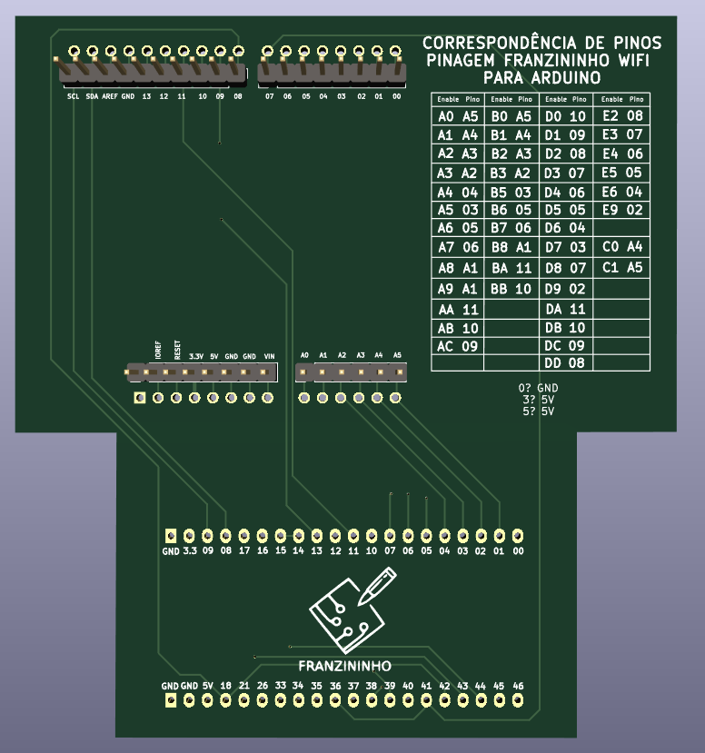

Este adaptador permite a utilização da placa Arduino Uno em conjunto com a placa _Laboratório de Sistemas Embarcados e IoT_ através de um remapeamento da pinagem do Arduino Uno e para a pinagem da Franzininho Wifi (utilizada no projeto da placa de laboratório). Para utilizar o adaptador basta conectá-lo ao Arduino como um shield e então conectar o adaptador na placa.

[Clique aqui](https://github.com/Franzininho/laboratorio-SEIoT-adaptador-arduino) para acessar o projeto da placa de circuito impresso no Github.

## Pinos de ativação

Este adaptador utiliza o mesmo sistema de codificação de pinos de ativação definido para a placa _Laboratório de Sistemas Embarcados e IoT_ sendo que a correspondência entre o pino do Arduino e o pino de ativação na placa laboratório foi impresso no adaptdor e também pode ser verificada no repositório do projeto no Github.

Para facilitar o uso deste adaptador foi desenvolvida a biblioteca laboratorioFW_ARDUNO para uso em conjunto com o placa que permite o uso dos códigos dos pinos de ativação dentro da programação.

:::info Obs.
Este projeto foi desenvolvido como parte do Trabalho de Conclusão de Curso de Letícia Pegoraro Garcez.
:::
