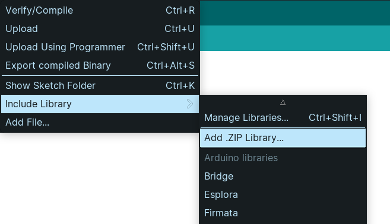

Nesta biblioteca é possível encontrar o mapeamento entre a pinagem da placa **Franzininho Wifi** e a codificação dos pinos de ativação da placa Laboratório de sistemas embarcados e IoT e exemplos de utilização dos periféricos disponíveis na placa.

[Clique aqui](https://github.com/Franzininho/biblioteca-laboratorioFW) para acessar o repositório da biblioteca no Github.

## Como instalar a biblioteca

1. Faça o donwload da biblioteca em formato zip clicando em **Code** e depois em **Download ZIP**


2. Abra a IDE do Arduino
3. Vá em Sketch > Include Library > Add .ZIP Library



4. Selecione o arquivo zip baixado e clique em ok
5. Opcional: Procure pelos exemplos da biblioteca em File > Examples

## Como usar a biblioteca

Para utilizar a biblioteca basta incluí-la no seu arquivo de código com a linha `#include<laboratorioFW.h>`. Depois disso, você pode utilizar os códigos dos pinos de ativação na placa dentro do seu código.

**Importante : Os algorismos do código do pino de ativação são separados por um caractere de `_`, ou seja o pino de ativação C0 pode ser acessado no código através do código C_0 e assim por diante.**

## Exemplo de utilização:

```c
#include <laborarotioFW.h>

#define led A_1

void setup(){
    pinMode(led,OUTPUT);
}

void loop{
    digitalWrite(led,HIGH);
    delay(1000);
    digitalWrite(led,LOW);
    delay(1000);
}
```

## Exemplos implementados:

### testes_completos.ino

Neste exemplo temos todos os códigos necessários para os testes de todos os periféricos disponíveis na placa. Este código é um código para a validação da placa e não para ser utilizado no cotidiano.

### adivinhe_a_senha.ino

Neste exemplo implementamos um sistema de verificação de senha utilizando o teclado matricial e a biblioteca `Keypad` para fazer o mapeamento
do teclado. Neste sistema, o usuário deve inserir uma senha de cinco caracteres usando o teclado matricial da placa. Quando o usuário indica que terminou de digitar a senha apertando um o botão correspondente ao caractere `*` ou `#`, essa sequência é comparada com uma senha previamente definida no código. Um led é aceso para indicar se a senha está correta ou não e uma mensagem com essa informação é impresso no monitor serial.

### ativar_led_RGB_com_potenciometro_e_botoes.ino

Neste exemplo objetiva controlamos o brilho do LED RGB utilizando um potenciômetro e três botões. Os três botões são utilizados para selecionar qual cor do LED RGB será controlada (vermelho, verde e azul) e a leitura analógica do potenciômetro é usada para dosar a intensidade da cor do terminal.

### ativar_servo_motor_com_botoes.ino

Neste exemplo, utilizamos dois botões para controlar a posição de um servo motor. Os botões são associados no código às direções esquerda e direita e alteram o ângulo do servo fazendo com que seja possível movimentá-lo nas duas direções. Foi usada a biblioteca ESP32_S2_ISR_Servo.

### contagem_display_7seg.ino

Neste exemplo, utilizamos o display de sete segmentos para exibir uma contagem de 0 a 9 segundos.

### controle_led_com_ldr.ino

Neste exemplo, fazemos a leitura do sensor LDR e mapeamos esta leitura é mapeada e o valor resultante é usado para acender um LED. O exemplo também conta com um botão que controla um estado interno do programa e seleciona se a leitura será impressa como é lida ou com lógica complementar.

### do_re_mi_fa.ino

Neste exemplo uma música é tocada pelo buzzer em conjunto com a ativação
do LED RGB endereçável. O programa utiliza a biblioteca `Adafruit_NeoPixel` para controlar o LED.

### genio.ino

Neste exemplo, implementamos o jogo Simon, também conhecido como gênio. Neste jogo, quatro LEDs são ativados em uma sequência gerada aleatóriamente e essa sequência é apresentada para o jogador, que deve repetir a sequência na ordem correta pressionando os botões correspondentes. Quando os LEDs acendem, um som correspondente é tocado no buzzer.

### leitura_do_teclado.ino

Neste exemplo fazemos a leitura de uma tecla pressionada no teclado matricial e
a imprimimos essa tecla no no monitor serial. A biblioteca `Keypad` é utilizada para fazer o mapeamento do teclado.

### leitura_sensores_externos.ino

Neste exemplo fazemos a leitura dos sensores externos conectados nos sockets
para conectores externos da placa e imprimimos os valores lidos no monitor serial.

### leitura_sensores_grove.ino

Neste exemplo fazemos a leitura dos sensores externos conectados nos conectores Grove da placa e imprimimos os valores lidos no monitor serial.

### leitura_umidade_temperatura_oled.ino

Neste exemplo fazemos a leitura do sensor de temperatura e umidade escrevemos os dados lidos no display OLED. Para isso, são utilizadas as bibliotecas `DTH` e `SSD1306Wire`.

### movimentar_elemento_oled_joystick.ino

Neste exemplo utilizamos o display OLED para mostrar um asterisco que pode ser controlado pelo módulo de joystick se movendo no display. Foi utilizada a biblioteca `SSD1306Wire`.

:::info Obs.
Este projeto foi desenvolvido como parte do Trabalho de Conclusão de Curso de [Letícia Pegoraro Garcez](https://github.com/LelePG).
:::
