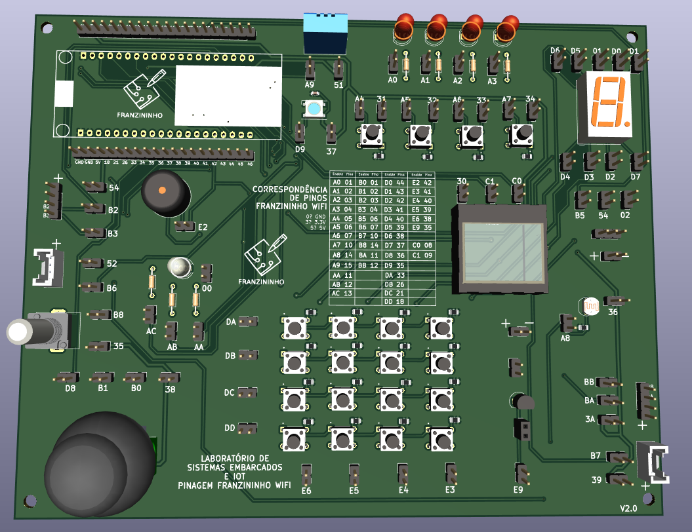

A placa _Laboratório de Sistemas Embarcados e IoT_ é uma placa de circuito impresso para o ensino de programação em placas microcontroladas. Esta placa contém uma série de periféricos que permitem a exploração de conceitos relacionados ao uso de placas microcontroladas. A conexão desses periféricos já está de certa forma "embutida" na placa sendo necessária apenas a ativação dos componentes através da conexão de pinos de ativação associados ao periférico.

Esta placa foi desevolvida para ser usada em conjunto com a placa Franzininho Wifi. Sendo assim, foram adicionadas na placa barras de pinos que permitam a conexão desta placa com facilidade. No entanto, é possível também utilizar a placa com outras placas microcontroladas, como a placa Arduino Uno através de um adaptador.

Além dos periféricos padrão, também estão disponíveis na placa conectores extra que permitem a utilização das portas da Franzininho Wifi para fazer conexões externas caso os periféricos da placa não sejam satisfatórios.

[Clique aqui](https://github.com/Franzininho/laboratorio-SEIoT-Franzininho-Wifi) para acessar o projeto da placa de circuito impresso no Github.

## Periféricos disponíveis na placa

-   4 LEDs coloridos difusos
-   4 chaves táteis 6X6mm
-   1 Teclado Matricial 4X4 (composto de chaves táteis 6X6mm)
-   1 LED RGB Endereçável 5050
-   1 Sensor DHT11
-   1 Display de 7 segmentos cátodo comum
-   1 Sensor LDR de 5mm
-   1 Joystick (também conhecido como Thumb Joystick)
-   1 LED RGB cátodo comum
-   1 Potenciômetro
-   1 Piezo Buzzer
-   1 Display OLED 128X64 Pixels
-   2 Conectores fêmea de 4 pinos para conexão de sensores externos
-   2 Conectores Grove para conexão de sensores externos
-   1 Transistor NPN

## Ativação dos periféricos

Os pinos de ativação disponíveis na placa são dois pinos macho localizados nas trilhas entre um pino de um componente e o pino onde este componente se conecta no socket da placa microcontrolada. Para ativar um pino de ativação, basta fazer a ligação dos dois pinos macho através de um conector, o que permite que as conexões corretas sejam realizadas rapidamente.

Estes pinos possuem uma codificação baseada no sistema hexadecimal que se encontra do lado do pino de ativação onde o primeiro algorismo indica a função do pino, e o segundo indica a numeração dele. A lista de pinos e funções pode ser vista na tabela abaixo:

| Letra |              Significado              |
| :---: | :-----------------------------------: |
|   0   |                  GND                  |
|   3   |          Alimentação de 3.3V          |
|   5   |           Alimentação de 5V           |
|   A   |  Pinos ligados em portas Analógicas   |
|   B   | Pinos ligados nas mesmas portas que A |
|   C   |               Especiais               |
|   D   |   Pinos ligados em portas Digitais    |
|   E   | Pinos ligados nas mesmas portas que D |

Devido à essa codificação, os pinos de ativação acabaram com numerações que não possuem relação com os pinos da Franzininho Wifi. Visando sanar eventuais problemas ligados a essa relação, a correpondência entre os pinos de ativação e os pinos da Franzininho Wifi se encontra impressa na PCB.

Além disso, também é possível usar a biblioteca laboratorioFW, que faz o mapeamento dos pinos da placa Franzininho Wifi para os códigos dos pinos de ativação, facilitando assim ainda mais o uso desta ferramenta.

## Periféricos e pinos de ativação

|              Periferico               |                     Pinos de Ativação                     | Código na imagem |
| :-----------------------------------: | :-------------------------------------------------------: | :--------------: |
|             LEDs difusos              |         A0, A1, A2, A3 (dependendo do LED escolhido)         |        1         |
|                Botões                 |        A4 e 31, A5 e 32, A6 e 33, A7 e 34 (dependendo do botão escolhido)        |        7         |
|                Buzzer                 |                            E2                             |        6         |
|                LED RGB                |                        AC, AB, AA, 00                        |        12        |
|             Potenciômetro             |                           B8, 35                           |        5         |
|        Sensor de luminosidade         |                           A8, 36                           |        10        |
| Sensor de umidade e temperatura DTH11 |                          A9, 51                           |        14        |
|        Display de 7 segmentos         |                D0, D1, D2, D3, D4, D5, D6, D7, 01                |        8         |
|            Transistor NPN             |                            E9                             |        9         |
|             Display OLED              |                         C0, C1, 30                          |        2         |
|           Teclado Matricial           |                   DA, DB, DC, DD, E6, E4, E3                    |        3         |
|       Conexão para Servo Motor        |                         B5, 54, 02                          |        11        |
|          LED RGB endereçável          |                           D9, 37                           |        13        |
|            Módulo Joystick            |                        D8, B1, B0, 38                        |        4         |
|      Conectores fêmea de 4 pinos      | (BA, BB, 3A) ou (B3, B2, 54) dependendo do conector escolhido |     17 e 15      |
|           Conectores Grove            |   (B7, 39) ou (52, B6) dependendo do conector escolhido   |     16 e 18      |

:::info Obs.
A placa _Laboratório de Sistemas Embarcados e IoT_ foi desenvolvida como o Trabalho de Conclusão de Curso de [Letícia Pegoraro Garcez](https://github.com/LelePG).
:::
