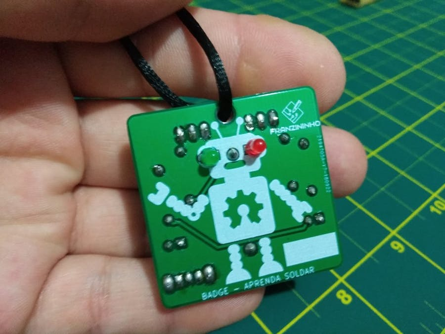
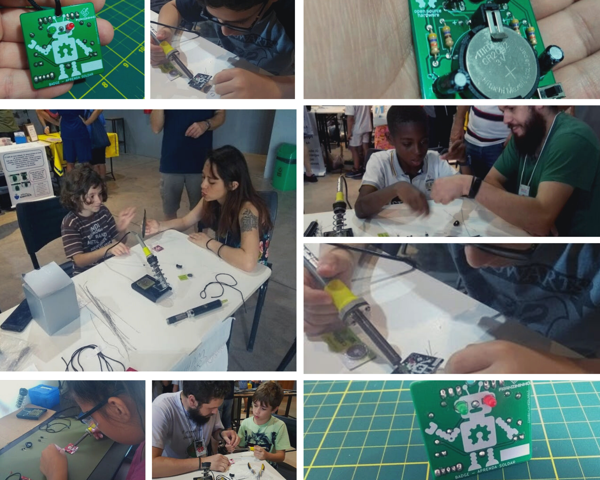

## O que é Badge?

O badge Aprenda Soldar foi desenvolvido para oficinas de solda onde os participantes dão os primeiros passos com o uso de ferramentas de soldagem e adquirem conhecimento dos componentes eletrônicos e circuito da placa.

Com poucos componentes, esse badge permite que qualquer pessoa aprenda a soldar e se divertir.

O circuito escolhido para esse badge, foi o clássico multivibrador astável com transistores. Ao final da soldagem os olhos do robô piscam, e placa está pronta para usar como colar ou chaveiro.

Durante a oficina os participantes conseguem aprender a usar o ferro de solda e como é o processo de soldagem de componentes PTH em uma placa.

As oficinas com o Badge Aprenda Soldar são direcionadas para adultos e adolescentes com interesse em aprender sobre soldagem eletrônica. A oficina dura em média 1 h, dependendo da quantidade de pessoas no grupo.

:::tip Premiação: Contest badge Love na categoria "The Badge of Hope"
:::

Esse projeto foi um dos vencedores do Contest badge Love na categoria The Badge of Hope, promovido pelo Hackster  O projeto é open hardware e foi publicado sob a licença Creative Commons Attribution Share Alike 4.0 International

## Contrate uma oficina ou adquira kit do Badge Aprenda Soldar

Para adquirir placas e kits do Badge Aprenda Soldar ou oficinas, entre em contato conosco: contato@franzininho.com.br

Fotos de oficinas com Badge Aprenda Soldar

