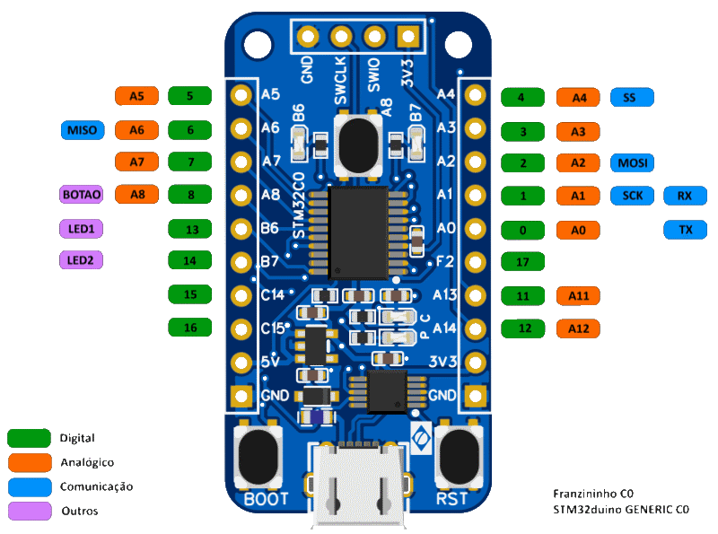

Na documentação da ST, os pinos dos microcontroladores STM32 são identificados por nomes como PA1, PA2 e PB6 (como pode ser visto no esquema da Franzininho C0). Descrevemos aqui as identificações usadas no Ambiente Arduino.

*Estas informações se referem à opção de placa "Generic STM32C0" do pacote STM32duino. Futuramente esperamos ter uma opção de placa específica para a Franzininho C0, usando opções default mais adequadas para os pinos.*

A figura abaixo resume as identificações:



O pacote STM32duino aceita as identificações do tipo PA1 como "nomes" dos pinos, porém esta não é a identificação usual do ambiente Arduino.

## Entrada e Saída Digital

Para entrada e saída digital, o ambiente Arduino utiliza números para identificar os pinos. A figura no início da página mostra os números correspondentes aos pinos da Franzininho.

As funções digitais aceitam também os nomes usados para entrada analógica (ver o próximo item).

## Entrada Analógica (ADC)

Para entrada analógica, o ambiente Arduino utiliza nomes do tipo An. A figura no início da página mostra os nomes correspondentes aos pinos da Franzininho.

## Interface Serial Assíncrona (UART)

O microcontrolador na Franzininho C0 possui duas interfaces seriais assíncronas (uart1 e uart2). Ele possui uma certa flexibilidade na conexão destas interfaces aos pinos.

No ambiente Arduino, as interfaces seriais assíncronas são acessadas através de objetos com nomes como Serial, Serial1 e Serial2.

Na Franzininho C0, os pinos PA9 e PA10 estão conectados ao conversor serial USB CH340, para fornecer comunicação serial com um micro através de um cabo USB.

A opção "Generic STM32C0" define um objeto Serial associado à interface uart1, usando os pinos PA0 e PA1 (como indicado na figura no alto da página). Para usar o objeto Serial para comunicar via USB é preciso reconfigurar os pinos através dos métodos setRx e setTx **antes** de chamar o método begin (veja também o exemplo "Hello World"):

```
  Serial.setRx(PA_10_R);
  Serial.setTx(PA_9_R);
  Serial.begin(115200);
```

Obs.: Os nomes especiais para os pinos PA9 e PA10 se devem ao fato destes pinos compartilharem os mesmos pinos físicos que PA11 e PA12.

Para usar a uart2 é preciso declarar um objeto Serial2 e especificar os pinos que serão usados:

```
HardwareSerial Serial2(uart2);

  Serial2.setRx(PA3);
  Serial2.setTx(PA2);
  Serial2.begin(115200);
```

## SPI

A figura no alto da página indica os pinos utilizados por padrão para a interface spi, acessada através do objeto SPI que é parte da bioblioteca padrão SPI.

Veja detalhes no exemplo SPI.

## I^2^C

No ambiente Arduino, a interface i^2^c é acessada através do objeto Wire, que é parte da bioblioteca padrão SPI.

A opção "Generic STM32C0" usa como padrão os pinos PA9 e PA10 para a interface i2c. Como estes pinos estão ligados na Franzininho C0 aos conversor serial USB, é preciso reconfigurar os pinos através dos métodos setSCL e setSDA **antes** de chamar o método begin (veja o exemplo "I2C").

## Opções Válidas para os Pinos

**UART1**  

| Sinal | Opções              |
| :---- | :------------------ |
| TX    | PA0, PA9, PB6, PC14 |
| RX    | PA1, PA8, PA10, PB7 |

**UART2**

| Sinal | Opções               |
| :---- | :------------------- |
| TX    | PA2, PA4, PA8, PA14  |
| RX    | PA3, PA5, PA13, PA14 |

**SPI** 

| Sinal | Opções              |
| :---- | :------------------ |
| MISO  | PA6, PA1, PB6       |
| MOSI  | PA2, PA7, PA12, PB6 |
| SCK   | PA1, PA5, PB6       |
| SS    | PA4, PA8, PA14      |

**I2C**

| Sinal | Opções          |
| :---- | :-------------- |
| SCL   | PA9, PB6, PB7   |
| SDA   | PC14, PA10, PB7 |


| Autor | Daniel Quadros |
| :---- | :------------- |
| Data: | 19/10/2023     |
