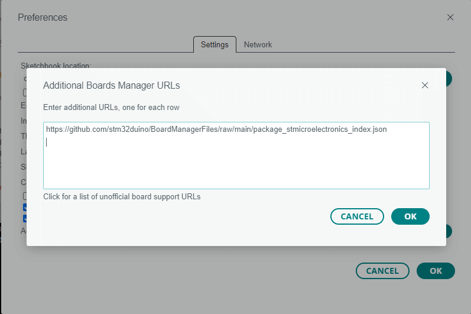
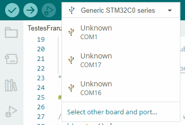
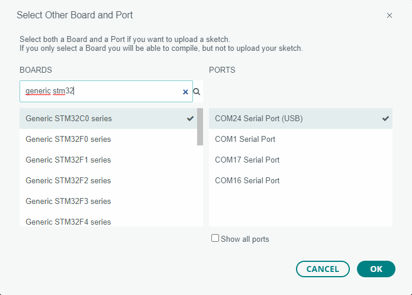
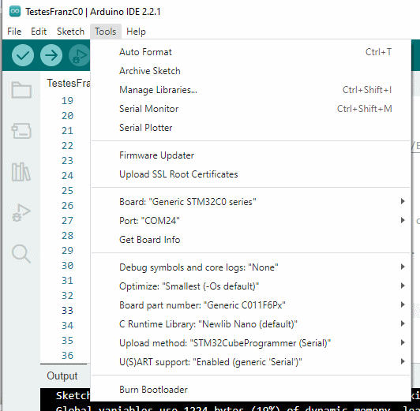
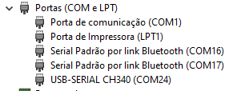

Os passos a seguir mostram a instalação e configuração da IDE Arduino para usar a opção de placa "Generic STM32C0" do pacote STM32duino. Futuramente esperamos ter uma opção de placa específica para a Franzininho C0, eliminando a necessidade de algumas configurações e usando opções default mais adequadas para os pinos. 

1. Instale a **IDE do Arduino** (se você não tiver instalada) de https://www.arduino.cc/en/software. As telas apresentadas foram capturadas com a versão 2.2.1 para Windows.

2. Instale o **STM32CubeProgrammer** de https://www.st.com/en/development-tools/stm32cubeprog.html. Pode ser necessáro fazer um pequeno cadastro para baixar o instalador.

3. Execute a IDE do Arduino. Entre em **File**, **Preferences**, Additional Boards Manager URLs e acrescente `https://github.com/stm32duino/BoardManagerFiles/raw/main/package_stmicroelectronics_index.json`:

4. Conecte a Franzininho C0 ao micro através de um cabo USB. A placa será reconhecida como uma serial pelo sistema operacional.

5. Selecione "Select other board and port..." no *dropbox* na tarja superior da IDE.

6. Selecione a placa **"Generic STM32C0 series"** e a porta correspondente à placa (se tiver dúvida, veja adiante como identificar a serial).

7. Use o menu **Tools** para acertar a configuração da placa:
	* Board part number: "Generic C011F6Px"
	* Upload method: "STM32CubeProgrammer (Serial)"
	* U(S)ART support: "Enabled (generic 'Serial')"

## Gravação de Programas pela USB

A configuração acima fará a carga de programas através da USB. Para isto a placa precisa estar com o bootloader em execução, o que é feito através destes passos:

1. Aperte o botão **BOOT** e o mantenha apertado
2. Aperte e solte o botão **RST**
3. Solte o botão **BOOT**

*A placa precisa estar executando o bootloader antes da IDE tentar carregar o programa, caso contrário será apresentado um erro. O ideal é fazer o procedimento acima **antes** de apertar o botão da IDE para compilar e carregar o programa.*

## Identificação da Porta Serial

A Franzininho C0 utiliza um integrado CH340E para emular uma porta serial através de uma conexão USB. As versões mais recentes de Windows e Linux reconhecem esta serial sem a necessidade de instalação de um driver específico.

### Windows

O Windows associa um nome do tipo COMnn para os dispositivos seriais. De um modo geral, o Windows tenta usar sempre o mesmo nome para cada dispositivo (identificando o dispositivo pelo VendorID, ProductID e Serial Number informados pela USB).

O Gerenciador de Dispositivos mostra os dispositivos seriais embaixo de "Portas (COM e LPT)"

A Franzininho C0 se apresenta como "USB-SERIAL CH340". Na dúvida, desconecte a placa e verifique quem sai da lista. Na figura acima, a Franzininho C0 está em COM24.

### Linux

TBD

| Autor | Daniel Quadros |
| :---- | :------------- |
| Data: | 15/10/2023     |